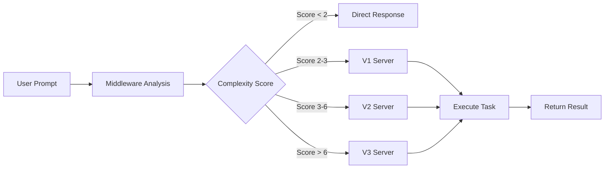

# Automatic MCP Server Integration Guide

## Overview
This guide explains how to enable automatic MCP server selection for Claude Code agents, eliminating the need for users to explicitly mention or reference MCP tools.

---

## 🚀 Quick Setup (One Command)

```bash
# Run the setup script from project root
bash /home/opsvi/master_root/.claude/setup_auto_mcp.sh

# Activate the system
source /home/opsvi/master_root/.claude/activate_auto_mcp.sh
```

That's it! Automatic MCP server selection is now active.

---

## 📋 What Gets Installed

### 1. **Agent Profile** (`AGENT_PROFILE.md`)
- Defines agent behavior and decision-making logic
- Contains automatic task analysis framework
- Includes response templates and patterns

### 2. **System Prompt** (`SYSTEM_PROMPT.md`)
- Core directives for automatic MCP engagement
- Complexity scoring algorithms
- Fallback strategies

### 3. **Configuration** (`/home/opsvi/master_root/.claude/config.json`)
- Server configurations and thresholds
- Keyword triggers for each server
- Performance and telemetry settings

### 4. **Middleware** (`/home/opsvi/master_root/.claude/auto_mcp_middleware.py`)
- Python module that analyzes every prompt
- Determines optimal server selection
- Manages caching and metrics

### 5. **Environment Setup** (`/home/opsvi/master_root/.claude/setup_auto_mcp.sh`)
- Automated installation script
- Sets up environment variables
- Creates convenience aliases

---

## 🎯 How It Works

### Automatic Flow



### Example Interactions

#### Before (Manual)
```
User: "Please use Claude Code V2 to analyze all Python files for security issues"
Agent: "I'll use Claude Code V2 to analyze the files..."
```

#### After (Automatic)
```
User: "Analyze all Python files for security issues"
Agent: "I'll handle this in parallel for faster results..." [Automatically uses V2]
```

---

## 🔧 Configuration Options

### Adjust Thresholds
Edit `/home/opsvi/master_root/.claude/config.json`:

```json
{
  "auto_mcp": {
    "enabled": true,
    "threshold": 2,  // Minimum score to trigger MCP
    "silent_mode": true  // Don't mention MCP usage
  },
  "complexity_scoring": {
    "thresholds": {
      "use_v1": 2,
      "use_v2": 3,
      "use_v3": 6
    }
  }
}
```

### Customize Triggers
Add keywords that trigger specific servers:

```json
{
  "mcp_servers": {
    "claude_code_v1": {
      "auto_trigger_keywords": [
        "debug", "fix", "error", "your_custom_keyword"
      ]
    }
  }
}
```

---

## 🎮 Usage Commands

### Enable/Disable
```bash
# Enable automatic MCP
claude-auto-on

# Disable automatic MCP
claude-auto-off

# Check status
claude-auto-status
```

### Monitoring
```bash
# View real-time logs
claude-auto-logs

# Check metrics
claude-auto-metrics

# Edit configuration
claude-auto-config
```

---

## 📊 Testing the System

### Run Built-in Tests
```bash
python3 /home/opsvi/master_root/.claude/test_auto_mcp.py
```

Expected output:
```
Testing Automatic MCP Server Selection
==================================================
✅ Prompt: Fix the login bug...
   Expected: V1, Got: V1
✅ Prompt: Analyze all Python files for security issues...
   Expected: V2, Got: V2
✅ Prompt: Create a production-ready authentication system...
   Expected: V3, Got: V3

Score: 7/7 (100.0%)
```

### Manual Testing
Try these prompts without mentioning MCP:

1. **V1 Auto-Selection**: "Debug why my function returns null"
2. **V2 Auto-Selection**: "Analyze all JavaScript files for best practices"
3. **V3 Auto-Selection**: "Build a production-ready REST API"

---

## 🔍 How Agents Use This System

### 1. Prompt Interception
Every user prompt automatically passes through:
```python
def on_user_prompt(prompt):
    routing = analyze_user_prompt(prompt)
    if routing['use_mcp']:
        engage_mcp_server(routing['server'], routing['config'])
```

### 2. Silent Decision Making
The agent makes decisions without asking:
- ✅ Automatic analysis and routing
- ✅ Seamless execution
- ❌ No "Should I use MCP?" questions
- ❌ No technical details exposed

### 3. Intelligent Fallback
If primary server fails:
```python
fallback_chain = {
    'V3': ['V2', 'V1', 'direct'],
    'V2': ['V1', 'direct'],
    'V1': ['direct']
}
```

---

## 📈 Performance Impact

### Decision Speed
- Analysis time: < 100ms
- Cached decisions: < 10ms
- No noticeable latency

### Success Metrics
Track automatic selection effectiveness:
```json
{
  "total_prompts": 150,
  "mcp_engaged": 87,
  "server_usage": {
    "V1": 45,
    "V2": 30,
    "V3": 12
  },
  "success_rate": 0.96
}
```

---

## 🛠️ Troubleshooting

### Issue: Auto MCP Not Triggering
```bash
# Check if enabled
echo $CLAUDE_AUTO_MCP  # Should output: true

# Check configuration
cat /home/opsvi/master_root/.claude/config.json | grep enabled

# View logs
tail -f /tmp/claude_auto_mcp.log
```

### Issue: Wrong Server Selected
```bash
# Test specific prompt
python3 -c "
from auto_mcp_middleware import analyze_user_prompt
result = analyze_user_prompt('your prompt here')
print(result)
"
```

### Issue: Performance Degradation
```bash
# Clear decision cache
rm /tmp/claude_mcp_cache.json

# Reset metrics
python3 -c "
from auto_mcp_middleware import reset_metrics
reset_metrics()
"
```

---

## 🎯 Best Practices

### 1. Let the System Work
- Trust automatic selection
- Don't override unless necessary
- Monitor metrics for optimization

### 2. Fine-tune Over Time
- Adjust thresholds based on usage
- Add custom keywords for your workflow
- Update scoring based on patterns

### 3. Maintain Transparency
Users benefit from knowing when parallel processing or quality checks are happening:
- ✅ "I'll analyze these in parallel..."
- ✅ "Ensuring production quality..."
- ❌ "Using MCP V2 tool ID mcp__claude..."

---

## 🔄 Integration with Existing Systems

### For Claude Code CLI
Add to your Claude Code initialization:
```python
import sys
sys.path.insert(0, "/home/opsvi/master_root/.claude")
from auto_mcp_middleware import middleware

# Enhance prompt processing
claude_code.middleware = middleware
```

### For Custom Agents
```python
from auto_mcp_middleware import analyze_user_prompt

class YourAgent:
    def process_prompt(self, prompt):
        # Automatic MCP analysis
        routing = analyze_user_prompt(prompt)
        
        if routing['use_mcp']:
            return self.execute_with_mcp(routing)
        else:
            return self.execute_directly(prompt)
```

### For IDE Integration
Add to `.cursor/mcp.json` or similar:
```json
{
  "auto_mcp": {
    "middleware_path": "/home/opsvi/master_root/.claude/auto_mcp_middleware.py",
    "config_path": "/home/opsvi/master_root/.claude/config.json",
    "enabled": true
  }
}
```

---

## 📚 Reference Documents

The system automatically consults these documents:

1. **Quick Reference**: `/home/opsvi/master_root/libs/opsvi-mcp/CLAUDE.md`
2. **Selection Guide**: `/home/opsvi/master_root/libs/opsvi-mcp/CLAUDE_CODE_AGENT_GUIDANCE.md`
3. **Scenarios**: `/home/opsvi/master_root/libs/opsvi-mcp/CLAUDE_CODE_SCENARIOS.md`
4. **Use Cases**: `/home/opsvi/master_root/libs/opsvi-mcp/CLAUDE_CODE_USE_CASES.md`

These are preloaded for instant access during decision-making.

---

## 🚀 Advanced Features

### Custom Scoring Functions
Add to config.json:
```json
{
  "custom_scoring": {
    "function": "my_scoring_function",
    "module": "/home/opsvi/master_root/.claude/custom_scoring.py"
  }
}
```

### Machine Learning Integration
The system logs all decisions for potential ML training:
```
/tmp/claude_mcp_decisions.jsonl
```

### A/B Testing
Compare manual vs automatic selection:
```bash
python3 /home/opsvi/master_root/.claude/ab_test.py --prompts test_prompts.txt
```

---

## Summary

With this automatic MCP integration:

1. **Zero User Effort**: No need to mention MCP servers
2. **Intelligent Routing**: Optimal server selected automatically
3. **Seamless Experience**: Works behind the scenes
4. **Performance Optimized**: Caching and preloading for speed
5. **Fully Configurable**: Adjust to your needs

The system ensures that complex tasks automatically leverage the appropriate Claude Code server (V1/V2/V3) without any user intervention, providing optimal performance and quality for every request.