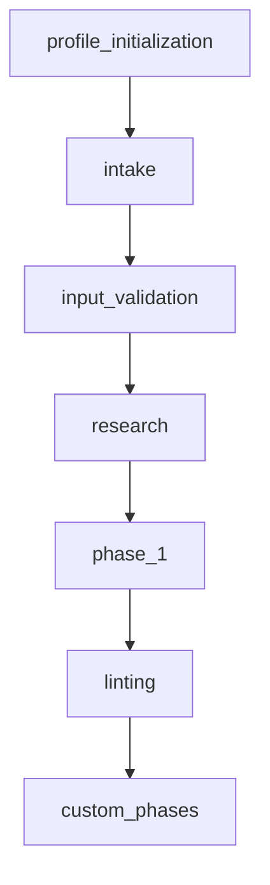

<!-- FILE_MAP_BEGIN 
<!--
{"file_metadata":{"title":"[Workflow Name] Generation Report","description":"Template for documenting the generation report of a workflow, summarizing files created, workflow structure, key decisions, standards loaded, and additional notes.","last_updated":"2025-07-31","type":"documentation"},"ai_instructions":"Analyze the document to identify logical sections based on headings and content themes. Capture all major sections with precise line ranges, ensuring no overlap. Identify key elements such as tables, code blocks, and lists that are critical for understanding the workflow generation report. Provide clear, concise section names and descriptions that reflect the content purpose. Ensure line numbers are 1-indexed and include all lines, including blank and formatting lines. The output should facilitate efficient navigation and comprehension of the report template.","sections":[{"name":"Title and Metadata","description":"Contains the main title of the report and metadata fields for date and author.","line_start":7,"line_end":13},{"name":"Overview","description":"Summarizes the purpose of the report and outlines the workflow generation process.","line_start":14,"line_end":19},{"name":"Files Created","description":"Lists all files created during the workflow generation along with their purposes and descriptions in a table format.","line_start":20,"line_end":29},{"name":"Workflow Structure","description":"Visual representation of the workflow structure using a Mermaid flowchart code block.","line_start":30,"line_end":44},{"name":"Key Decisions & Deviations","description":"Documents any deviations from the template, special configurations, or important decisions made during the workflow generation.","line_start":45,"line_end":50},{"name":"Standards & Rules Loaded","description":"Lists standards, rules, or compliance requirements that have been loaded for the workflow.","line_start":51,"line_end":56},{"name":"Additional Notes","description":"Contains any other relevant information or notes related to the workflow generation report.","line_start":57,"line_end":62}],"key_elements":[{"name":"Title Header","description":"Main title of the document indicating the workflow generation report.","line":7},{"name":"Metadata Fields","description":"Date and author information fields immediately following the title.","line":8},{"name":"Overview Section Text","description":"Descriptive summary of the workflow generation process.","line":15},{"name":"Files Created Table","description":"Table listing file paths and their descriptions created during the workflow.","line":21},{"name":"Workflow Structure Mermaid Diagram","description":"Mermaid code block illustrating the workflow steps and their connections.","line":31},{"name":"Key Decisions List","description":"Bullet list capturing deviations and important decisions.","line":46},{"name":"Standards & Rules List","description":"Bullet list of standards and rules loaded for the workflow.","line":52},{"name":"Additional Notes List","description":"Bullet list for any other relevant notes or information.","line":58}]}
-->
<!-- FILE_MAP_END -->

# [Workflow Name] Generation Report

**Date:** [generation_date]
**Generated by:** [agent/author]

---

## Overview

This report summarizes the workflow generation process, including all files created, their purposes, and the structure of the workflow.

---

## Files Created

| File Path | Purpose/Description |
|-----------|--------------------|
| [file_1]  | [description_1]    |
| [file_2]  | [description_2]    |
| ...       | ...                |

---

## Workflow Structure

---

## Key Decisions & Deviations

- [List any deviations from the template, special configurations, or important decisions.]

---

## Standards & Rules Loaded

- [List any standards, rules, or compliance requirements loaded for this workflow.]

---

## Additional Notes

- [Any other relevant information.]

---
