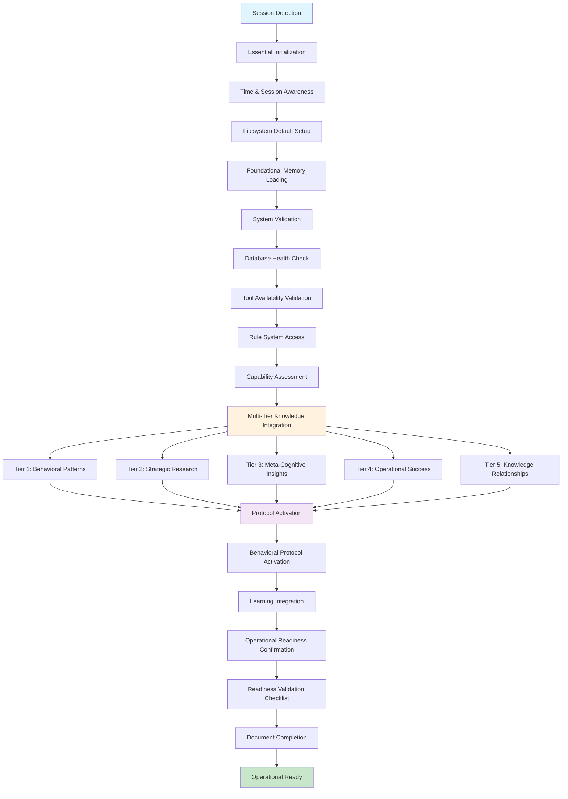

<!-- FILE_MAP_BEGIN 
<!--
{"file_metadata":{"title":"Startup Workflow v1.0 - Comprehensive Documentation","description":"Detailed documentation of the Startup Workflow v1.0, outlining the initialization sequence, multi-tier knowledge integration, system validation, protocol activation, and operational readiness confirmation for autonomous agent activation.","last_updated":"2025-07-31","type":"documentation"},"ai_instructions":"Analyze the document focusing on major thematic sections to create a navigable file map. Group related subsections into broader logical divisions to maintain clarity and manageability. Identify key elements such as diagrams, code blocks, and critical procedural steps that aid comprehension. Ensure all line numbers are precise and sections do not overlap. Provide clear, concise section names and descriptions that reflect the document's structure and content purpose.","sections":[{"name":"Introduction and Overview","description":"Introduces the Startup Workflow, its purpose, and provides a high-level overview of the initialization sequence and operational readiness goals.","line_start":7,"line_end":11},{"name":"Workflow Diagram","description":"Visual representation of the entire startup workflow process using a Mermaid graph, illustrating phases and their interconnections.","line_start":12,"line_end":51},{"name":"Workflow Architecture","description":"Describes the design principles and key innovations underlying the startup workflow architecture, emphasizing knowledge foundation and validation strategies.","line_start":54,"line_end":67},{"name":"Phase-by-Phase Breakdown","description":"Detailed explanation of each startup phase including essential initialization, system validation, multi-tier knowledge integration, protocol activation, and operational readiness confirmation.","line_start":69,"line_end":196},{"name":"Success Metrics","description":"Outlines the efficiency and quality improvements achieved through the startup workflow, highlighting parallel loading and validation benefits.","line_start":198,"line_end":208},{"name":"Tool Integration Details","description":"Details on rate limiting, API management, error handling, failure recovery, and integration with existing systems to ensure robust tool operation.","line_start":210,"line_end":225},{"name":"Implementation Requirements","description":"Specifies database schema needs, workflow infrastructure components, and performance considerations necessary to implement the startup workflow effectively.","line_start":227,"line_end":242},{"name":"Critical Enforcement Points","description":"Lists mandatory checkpoints and conditions that must be met before proceeding through the startup workflow phases to ensure operational integrity.","line_start":244,"line_end":247},{"name":"Quality Gates & Validation","description":"Defines the validation criteria and quality gates that confirm successful completion of each phase and overall readiness for operation.","line_start":249,"line_end":262}],"key_elements":[{"name":"Mermaid Workflow Diagram","description":"Graphical flowchart illustrating the startup workflow phases and their relationships, aiding visual comprehension of the process.","line":13},{"name":"Design Principles List","description":"Enumerated design principles that guide the architecture and operational approach of the startup workflow.","line":56},{"name":"Key Innovations List","description":"Bullet points highlighting the novel features and strategies implemented in the startup workflow.","line":63},{"name":"Phase 1 Detailed Steps","description":"Subsections describing essential initialization tasks including time/session awareness, filesystem setup, and memory loading.","line":71},{"name":"Phase 2 Tool Availability Validation Subsections","description":"Nested subsections covering primary tool testing and tool hierarchy compliance within system validation.","line":103},{"name":"Phase 3 Knowledge Integration Code Blocks","description":"YAML code blocks specifying search queries for each of the five knowledge tiers to be loaded during multi-tier knowledge integration.","line":134},{"name":"Protocol Activation Steps List","description":"Numbered list detailing the steps involved in activating behavioral and learning protocols for operational readiness.","line":175},{"name":"Readiness Validation Checklist","description":"Checklist enumerating all validations required to confirm operational readiness before handover.","line":184},{"name":"Success Metrics - Efficiency and Quality Improvements","description":"Lists describing the improvements in efficiency and quality resulting from the workflow implementation.","line":200},{"name":"Tool Integration Details Subsections","description":"Sections covering rate limiting, error handling, and system integration strategies for tools used in the workflow.","line":212},{"name":"Implementation Requirements Subsections","description":"Details on database schema, infrastructure, and performance considerations necessary for workflow deployment.","line":229},{"name":"Critical Enforcement Points List","description":"Mandatory conditions and checkpoints that enforce workflow integrity and quality.","line":244},{"name":"Quality Gates & Validation Summary","description":"Summary of quality gates and validation steps ensuring each phase meets required standards before proceeding.","line":249}]}
-->
<!-- FILE_MAP_END -->

# Startup Workflow v1.0 - Comprehensive Documentation

## Overview
The Startup Workflow provides a comprehensive initialization sequence for autonomous agent activation with multi-tier knowledge loading and systematic validation. It ensures operational readiness through structured knowledge foundation establishment, system validation, and protocol activation. This workflow optimizes agent initialization by prioritizing high-quality knowledge integration and validates system capabilities before operational handover.

## Workflow Diagram



## Workflow Architecture

### Design Principles
1. **Multi-Tier Knowledge Foundation**: Systematic loading of five knowledge tiers ensuring comprehensive cognitive foundation before operation
2. **Progressive Validation**: Each phase validates success before proceeding, preventing cascade failures and ensuring operational integrity
3. **Parallel Optimization**: Knowledge tier loading executes in parallel when possible, maximizing efficiency while maintaining quality
4. **Content-First Approach**: Prioritizes relevant content through content search and systematic validation for optimal decision-making capability
5. **Evidence-Based Readiness**: Comprehensive validation checklist ensures all systems operational before agent handover

### Key Innovations
- **Tiered Knowledge Architecture**: Five-tier knowledge loading strategy from behavioral patterns to relationship contexts
- **Comprehensive System Validation**: Database, tools, rules, and capabilities validated systematically before operation
- **Protocol Activation Framework**: Behavioral and learning protocols activated with validation confirmation
- **Session Context Documentation**: Complete initialization state documented for operational handover and continuity

## Phase-by-Phase Breakdown

### Phase 1: Essential Initialization
**Purpose**: Establish fundamental operational context and core memory foundation

#### 1.1 Time & Session Awareness
- **Action**: Execute temporal context establishment and session tracking
- **Tool(s)**: `mcp_time_current_time`
- **Input**: Current system time and session detection parameters
- **Output**: Temporal context with session timestamp
- **Validation**: Temporal context established and session tracking active

#### 1.2 Filesystem Default Setup
- **Action**: Configure project root filesystem defaults for all file operations
- **Tool(s)**: `mcp_filesystem_set_filesystem_default`
- **Strategy**: Use mcp_filesystem_set_filesystem_default for consistent relative path operations
- **Output**: Filesystem defaults configured with project root access

#### 1.3 Foundational Memory Loading
- **Tool**: `mcp_cognitive_tools_arango_search`
- **Strategy**: Content-filtered search for core operational memories
- **Rate Management**: Single query for foundational content (limit: 15)
- **Output**: Essential behavioral patterns and operational knowledge loaded

### Phase 2: System Validation
**Purpose**: Verify all critical systems are operational and accessible
**Condition**: After essential initialization completes successfully

#### 2.1 Database Health Check
- **Tool**: `mcp_cognitive_tools_arango_manage`
- **Strategy**: Health action to verify database connectivity and responsiveness
- **Rate Management**: Single health check operation
- **Output**: Database status confirmation

#### 2.2 Tool Availability Validation
**Key Innovation**: Comprehensive tool hierarchy compliance verification

##### Primary Tool Testing
- **Tool**: Multiple consolidated tools testing
- **Input**: Tool functionality verification parameters
- **Strategy**: Test core operations with consolidated tools
- **Returns**: Tool availability and functionality confirmation

##### Tool Hierarchy Compliance
- **Tools**: Cognitive tools suite validation
- **Input**: Tool usage compliance requirements
- **Strategy**: Verify cognitive tools coverage capability
- **Returns**: Tool hierarchy compliance confirmation

#### 2.3 Rule System Access Verification
- **Action**: Verify access to rule consultation system
- **Input**: Rule directory and loading capability parameters
- **Strategy**: Test rule system accessibility and loading functionality
- **Output**: Rule consultation capability confirmed

#### 2.4 Capability Assessment
- **Tool**: `mcp_cognitive_tools_arango_manage`
- **Strategy**: Count operation to assess available capabilities
- **Output**: Capability metrics and assessment results

### Phase 3: Multi-Tier Knowledge Integration
**Purpose**: Establish comprehensive knowledge foundation across five strategic tiers

#### Tier 1: Essential Behavioral Patterns
```yaml
search_type: content
collection: research_docs
content: "behavioral patterns essential"
limit: 15
```

#### Tier 2: Strategic Research Knowledge
```yaml
search_type: content
collection: research_synthesis
content: "strategic research validated"
limit: 10
```

#### Tier 3: Meta-Cognitive Insights
```yaml
search_type: content
collection: core_memory
content: "meta-cognitive insights"
limit: 8
```

#### Tier 4: Operational Success Patterns
```yaml
search_type: type
collection: metrics
document_type: operational_success
limit: 5
```

#### Tier 5: Knowledge Relationships Context
```yaml
search_type: recent
collection: knowledge_relationships
hours: 168
limit: 8
```

### Phase 4: Protocol Activation
**Purpose**: Activate behavioral and learning protocols for operational excellence

#### Protocol Activation Steps
1. **Behavioral Protocol Activation**: Evidence-based operation enforcement, systematic approach application, quality assurance protocol activation
2. **Learning Integration**: Continuous learning integration, memory persistence protocols, knowledge evolution capabilities
3. **Validation Confirmation**: Protocol activation confirmation and operational status verification
4. **Integration Completion**: Learning protocols operational with behavioral compliance active

### Phase 5: Operational Readiness Confirmation
**Purpose**: Validate complete system readiness and document operational handover

#### Readiness Validation Checklist
- **Primary Validation**: Database connectivity confirmed
- **Tool Validation**: Tools available and functional
- **System Validation**: Rule system accessible
- **Knowledge Validation**: All 5 knowledge tiers loaded successfully
- **Protocol Validation**: Protocols activated
- **Context Validation**: Session context established

#### Document Completion
- **Session Context**: Complete initialization state documentation
- **Operational Status**: Startup complete with operational ready status
- **Knowledge Foundation**: All tiers loaded and accessible
- **Capability Status**: Confirmed active with comprehensive foundation

## Success Metrics

### Efficiency Improvements
- **Parallel Knowledge Loading**: Faster initialization through concurrent tier loading
- **Content-Filtered Results**: Improved knowledge relevance through targeted content search
- **Strategic Prioritization**: Enhanced operational effectiveness through tier-based loading priority

### Quality Improvements
- **Comprehensive Foundation**: Complete knowledge tier coverage ensuring comprehensive cognitive foundation
- **System Validation**: Reduced operational failures through systematic validation
- **Protocol Activation**: Behavioral compliance through protocol activation confirmation

## Tool Integration Details

### Rate Limiting & API Management
- **Cognitive Tools**: Batch operations for knowledge loading with parallel execution optimization
- **Database Operations**: Health checks and document operations with single-query efficiency
- **Filesystem Operations**: Default path configuration with minimal overhead

### Error Handling & Failure Recovery
- **Knowledge Loading Failures**: Tier-specific retry with quality threshold adjustment
- **Database Connectivity Issues**: Health check retry with escalated diagnostics
- **Tool Availability Failures**: Alternative tool pathway with functionality verification

### Integration with Existing Systems
- **Session Context Integration**: Complete handover documentation for operational continuity
- **Knowledge Base Integration**: Multi-tier loading from existing knowledge collections
- **Protocol System Integration**: Behavioral and learning protocol activation with existing frameworks

## Implementation Requirements

### Database Schema Requirements
- Collections: research_docs, research_synthesis, core_memory, metrics, knowledge_relationships, session_context
- Content fields for targeted search and retrieval
- Session tracking capabilities for continuity

### Workflow Infrastructure
- Multi-tier knowledge loading capability with parallel execution
- Protocol activation framework with validation confirmation
- Comprehensive system validation with error recovery

### Performance Considerations
- Parallel knowledge tier loading for efficiency optimization
- Content filtering to focus on relevant information through targeted search
- Strategic prioritization by operational importance for optimal initialization

## Critical Enforcement Points
- **MANDATORY**: Multi-tier knowledge loading before any operational activity
- **MANDATORY**: System validation comprehensive completion before proceeding
- **MANDATORY**: All five knowledge tiers successfully loaded with quality validation

## Quality Gates & Validation
- Essential initialization complete with temporal context and filesystem defaults
- System validation passed with database, tools, rules, and capabilities confirmed
- Multi-tier knowledge loaded with all five tiers accessible and content-validated
- Protocols activated with behavioral and learning integration confirmed
- Operational readiness confirmed with comprehensive validation checklist

This documentation provides the foundation for implementing the Startup Workflow v1.0 with full traceability from requirements to execution.
