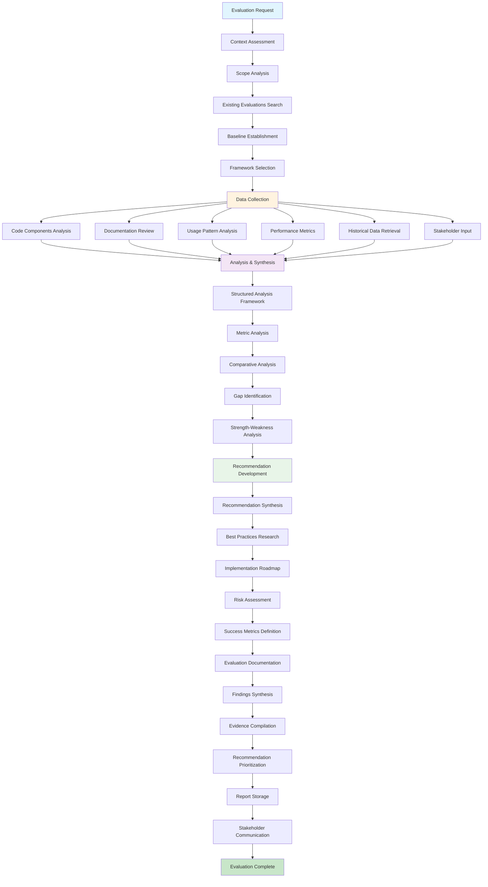

<!-- FILE_MAP_BEGIN 
<!--
{"file_metadata":{"title":"Evaluate Workflow v1.0 - Comprehensive Documentation","description":"Detailed documentation describing the Evaluate Workflow v1.0, covering overview, architecture, phased methodology, success metrics, tool integration, implementation requirements, enforcement points, and quality validation.","last_updated":"2025-07-31","type":"documentation"},"ai_instructions":"Analyze the document by focusing on major thematic sections rather than every subheading due to high heading count. Identify logical groupings of content such as overview, architecture, phased workflow, metrics, integration, requirements, enforcement, and validation. Ensure line numbers are accurate and sections do not overlap. Highlight key elements like the workflow diagram, code blocks, YAML framework snippet, and important tools or concepts mentioned. Provide a navigable file map that aids users in quickly locating major content areas and understanding the document's structure and purpose.","sections":[{"name":"Document Introduction and Overview","description":"Introduces the Evaluate Workflow, its purpose, and provides a high-level overview including the workflow diagram.","line_start":7,"line_end":64},{"name":"Workflow Architecture","description":"Describes the design principles and key innovations underlying the Evaluate Workflow methodology.","line_start":65,"line_end":79},{"name":"Phase-by-Phase Workflow Breakdown","description":"Detailed explanation of each evaluation phase from context assessment through evaluation documentation, outlining purpose, actions, tools, and outputs.","line_start":80,"line_end":239},{"name":"Success Metrics","description":"Defines efficiency and quality improvements expected from the Evaluate Workflow implementation.","line_start":240,"line_end":251},{"name":"Tool Integration Details","description":"Details on rate limiting, API management, error handling, failure recovery, and integration with existing systems.","line_start":252,"line_end":268},{"name":"Implementation Requirements","description":"Specifies database schema, workflow infrastructure, and performance considerations necessary to support the Evaluate Workflow.","line_start":269,"line_end":285},{"name":"Critical Enforcement Points","description":"Lists mandatory checkpoints and requirements to ensure proper workflow execution and evaluation integrity.","line_start":286,"line_end":290},{"name":"Quality Gates and Validation","description":"Outlines criteria for validating evaluation completeness, data quality, analysis rigor, and documentation thoroughness.","line_start":291,"line_end":307}],"key_elements":[{"name":"Workflow Diagram (Mermaid Graph)","description":"Visual representation of the Evaluate Workflow phases and their interconnections using Mermaid syntax.","line":13},{"name":"Design Principles List","description":"Enumerated key design principles guiding the workflow's evidence-based, multi-dimensional, and stakeholder-inclusive approach.","line":67},{"name":"Key Innovations List","description":"Highlights innovations such as adaptive framework selection and multi-source data integration that enhance workflow effectiveness.","line":74},{"name":"Phase 1 to Phase 5 Headings","description":"Main phase headings marking major workflow stages from context assessment to evaluation documentation.","line":82},{"name":"Technical Component Discovery and Documentation Review","description":"Subsections describing tools and strategies for codebase and documentation analysis within Phase 2 Data Collection.","line":115},{"name":"Analysis Framework Application (YAML Code Block)","description":"YAML snippet illustrating the systematic analysis framework applied in Phase 3 for quantitative and qualitative data synthesis.","line":152},{"name":"Recommendation Development Subsections","description":"Key steps in Phase 4 including synthesis, best practices research, roadmap creation, risk assessment, and success metrics definition.","line":187},{"name":"Documentation Standards and Findings Synthesis","description":"Standards and actions for compiling and communicating evaluation findings in Phase 5.","line":213},{"name":"Success Metrics Categories","description":"Sections defining efficiency and quality improvements as measures of workflow success.","line":242},{"name":"Tool Integration Topics","description":"Details on managing API rate limits, error handling, and integration with existing systems.","line":254},{"name":"Implementation Requirements Topics","description":"Descriptions of database schema, infrastructure, and performance considerations needed for workflow support.","line":271},{"name":"Critical Enforcement Points List","description":"Mandatory checkpoints ensuring comprehensive assessment and evidence-based analysis.","line":286},{"name":"Quality Gates & Validation Criteria","description":"Checklist for validating evaluation completeness, data quality, analysis, recommendations, and documentation.","line":291}]}
-->
<!-- FILE_MAP_END -->

# Evaluate Workflow v1.0 - Comprehensive Documentation

## Overview
The Evaluate Workflow provides systematic assessment and analysis capabilities for technical systems, processes, and components. It enables evidence-based evaluation through comprehensive data collection, structured analysis, and actionable recommendation development. This workflow ensures thorough evaluation by incorporating multiple data sources, stakeholder perspectives, and domain-appropriate frameworks while delivering practical implementation guidance.

## Workflow Diagram



## Workflow Architecture

### Design Principles
1. **Evidence-Based Assessment**: All conclusions supported by collected data, metrics, and stakeholder input with clear traceability
2. **Multi-Dimensional Analysis**: Evaluates technical, functional, performance, quality, and usability dimensions comprehensively
3. **Stakeholder-Inclusive Approach**: Incorporates perspectives from users, developers, and stakeholders for comprehensive assessment
4. **Framework-Driven Methodology**: Applies domain-appropriate evaluation frameworks ensuring systematic and consistent analysis
5. **Actionable Outcomes**: Delivers practical recommendations with implementation guidance and measurable success criteria

### Key Innovations
- **Adaptive Framework Selection**: Automatically selects evaluation frameworks based on domain and evaluation type
- **Multi-Source Data Integration**: Combines technical metrics, documentation analysis, and stakeholder feedback systematically
- **Gap-Driven Recommendations**: Identifies specific gaps between current and desired state for targeted improvements
- **Implementation-Ready Deliverables**: Provides detailed roadmaps with timelines, resources, and success metrics

## Phase-by-Phase Breakdown

### Phase 1: Context Assessment
**Purpose**: Establish evaluation scope, context, and appropriate assessment framework

#### 1.1 Evaluation Scope Analysis
- **Action**: Parse evaluation request into dimensions and requirements
- **Input**: Evaluation request with target system or component
- **Output**: Scope dimensions identified across technical, functional, performance, quality, usability
- **Validation**: Scope dimensions clearly identified and boundaries established

#### 1.2 Existing Evaluations Search
- **Tool**: `mcp_cognitive_tools_arango_search`
- **Strategy**: Content search for previous evaluations and related assessments
- **Input**: Evaluation topics and target components
- **Output**: Historical evaluation context and baseline understanding

#### 1.3 Baseline Establishment
- **Action**: Document current state and establish measurement baseline
- **Strategy**: Capture current metrics and performance indicators
- **Output**: Baseline metrics documented for comparison purposes

#### 1.4 Framework Selection
- **Action**: Select domain-appropriate evaluation methodology
- **Input**: Evaluation type and target characteristics
- **Output**: Evaluation framework selected with defined criteria
- **Validation**: Framework selected and evaluation criteria clearly defined

### Phase 2: Data Collection
**Purpose**: Gather comprehensive data from multiple sources for thorough analysis
**Condition**: Context assessment complete with framework established

#### 2.1 Code Components Analysis
**Key Innovation**: Systematic codebase analysis for technical evaluation

##### Technical Component Discovery
- **Tool**: `codebase_search`
- **Input**: Evaluation target components and related systems
- **Strategy**: Identify all relevant code components and dependencies
- **Returns**: Complete component inventory with relationships

##### Documentation Review
- **Tool**: `mcp_filesystem_read_file`
- **Input**: Configuration files, documentation, specifications
- **Strategy**: Review all relevant documentation for context and requirements
- **Returns**: Documentation analysis with gaps and quality assessment

#### 2.2 Usage Pattern Analysis
- **Tool**: `grep_search`
- **Strategy**: Search for usage patterns, configurations, and implementation details
- **Rate Management**: Targeted searches with specific file type filtering
- **Output**: Usage patterns and implementation approaches identified

#### 2.3 Performance Metrics Collection
- **Tool**: `run_terminal_cmd`
- **Strategy**: Execute performance testing and metric collection commands
- **Output**: Quantitative performance data and system metrics

#### 2.4 Historical Performance Data
- **Tool**: `mcp_cognitive_tools_arango_search`
- **Strategy**: Related search for historical performance tracking data
- **Output**: Historical trends and performance evolution data

#### 2.5 Stakeholder Input Collection
- **Action**: Gather stakeholder perspectives and requirements
- **Input**: User feedback, requirements, constraints from stakeholders
- **Output**: Stakeholder perspectives documented with priorities

### Phase 3: Analysis & Synthesis
**Purpose**: Apply systematic analysis framework to collected data for evidence-based conclusions

#### Analysis Framework Application
```yaml
systematic_analysis:
  quantitative_metrics: performance_usage_statistics
  qualitative_data: user_feedback_documentation_quality
  comparative_benchmarks: baseline_industry_standards
  gap_analysis: current_vs_desired_state
```

#### 3.1 Structured Analysis Framework
- **Tool**: `mcp_thinking_sequentialthinking`
- **Strategy**: Apply systematic evaluation analysis with structured thinking
- **Output**: Comprehensive analysis framework applied with documented reasoning

#### 3.2 Metric Analysis
- **Action**: Analyze quantitative and qualitative data systematically
- **Input**: Performance metrics, usage statistics, user feedback, documentation quality
- **Output**: Metrics analyzed with trends identified and documented

#### 3.3 Comparative Analysis
- **Action**: Compare against baseline, industry standards, and best practices
- **Strategy**: Multi-point comparison for comprehensive assessment
- **Output**: Comparative assessment with clear performance positioning

#### 3.4 Gap Identification
- **Action**: Identify specific gaps between current and desired state
- **Input**: Current evaluation findings vs requirements/standards/expectations
- **Output**: Gaps clearly identified and prioritized by impact

#### 3.5 Strength-Weakness Analysis
- **Action**: Document strengths and weaknesses with supporting evidence
- **Output**: Evidence-based strengths and weaknesses documentation

### Phase 4: Recommendation Development
**Purpose**: Develop actionable recommendations with implementation guidance

#### 4.1 Recommendation Synthesis
- **Action**: Synthesize analysis findings into practical recommendations
- **Input**: Gap analysis results, strength-weakness analysis, resource constraints
- **Output**: Practical and actionable recommendations prioritized by impact

#### 4.2 Best Practices Research
- **Tool**: `mcp_cognitive_tools_arango_search`
- **Strategy**: Search for similar recommendations and industry best practices
- **Output**: Best practices research incorporated into recommendations

#### 4.3 Implementation Roadmap
- **Action**: Create detailed implementation plan with timelines
- **Input**: Prioritized recommendations and available resources/capabilities
- **Output**: Implementation plan with phases, timelines, and resource requirements

#### 4.4 Risk Assessment
- **Action**: Identify implementation risks and mitigation strategies
- **Output**: Risks identified with mitigation strategies for each recommendation

#### 4.5 Success Metrics Definition
- **Action**: Define measurable success criteria for recommendations
- **Output**: Specific, measurable success criteria for tracking implementation progress

### Phase 5: Evaluation Documentation
**Purpose**: Document comprehensive evaluation findings with stakeholder communication

#### Documentation Standards
- **Comprehensive Report**: All findings, analysis, and recommendations documented
- **Evidence Traceability**: Clear linkage between data, analysis, and conclusions
- **Implementation Guidance**: Detailed roadmaps with practical next steps
- **Stakeholder Communication**: Appropriate format for different audiences

#### 5.1 Findings Synthesis
- **Action**: Compile all evaluation data into comprehensive report
- **Output**: Findings clearly documented with executive summary

#### 5.2 Evidence Compilation
- **Action**: Link evidence to conclusions with clear traceability
- **Output**: Evidence supporting all conclusions documented systematically

#### 5.3 Recommendation Prioritization
- **Action**: Prioritize recommendations by impact, effort, risk, and resources
- **Output**: Recommendations prioritized with clear rationale

#### 5.4 Report Storage
- **Tool**: `mcp_cognitive_tools_arango_modify`
- **Strategy**: Store complete evaluation in structured format for future reference
- **Output**: Evaluation stored with unique ID for tracking and follow-up

#### 5.5 Stakeholder Communication
- **Action**: Communicate findings in stakeholder-appropriate format
- **Output**: Findings effectively communicated to relevant stakeholders

## Success Metrics

### Efficiency Improvements
- **Comprehensive Data Collection**: Faster evaluation through systematic multi-source data gathering
- **Framework-Driven Analysis**: Improved analysis consistency through structured methodology application
- **Parallel Processing**: Enhanced efficiency through concurrent data collection from multiple sources

### Quality Improvements
- **Evidence-Based Conclusions**: All conclusions supported by documented evidence and data
- **Actionable Recommendations**: Recommendations include specific implementation guidance
- **Stakeholder Inclusion**: Evaluations include stakeholder perspectives and requirements

## Tool Integration Details

### Rate Limiting & API Management
- **Database Operations**: Efficient search queries with appropriate limits for context and historical data
- **Filesystem Operations**: Batch file reading for documentation and configuration analysis
- **Command Execution**: Performance testing commands with appropriate timeouts and resource management

### Error Handling & Failure Recovery
- **Data Collection Failures**: Alternative data sources and graceful degradation for incomplete data
- **Analysis Framework Issues**: Fallback analysis methods with manual validation options
- **Documentation Failures**: Alternative documentation methods with stakeholder input backup

### Integration with Existing Systems
- **Knowledge Base Integration**: Leverages existing evaluation reports and best practices
- **Performance Tracking Integration**: Connects with historical performance data for trend analysis
- **Stakeholder Systems Integration**: Incorporates feedback systems and requirement management

## Implementation Requirements

### Database Schema Requirements
- Collections: evaluation_reports, performance_tracking, stakeholder_feedback
- Evidence linking capabilities for traceability
- Recommendation tracking for implementation follow-up

### Workflow Infrastructure
- Multi-source data collection capability with parallel processing
- Analysis framework application with systematic methodology
- Stakeholder communication systems with multiple format support

### Performance Considerations
- Parallel data collection for efficiency optimization
- Framework selection based on evaluation type for consistency
- Evidence compilation for comprehensive traceability

## Critical Enforcement Points
- **MANDATORY**: Comprehensive context assessment before data collection begins
- **MANDATORY**: Multiple source data collection for thorough evaluation coverage
- **MANDATORY**: Evidence-based analysis with systematic framework application

## Quality Gates & Validation
- Context established with scope clear and framework selected
- Data comprehensive from multiple sources with stakeholder perspectives captured
- Analysis systematic with evidence-based conclusions and gaps identified
- Recommendations actionable with implementation guidance and success metrics
- Evaluation documented with complete traceability and stakeholder communication

This documentation provides the foundation for implementing the Evaluate Workflow v1.0 with full traceability from requirements to execution.
