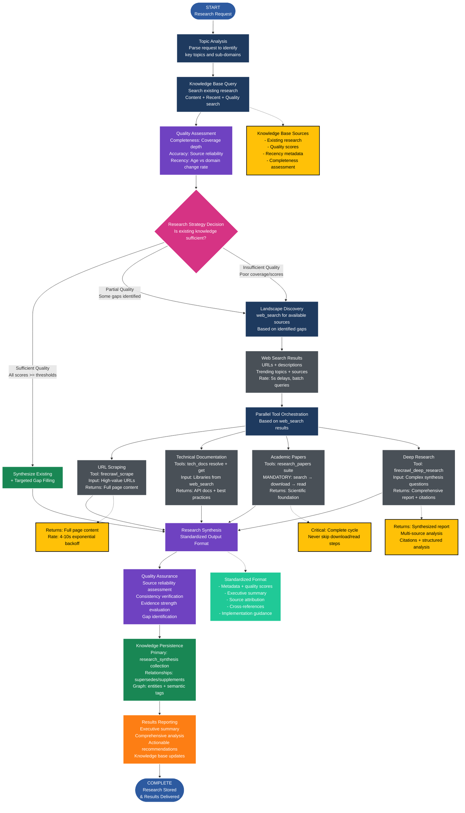

<!-- FILE_MAP_BEGIN 
<!--
{"file_metadata":{"title":"Enhanced Research Workflow v3.0 - Comprehensive Documentation","description":"Detailed documentation describing the Enhanced Research Workflow v3.0, including its phases, architecture, tool integration, success metrics, and implementation requirements.","last_updated":"2025-07-31","type":"documentation"},"ai_instructions":"Analyze the document to identify major thematic sections reflecting the Enhanced Research Workflow v3.0. Focus on grouping related headings into broader logical sections to maintain manageable navigation. Capture key elements such as the workflow diagram, phase breakdowns, YAML schema, and critical tool descriptions. Ensure line numbers are precise and sections do not overlap. Provide clear, descriptive section names and concise descriptions to facilitate efficient document comprehension and navigation.","sections":[{"name":"Introduction and Workflow Overview","description":"Introduces the Enhanced Research Workflow, its purpose, and presents the detailed workflow diagram illustrating the process flow and tool orchestration.","line_start":7,"line_end":91},{"name":"Workflow Architecture and Innovations","description":"Describes the design principles underpinning the workflow and highlights key innovations that differentiate this approach.","line_start":92,"line_end":106},{"name":"Phase-by-Phase Workflow Breakdown","description":"Detailed explanation of each of the five phases of the workflow, including knowledge base assessment, external research, synthesis, quality assurance, and knowledge persistence.","line_start":107,"line_end":250},{"name":"Success Metrics","description":"Defines metrics for evaluating efficiency and quality improvements achieved by the workflow.","line_start":251,"line_end":264},{"name":"Tool Integration Details","description":"Details on rate limiting, API management, error handling, failure recovery, and integration with existing systems for the various tools used in the workflow.","line_start":265,"line_end":284},{"name":"Implementation Requirements","description":"Specifies database schema needs, workflow infrastructure components, and performance considerations for implementing the Enhanced Research Workflow.","line_start":285,"line_end":313}],"key_elements":[{"name":"Workflow Diagram (Mermaid Flowchart)","description":"A comprehensive Mermaid flowchart illustrating the entire Enhanced Research Workflow process, including decision points, parallel tool orchestration, and knowledge persistence.","line":13},{"name":"Design Principles List","description":"Enumerated design principles that guide the workflow architecture, emphasizing knowledge-first approach and quality-driven decisions.","line":94},{"name":"Key Innovations List","description":"Highlights innovative features such as adaptive strategy selection and automated knowledge integration.","line":101},{"name":"Phase 1: Knowledge Base Assessment Details","description":"Detailed breakdown of substeps including topic analysis, knowledge base querying, quality assessment, and research strategy decision.","line":109},{"name":"Phase 2: Strategic External Research Details","description":"Description of landscape discovery and parallel tool orchestration branches including URL scraping, technical documentation, academic papers, and deep research.","line":140},{"name":"Standardized Output Format YAML Schema","description":"YAML schema defining the standardized research output format including metadata, executive summary, detailed analysis, source attribution, cross references, and implementation guidance.","line":182},{"name":"Phase 4: Quality Assurance Steps","description":"Enumerated steps for validating research quality, including source reliability assessment and gap identification.","line":226},{"name":"Phase 5: Knowledge Persistence & Results Reporting","description":"Details on storage strategy, relationship mapping, knowledge graph integration, and reporting of research results.","line":232},{"name":"Success Metrics - Efficiency and Quality Improvements","description":"Lists metrics used to measure workflow performance improvements in efficiency and quality.","line":253},{"name":"Tool Integration - Rate Limiting and Error Handling","description":"Specifics on API rate limits, fallback strategies, and failure recovery mechanisms for integrated tools.","line":267},{"name":"Implementation Requirements - Database and Infrastructure","description":"Requirements for database schema, workflow infrastructure, and performance optimization considerations.","line":287}]}
-->
<!-- FILE_MAP_END -->

# Enhanced Research Workflow v3.0 - Comprehensive Documentation

## Overview
The Enhanced Research Workflow represents a knowledge-first approach to systematic research that prioritizes existing knowledge assessment before external research. This workflow implements a 5-phase process designed to maximize efficiency, quality, and knowledge persistence.

## Workflow Diagram



## Workflow Architecture

### Design Principles
1. **Knowledge-First Approach**: Always check existing knowledge before external research
2. **Intelligent Tool Orchestration**: Use web search results to inform parallel tool execution
3. **Quality-Driven Decisions**: Automated quality assessment determines research strategy
4. **Standardized Output**: Consistent research format for knowledge persistence
5. **Relationship Mapping**: Connect research to existing knowledge graph

### Key Innovations
- **Adaptive Strategy Selection**: Research approach adapts based on existing knowledge quality
- **Parallel Tool Execution**: Multiple research tools execute simultaneously for efficiency
- **Multi-Dimensional Quality Assessment**: Completeness, accuracy, and recency scoring
- **Automated Knowledge Integration**: Research results automatically stored with relationships

## Phase-by-Phase Breakdown

### Phase 1: Knowledge Base Assessment
**Purpose**: Determine what we already know and identify knowledge gaps

#### 1.1 Topic Analysis
- **Action**: Parse research request to extract key topics and sub-domains
- **Output**: Structured topic breakdown for targeted knowledge search
- **Example**: "GraphRAG implementations" → ["GraphRAG", "graph databases", "RAG architectures", "production deployment"]

#### 1.2 Knowledge Base Query
- **Tool**: `mcp_cognitive_tools_arango_search`
- **Strategy**: Multi-type search approach
  - Content search: Semantic similarity to research topics
  - Recent search: Time-filtered results (6-12 months)
  - Quality search: Filter by confidence >= 0.7
- **Output**: Existing research with metadata

#### 1.3 Quality Assessment
- **Dimensions**:
  - **Completeness** (0.0-1.0): Coverage depth of key aspects
  - **Accuracy** (0.0-1.0): Source reliability and evidence quality
  - **Recency** (0.0-1.0): Age relative to domain change rate
- **Domain-Specific Thresholds**:
  - Tech topics: 6 months = 0.5, 1 year = 0.3
  - Scientific: 2 years = 0.7, 5 years = 0.5
  - General: 1 year = 0.8, 3 years = 0.6

#### 1.4 Research Strategy Decision
- **Sufficient Quality**: All scores >= thresholds → Synthesize existing + targeted gap filling
- **Partial Quality**: Some gaps → Build on foundation + strategic external research
- **Insufficient Quality**: Poor coverage → Full external research cycle

### Phase 2: Strategic External Research
**Purpose**: Gather external sources based on knowledge gaps
**Condition**: Execute only if knowledge base assessment indicates need

#### 2.1 Landscape Discovery
- **Tool**: `mcp_web_search_brave_web_search`
- **Strategy**: Generate targeted queries based on identified gaps
- **Rate Management**: 5-second delays, batch related queries
- **Output**: URLs of interest, trending topics, available sources

#### 2.2 Parallel Tool Orchestration
**Key Innovation**: Based on web search results, execute multiple tools simultaneously

##### URL Scraping Branch
- **Tool**: `mcp_web_scraping_firecrawl_scrape`
- **Input**: High-value URLs identified from web search
- **Strategy**: Parallel execution with 4-10s exponential backoff
- **Returns**: Full page content (markdown/HTML)

##### Technical Documentation Branch
- **Tools**: `mcp_tech_docs_resolve-library-id` → `mcp_tech_docs_get-library-docs`
- **Input**: Technical topics/libraries identified from web search
- **Strategy**: Resolve IDs first, then parallel documentation fetching
- **Returns**: Current API docs and best practices

##### Academic Papers Branch
- **Tools**: `mcp_research_papers_search_papers` → `mcp_research_papers_download` → `mcp_research_papers_read`
- **Critical Enforcement**: MANDATORY complete cycle (never skip steps)
- **Input**: Academic queries derived from web search insights
- **Returns**: Scientific foundation and theoretical background

##### Deep Research Branch
- **Tool**: `mcp_web_scraping_firecrawl_deep_research`
- **Input**: Complex research questions requiring multi-source synthesis
- **Returns**: Comprehensive report with citations and structured analysis
- **Use Case**: When research requires cross-source analysis and synthesis

### Phase 3: Research Synthesis & Standardization
**Purpose**: Combine all research sources into standardized format

#### Standardized Output Format
```yaml
metadata:
  research_id: unique_identifier
  topic: primary_research_topic
  sub_topics: [related_subtopics]
  research_date: timestamp
  confidence: 0.0-1.0
  completeness_score: 0.0-1.0
  recency_score: 0.0-1.0

executive_summary:
  key_findings: [bullet_point_insights]
  confidence_level: high|medium|low
  actionable_conclusions: [specific_recommendations]

detailed_analysis:
  by_source_type:
    knowledge_base: existing_findings_summary
    web_sources: scraped_content_insights
    academic_papers: research_paper_findings
    technical_docs: implementation_guidance
    deep_research: synthesized_comprehensive_analysis

source_attribution:
  - source_type: academic|technical|web|knowledge_base
    source_id: unique_reference
    url_or_citation: full_reference
    reliability_score: 0.0-1.0
    content_summary: key_points_extracted

cross_references:
  related_research: [existing_research_ids]
  contradictions: [conflicting_source_pairs]
  validated: confirmed|partial|requires_verification

implementation_guidance:
  next_steps: [actionable_recommendations]
  tools_needed: [required_technologies]
  complexity_assessment: low|medium|high
  estimated_effort: time_estimate
```

### Phase 4: Quality Assurance & Cross-Referencing
**Purpose**: Validate research quality and identify contradictions

#### Quality Assurance Steps
1. **Source Reliability Assessment**: Academic > Technical Docs > Established Web > Community
2. **Consistency Verification**: Compare findings across sources, flag contradictions
3. **Evidence Strength Evaluation**: Multiple confirming sources = high confidence
4. **Gap Identification**: Areas requiring additional research or validation

### Phase 5: Knowledge Persistence & Results Reporting
**Purpose**: Store research and deliver actionable results

#### Storage Strategy
- **Primary Storage**: `research_synthesis` collection with standardized schema
- **Relationship Mapping**:
  - supersedes: Links to outdated research
  - supplements: Links to related research
  - contradicts: Links to conflicting research
  - validates: Links to confirmed research
- **Knowledge Graph Integration**: Extract entities and relationships for semantic search

#### Results Reporting
- **Executive Summary**: Key findings and confidence assessment
- **Comprehensive Analysis**: Detailed findings by source type
- **Actionable Recommendations**: Specific next steps and implementation guidance
- **Knowledge Base Updates**: What was added/updated
- **Future Research Opportunities**: Identified gaps and follow-up research

## Success Metrics

### Efficiency Improvements
- **Knowledge Reuse**: % of research leveraging existing knowledge base
- **Research Time**: Time to comprehensive analysis
- **Source Coverage**: Breadth of sources consulted
- **Duplicate Prevention**: Avoided redundant research instances

### Quality Improvements
- **Synthesis Quality**: Cross-validated findings score
- **Actionability**: % of research leading to concrete next steps
- **Knowledge Persistence**: % of research properly stored and linked
- **Future Retrieval**: Effectiveness of knowledge base searches

## Tool Integration Details

### Rate Limiting & API Management
- **Brave Web Search**: 1 req/sec, 15K/month limit
- **Firecrawl Tools**: 4-10s exponential backoff
- **Research Papers**: No specified limits, use responsibly
- **Tech Docs**: No specified limits, batch operations when possible

### Error Handling & Failure Recovery
- **Tool Failures**: Implement fallback strategies for each tool
- **Rate Limit Hits**: Exponential backoff with maximum retry limits
- **Partial Failures**: Continue with available sources, note limitations
- **Validation Failures**: Flag for manual review, don't block workflow

### Integration with Existing Systems
- **Behavioral Dispatcher**: Fully compatible with keyword trigger system
- **Failure Protocols**: Standard failure check protocols apply after each tool operation
- **Rule Consultation**: Fetch relevant rules before complex research operations
- **Memory Persistence**: Integrate with existing memory management patterns

## Implementation Requirements

### Database Schema Requirements
- `research_synthesis` collection with standardized schema
- Quality scoring fields and relationship mapping
- Semantic tagging system for entity extraction
- Indexing for efficient topic-based retrieval

### Workflow Infrastructure
- Enhanced research workflow file with decision trees
- Knowledge assessment algorithms as callable functions
- Tool orchestration logic with parallel execution support
- Quality validation protocols and automated checking

### Performance Considerations
- Parallel tool execution to minimize total research time
- Intelligent caching to avoid redundant API calls
- Progressive quality assessment to enable early completion
- Efficient knowledge base querying with proper indexing

This documentation provides the foundation for implementing the Enhanced Research Workflow v3.0 with full traceability from requirements to execution.
