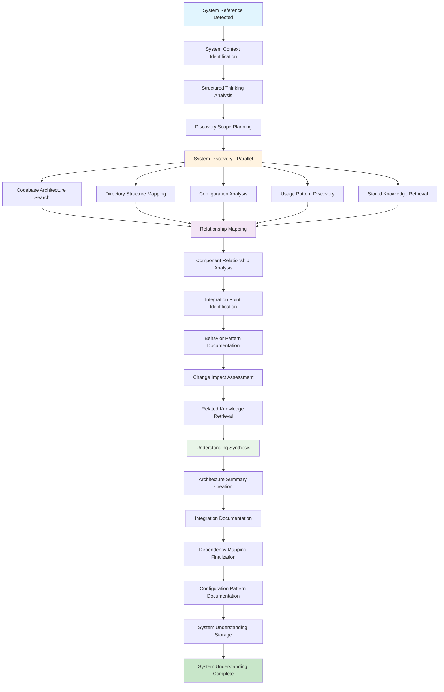

<!-- FILE_MAP_BEGIN 
<!--
{"file_metadata":{"title":"System Understanding Workflow v1.0 - Comprehensive Documentation","description":"Detailed documentation describing the System Understanding Workflow v1.0, including its purpose, architecture, phased breakdown, success metrics, tool integration, implementation requirements, enforcement points, and quality validation.","last_updated":"2025-07-31","type":"documentation"},"ai_instructions":"Analyze the document to identify major thematic sections that group related content logically, focusing on high-level navigation rather than granular subheadings. Extract key elements such as diagrams, code blocks, and critical conceptual frameworks that aid comprehension. Ensure line numbers are precise and sections do not overlap. Provide clear, concise section names and descriptions that reflect the document's structure and purpose, enabling efficient navigation and understanding of the System Understanding Workflow v1.0.","sections":[{"name":"Introduction and Overview","description":"Introduces the System Understanding Workflow, its purpose, and provides an overview of the systematic approach for technical system comprehension.","line_start":7,"line_end":11},{"name":"Workflow Diagram","description":"Visual representation of the System Understanding Workflow process using a Mermaid graph diagram illustrating the phases and their relationships.","line_start":12,"line_end":52},{"name":"Workflow Architecture","description":"Describes the design principles and key innovations that underpin the architecture of the System Understanding Workflow.","line_start":54,"line_end":67},{"name":"Phase-by-Phase Breakdown","description":"Detailed explanation of each phase in the workflow, including purpose, tools, strategies, and outputs for system context identification, discovery, relationship mapping, and synthesis.","line_start":69,"line_end":193},{"name":"Success Metrics","description":"Defines the criteria for measuring efficiency and quality improvements achieved through the workflow.","line_start":196,"line_end":206},{"name":"Tool Integration Details","description":"Details on managing rate limiting, error handling, failure recovery, and integration with existing systems for effective tool orchestration.","line_start":208,"line_end":223},{"name":"Implementation Requirements","description":"Specifies database schema needs, workflow infrastructure, and performance considerations necessary to support the workflow implementation.","line_start":225,"line_end":240},{"name":"Critical Enforcement Points","description":"Lists mandatory checkpoints and conditions that must be met to ensure the workflow's integrity and success.","line_start":242,"line_end":245},{"name":"Quality Gates & Validation","description":"Outlines validation criteria and quality gates to verify completeness and correctness of the system understanding process.","line_start":247,"line_end":258}],"key_elements":[{"name":"Mermaid Workflow Diagram","description":"Graphical Mermaid diagram illustrating the entire System Understanding Workflow process and phase relationships.","line":13},{"name":"Design Principles List","description":"Enumerated list of core design principles guiding the workflow architecture for comprehensive system analysis.","line":56},{"name":"Key Innovations List","description":"Bullet list highlighting innovative aspects integrated into the workflow for enhanced system understanding.","line":63},{"name":"Phase 1 and 2 Detailed Descriptions","description":"Comprehensive descriptions of Phase 1 (System Context Identification) and Phase 2 (System Discovery) including tools, inputs, outputs, and validation steps.","line":71},{"name":"Component Analysis Framework Code Block","description":"YAML code block defining analysis levels for component, architecture, project, and integration within relationship mapping.","line":127},{"name":"Phase 3 Relationship Mapping Details","description":"Detailed explanation of component relationship analysis, integration point identification, behavior documentation, change impact assessment, and knowledge retrieval.","line":122},{"name":"Phase 4 Understanding Synthesis Details","description":"Descriptions of synthesis activities including architecture summary creation, integration documentation, dependency mapping, configuration pattern documentation, and storage.","line":163},{"name":"Success Metrics Lists","description":"Lists of efficiency and quality improvements expected from the workflow implementation.","line":196},{"name":"Tool Integration Subsections","description":"Sections covering rate limiting, error handling, and integration with existing systems for robust workflow execution.","line":210},{"name":"Implementation Requirements Subsections","description":"Details on database schema, workflow infrastructure, and performance considerations critical for deployment.","line":227},{"name":"Critical Enforcement Points List","description":"Mandatory conditions and checkpoints ensuring proper workflow execution and system understanding integrity.","line":243},{"name":"Quality Gates & Validation Criteria","description":"Criteria and checkpoints to validate the completeness and accuracy of the system understanding process.","line":247}]}
-->
<!-- FILE_MAP_END -->

# System Understanding Workflow v1.0 - Comprehensive Documentation

## Overview
The System Understanding Workflow provides systematic technical system comprehension before modifications or integrations. It ensures thorough understanding of existing architecture, dependencies, and integration points through structured discovery and relationship mapping. This workflow prevents modification failures by establishing comprehensive system knowledge including component relationships, configuration patterns, and change impact boundaries.

## Workflow Diagram



## Workflow Architecture

### Design Principles
1. **Multi-Level Analysis**: Analyzes systems at component, architecture, project, and integration levels for comprehensive understanding
2. **Parallel Discovery**: Executes multiple discovery methods simultaneously for efficient and thorough system exploration
3. **Relationship-Centric Mapping**: Focuses on dependencies, integration points, and component relationships for impact assessment
4. **Evidence-Based Documentation**: Supports all findings with specific examples and concrete evidence from system exploration
5. **Change-Impact Aware**: Identifies modification boundaries and affected components for safe system evolution

### Key Innovations
- **Structured Thinking Integration**: Uses systematic cognitive analysis to plan discovery scope and architectural boundaries
- **Multi-Source Discovery**: Combines codebase analysis, filesystem exploration, and stored knowledge for comprehensive coverage
- **Integration-Point Focus**: Specifically identifies how systems connect to broader project architecture
- **Configuration Pattern Recognition**: Documents setup conventions and architectural patterns for consistent modifications

## Phase-by-Phase Breakdown

### Phase 1: System Context Identification
**Purpose**: Identify target system and establish structured discovery plan with architectural boundaries

#### 1.1 Structured Thinking Analysis
- **Tool**: `mcp_thinking_sequentialthinking`
- **Strategy**: 5-thought systematic analysis of system context and discovery requirements
- **Input**: User instruction with system/component references
- **Output**: System identified with discovery scope and architectural boundaries planned
- **Validation**: System identified and scope planned with clear boundaries

#### 1.2 Discovery Scope Planning
- **Action**: Establish discovery plan with architectural and integration boundaries
- **Input**: User-identified components and system references
- **Output**: Discovery plan with boundaries established for systematic exploration
- **Validation**: Discovery plan with boundaries established and scope clearly defined

### Phase 2: System Discovery
**Purpose**: Comprehensive system knowledge gathering from multiple sources with parallel execution
**Condition**: System context identified with discovery plan established

#### 2.1 Codebase Architecture Search
**Key Innovation**: Targeted architectural pattern discovery through semantic search

##### Architecture Pattern Identification
- **Tool**: `codebase_search`
- **Input**: System architecture patterns and component keywords
- **Strategy**: Search relevant system directories for architectural patterns
- **Returns**: Architectural patterns identified with component structure

##### Directory Structure Mapping
- **Tool**: `mcp_filesystem_list_files`
- **Input**: System directory structure with nested exploration
- **Strategy**: Map complete directory organization and file relationships
- **Returns**: Directory organization mapped with file structure documented

#### 2.2 Configuration and Documentation Analysis
- **Tool**: `mcp_filesystem_read_file`
- **Strategy**: Read configuration files, documentation, and key components
- **Input**: Configuration files, documentation files, key component files
- **Output**: Configuration and documentation analyzed with patterns identified

#### 2.3 Usage Pattern Discovery
- **Tool**: `grep_search`
- **Strategy**: Search for usage patterns, references, and dependencies across relevant file types
- **Output**: Usage patterns and dependencies identified with relationship mapping

#### 2.4 Stored Knowledge Integration
- **Tool**: `mcp_cognitive_tools_arango_search`
- **Strategy**: Content search for existing system knowledge and related documentation
- **Output**: Stored system knowledge retrieved and integrated with current discovery

### Phase 3: Relationship Mapping
**Purpose**: Map component relationships and integration points for comprehensive system understanding

#### Component Analysis Framework
```yaml
analysis_levels:
  component: how_specific_part_works
  architecture: how_fits_within_system
  project: how_integrates_with_project
  integration: what_depends_or_interacts
```

#### 3.1 Component Relationship Analysis
- **Action**: Analyze relationships and dependencies at all architectural levels
- **Input**: Discovered system components and architectural information
- **Output**: Relationships and dependencies mapped across all levels
- **Validation**: Component relationships mapped with dependency network documented

#### 3.2 Integration Point Identification
- **Action**: Identify how system integrates with broader project architecture
- **Input**: Target system information and broader project context
- **Output**: Integration points documented with connection details
- **Validation**: Integration points clearly documented with project connections

#### 3.3 Behavior Pattern Documentation
- **Action**: Document current system behavior and configuration patterns
- **Input**: Observed system behavior and discovered configuration patterns
- **Output**: Behavior patterns documented with configuration conventions
- **Validation**: Current behavior and patterns comprehensively documented

#### 3.4 Change Impact Assessment
- **Action**: Identify modification boundaries and affected components
- **Input**: System boundaries and mapped dependencies
- **Output**: Change impact boundaries identified with affected component analysis
- **Validation**: Change impact assessment complete with clear modification boundaries

#### 3.5 Related Knowledge Retrieval
- **Tool**: `mcp_cognitive_tools_arango_search`
- **Strategy**: Related search for architectural knowledge and similar systems
- **Output**: Related architectural knowledge retrieved and integrated

### Phase 4: Understanding Synthesis
**Purpose**: Synthesize comprehensive system understanding with documentation and storage

#### 4.1 Architecture Summary Creation
- **Action**: Create comprehensive architecture summary covering all analysis levels
- **Input**: All system discovery results from parallel exploration
- **Output**: Architecture summary comprehensive with component, system, project, integration coverage
- **Validation**: Architecture summary complete and comprehensive

#### 4.2 Integration Documentation
- **Action**: Document system connections to broader project architecture
- **Input**: Identified integration points and project context
- **Output**: Integration documentation complete with connection details
- **Validation**: Integration documentation comprehensive with all connections mapped

#### 4.3 Dependency Mapping Finalization
- **Action**: Finalize complete dependency network with change impact analysis
- **Input**: All discovered dependencies and change boundaries
- **Output**: Complete dependency map with impact assessment
- **Validation**: Dependency mapping complete with modification impact clearly defined

#### 4.4 Configuration Pattern Documentation
- **Action**: Document configuration conventions and setup patterns
- **Input**: Discovered configuration patterns and current system setup
- **Output**: Configuration patterns documented with setup conventions
- **Validation**: Configuration patterns comprehensive with convention documentation

#### 4.5 System Understanding Storage
- **Tool**: `mcp_cognitive_tools_arango_modify`
- **Strategy**: Store complete system understanding for future reference and building
- **Output**: System understanding stored with unique ID for tracking and reference
- **Validation**: Understanding stored successfully with database confirmation

## Success Metrics

### Efficiency Improvements
- **Parallel Discovery**: Faster discovery through concurrent multi-source exploration
- **Structured Analysis**: Enhanced discovery completeness through systematic methodology
- **Knowledge Integration**: Enhanced efficiency through existing knowledge incorporation

### Quality Improvements
- **Comprehensive Coverage**: Complete system coverage across component, architecture, project, integration levels
- **Evidence-Based Documentation**: All findings supported by specific examples and concrete evidence
- **Change-Impact Awareness**: Accurate modification boundary identification

## Tool Integration Details

### Rate Limiting & API Management
- **Parallel Execution**: Optimized concurrent tool usage for discovery efficiency
- **Database Operations**: Efficient search and storage operations with appropriate limits
- **Filesystem Operations**: Batch file reading with structured directory exploration

### Error Handling & Failure Recovery
- **Discovery Failures**: Alternative discovery methods with graceful degradation
- **Knowledge Integration Issues**: Fallback to manual analysis with validation protocols
- **Storage Failures**: Retry mechanisms with alternative documentation methods

### Integration with Existing Systems
- **Knowledge Base Integration**: Leverages existing system documentation and architectural knowledge
- **Project Architecture Integration**: Connects with broader project understanding and documentation
- **Configuration Management Integration**: Incorporates existing configuration patterns and conventions

## Implementation Requirements

### Database Schema Requirements
- Collections: system_understanding, system_architecture, configuration_patterns
- Relationship mapping capabilities for dependency networks
- Integration point documentation for project connections

### Workflow Infrastructure
- Parallel discovery execution capability with multiple tool orchestration
- Structured thinking integration for systematic analysis planning
- Comprehensive documentation synthesis with evidence linking

### Performance Considerations
- Parallel tool execution for discovery efficiency optimization
- Structured analysis methodology for comprehensive coverage
- Evidence compilation for change impact assessment accuracy

## Critical Enforcement Points
- **MANDATORY**: Systematic context identification before discovery begins
- **MANDATORY**: Comprehensive discovery from multiple sources with parallel execution
- **MANDATORY**: Relationship mapping at all architectural levels before synthesis

## Quality Gates & Validation
- System identified with discovery plan established and boundaries defined
- Discovery comprehensive from multiple sources with architectural patterns mapped
- Relationships mapped with integration points and dependencies documented
- Understanding synthesized with architecture summary and dependency map complete

This documentation provides the foundation for implementing the System Understanding Workflow v1.0 with full traceability from requirements to execution.
