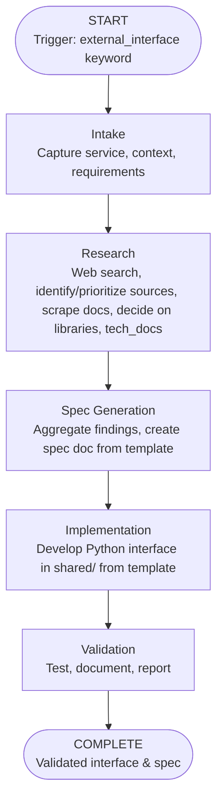

<!-- FILE_MAP_BEGIN 
<!--
{"file_metadata":{"title":"External Interface Generation Workflow - Comprehensive Documentation","description":"This document details the External Interface Generation Workflow, providing a systematic process for researching, specifying, implementing, and validating new shared interfaces for external services in the project.","last_updated":"2025-07-31","type":"documentation"},"ai_instructions":"Analyze the document to identify its hierarchical structure and logical sections based on headings and content themes. Extract key elements such as code blocks, diagrams, and important concepts that aid navigation and comprehension. Ensure all line numbers are accurate and sections do not overlap. Provide a clear, navigable file map with descriptive section names and detailed descriptions to facilitate understanding of the workflow and its components.","sections":[{"name":"Document Title and Introduction","description":"Title of the document and initial introduction to the External Interface Generation Workflow.","line_start":7,"line_end":8},{"name":"Overview","description":"Provides a high-level summary of the External Interface Generation Workflow, its purpose, and scope within the project.","line_start":9,"line_end":11},{"name":"Workflow Diagram","description":"Visual representation of the workflow stages using a Mermaid graph diagram illustrating the process flow from start to completion.","line_start":12,"line_end":22},{"name":"Phase-by-Phase Breakdown","description":"Detailed explanation of each phase in the workflow, including Intake, Research, Spec Generation, Implementation, and Validation.","line_start":24,"line_end":56},{"name":"Validation & Success Criteria","description":"Defines the criteria and standards that must be met for successful validation of the external interface generation process.","line_start":57,"line_end":63},{"name":"Update & Enhancement Instructions","description":"Guidelines for updating and enhancing the workflow documentation and related templates to keep them current with project standards.","line_start":64,"line_end":69},{"name":"References","description":"Lists related files and templates referenced in the workflow documentation for further context and implementation support.","line_start":70,"line_end":74}],"key_elements":[{"name":"Mermaid Workflow Diagram","description":"A Mermaid syntax graph illustrating the sequential stages of the External Interface Generation Workflow from start to completion.","line":13},{"name":"Phase 1: Intake","description":"Key tasks for capturing service/API details, documenting requirements, and loading standards for traceability.","line":26},{"name":"Phase 2: Research (Sequential)","description":"Steps for researching APIs and libraries, prioritizing sources, scraping documentation, and aggregating findings.","line":32},{"name":"Phase 3: Spec Generation","description":"Instructions for synthesizing research into a comprehensive markdown specification using a predefined template.","line":40},{"name":"Phase 4: Implementation","description":"Guidance on designing and implementing the Python interface, adhering to standards and using templates for consistency.","line":45},{"name":"Phase 5: Validation","description":"Details on testing interface methods, analyzing results, documenting validation, and storing metadata.","line":51},{"name":"Validation & Success Criteria List","description":"Enumerated criteria that must be fulfilled for the interface and specification to be considered successfully validated.","line":57},{"name":"Update & Enhancement Instructions List","description":"Stepwise instructions for maintaining and updating the workflow and associated templates to reflect current standards.","line":64},{"name":"References List","description":"A list of related workflow YAML and template files referenced in the documentation for implementation and specification.","line":70}]}
-->
<!-- FILE_MAP_END -->

# External Interface Generation Workflow - Comprehensive Documentation

## Overview
The External Interface Generation Workflow provides a systematic, repeatable process for researching, specifying, and implementing new shared interfaces for external services (e.g., OpenAI API, SaaS APIs) in the project. It ensures that all interfaces are robust, well-documented, and compliant with project standards.

## Workflow Diagram

## Phase-by-Phase Breakdown

### 1. Intake
- Capture the target service/API and use case
- Document requirements and context
- Load relevant development and documentation standards
- Record timestamp for traceability

### 2. Research (Sequential)
- Web search for available APIs/libraries (prioritize official docs)
- Identify and prioritize sources for detailed information
- Scrape and extract content from high-value URLs
- Decide on which libraries/APIs to use based on findings
- Use tech_docs tools to pull latest details for selected libraries/APIs
- Aggregate all findings for spec generation

### 3. Spec Generation
- Synthesize research into a comprehensive markdown spec using the EXTERNAL_INTERFACE_SPEC_TEMPLATE.md
- Populate all required sections (overview, auth, core ops, advanced features, etc.)
- Cross-reference related specs and documentation

### 4. Implementation
- Design and implement the Python interface in src/shared/ using the generated spec as the authoritative reference
- Use a Python interface script template for consistency (see INTERFACE_SCRIPT_TEMPLATE.py)
- Adhere to development and Python standards
- Add docstrings and comments for maintainability

### 5. Validation
- Write and run tests for all interface methods
- Analyze test results and flag issues
- Document validation results in a report
- Store validation metadata in the research_docs collection

## Validation & Success Criteria
- Official documentation must be scraped and referenced
- Spec must be comprehensive and follow the template
- Interface code must be documented and tested
- All standards (development, Python, documentation) must be met
- Validation report must be created and stored

## Update & Enhancement Instructions
- To update this workflow, review the latest standards and project requirements
- Update the workflow YAML and this documentation file in parallel
- Ensure the EXTERNAL_INTERFACE_SPEC_TEMPLATE.md and INTERFACE_SCRIPT_TEMPLATE.py are current and referenced
- Communicate changes to all agents and maintainers

## References
- .cursor/workflows/external_interface_generation.yml
- docs/project/EXTERNAL_INTERFACE_SPEC_TEMPLATE.md
- src/shared/INTERFACE_SCRIPT_TEMPLATE.py
