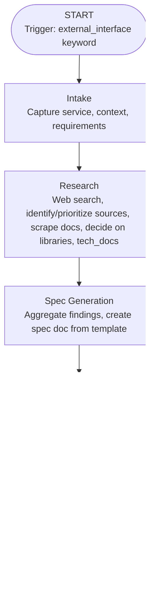

<!-- FILE_MAP_BEGIN 
<!--
{"file_metadata":{"title":"External Interface Generation Workflow - Comprehensive Documentation","description":"This document details the External Interface Generation Workflow, outlining a systematic process for researching, specifying, implementing, and validating new shared interfaces for external services within the project.","last_updated":"2025-07-31","type":"documentation"},"ai_instructions":"Analyze the document by recognizing its hierarchical structure and logical flow. Identify major sections and subsections, ensuring precise line boundaries without overlap. Extract key elements such as code blocks, diagrams, and important concepts that aid navigation and comprehension. Provide a structured JSON map with detailed sections and key elements, including exact line numbers and clear descriptions to facilitate efficient referencing and understanding of the workflow.","sections":[{"name":"Document Title and Introduction","description":"Title of the document and initial introduction to the External Interface Generation Workflow.","line_start":7,"line_end":8},{"name":"Overview","description":"Provides a high-level summary of the External Interface Generation Workflow, its purpose, and scope.","line_start":9,"line_end":11},{"name":"Workflow Diagram","description":"Visual representation of the workflow stages using a Mermaid graph diagram.","line_start":12,"line_end":22},{"name":"Phase-by-Phase Breakdown","description":"Detailed explanation of each phase in the workflow, including Intake, Research, Spec Generation, Implementation, and Validation.","line_start":24,"line_end":56},{"name":"Validation & Success Criteria","description":"Criteria that must be met for the workflow to be considered successful, including documentation, testing, and standards compliance.","line_start":57,"line_end":63},{"name":"Update & Enhancement Instructions","description":"Guidelines for updating and maintaining the workflow documentation and related templates.","line_start":64,"line_end":69},{"name":"References","description":"List of related files and templates referenced by the workflow documentation.","line_start":70,"line_end":74}],"key_elements":[{"name":"Mermaid Workflow Diagram","description":"A Mermaid syntax graph illustrating the sequential stages of the External Interface Generation Workflow.","line":13},{"name":"Phase 1: Intake","description":"Details the initial phase focused on capturing service information, requirements, and context.","line":26},{"name":"Phase 2: Research (Sequential)","description":"Describes the research activities including web search, source prioritization, and data aggregation.","line":32},{"name":"Phase 3: Spec Generation","description":"Explains the synthesis of research into a markdown specification document using a predefined template.","line":40},{"name":"Phase 4: Implementation","description":"Covers the design and coding of the Python interface based on the generated specification.","line":45},{"name":"Phase 5: Validation","description":"Focuses on testing, documenting results, and storing validation metadata.","line":51},{"name":"EXTERNAL_INTERFACE_SPEC_TEMPLATE.md Reference","description":"Mentioned template used for generating the specification document.","line":42},{"name":"INTERFACE_SCRIPT_TEMPLATE.py Reference","description":"Python interface script template referenced for implementation consistency.","line":48},{"name":"Validation & Success Criteria List","description":"Enumerates the standards and requirements that must be met for successful workflow completion.","line":57},{"name":"Update & Enhancement Instructions List","description":"Instructions for maintaining and updating the workflow documentation and related files.","line":64},{"name":"References List","description":"Lists related workflow YAML and template files for cross-reference and further context.","line":70}]}
-->
<!-- FILE_MAP_END -->

# External Interface Generation Workflow - Comprehensive Documentation

## Overview
The External Interface Generation Workflow provides a systematic, repeatable process for researching, specifying, and implementing new shared interfaces for external services (e.g., OpenAI API, SaaS APIs) in the project. It ensures that all interfaces are robust, well-documented, and compliant with project standards.

## Workflow Diagram

## Phase-by-Phase Breakdown

### 1. Intake
- Capture the target service/API and use case
- Document requirements and context
- Load relevant development and documentation standards
- Record timestamp for traceability

### 2. Research (Sequential)
- Web search for available APIs/libraries (prioritize official docs)
- Identify and prioritize sources for detailed information
- Scrape and extract content from high-value URLs
- Decide on which libraries/APIs to use based on findings
- Use tech_docs tools to pull latest details for selected libraries/APIs
- Aggregate all findings for spec generation

### 3. Spec Generation
- Synthesize research into a comprehensive markdown spec using the EXTERNAL_INTERFACE_SPEC_TEMPLATE.md
- Populate all required sections (overview, auth, core ops, advanced features, etc.)
- Cross-reference related specs and documentation

### 4. Implementation
- Design and implement the Python interface in src/shared/ using the generated spec as the authoritative reference
- Use a Python interface script template for consistency (see INTERFACE_SCRIPT_TEMPLATE.py)
- Adhere to development and Python standards
- Add docstrings and comments for maintainability

### 5. Validation
- Write and run tests for all interface methods
- Analyze test results and flag issues
- Document validation results in a report
- Store validation metadata in the research_docs collection

## Validation & Success Criteria
- Official documentation must be scraped and referenced
- Spec must be comprehensive and follow the template
- Interface code must be documented and tested
- All standards (development, Python, documentation) must be met
- Validation report must be created and stored

## Update & Enhancement Instructions
- To update this workflow, review the latest standards and project requirements
- Update the workflow YAML and this documentation file in parallel
- Ensure the EXTERNAL_INTERFACE_SPEC_TEMPLATE.md and INTERFACE_SCRIPT_TEMPLATE.py are current and referenced
- Communicate changes to all agents and maintainers

## References
- .cursor/workflows/external_interface_generation.yml
- docs/project/EXTERNAL_INTERFACE_SPEC_TEMPLATE.md
- src/shared/INTERFACE_SCRIPT_TEMPLATE.py
