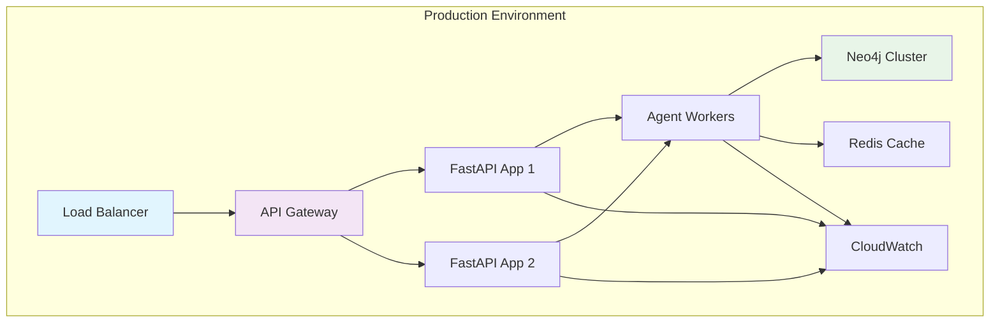

<!-- FILE_MAP_BEGIN 
<!--
{"file_metadata":{"title":"Deployment Guide","description":"Comprehensive guide for deploying the ACCF Research Agent using Docker Compose, Kubernetes, and AWS ECS, including environment configuration, monitoring, security, rollback, performance optimization, and troubleshooting.","last_updated":"2025-07-31","type":"documentation"},"ai_instructions":"Analyze the deployment.md document to extract a structured file map that groups related content into high-level logical sections for efficient navigation. Focus on major deployment options, configuration, monitoring, security, rollback procedures, performance, and troubleshooting. Capture key code blocks, configuration files, commands, and tables as important elements with precise line references. Ensure sections have clear names and non-overlapping line ranges, reflecting the document's thematic organization and aiding user comprehension.","sections":[{"name":"Introduction and Deployment Architecture","description":"Overview of the deployment guide and the architecture diagram illustrating the production environment components and their interactions.","line_start":7,"line_end":41},{"name":"Deployment Options","description":"Detailed instructions and configuration examples for deploying using Docker Compose, Kubernetes, and AWS ECS, including relevant YAML and JSON files and deployment commands.","line_start":42,"line_end":300},{"name":"Environment Configuration and Secrets Management","description":"Environment variables required for deployment and instructions for managing secrets using AWS Secrets Manager and Kubernetes Secrets.","line_start":301,"line_end":356},{"name":"Monitoring Setup","description":"Configuration of CloudWatch dashboards and alerting rules to monitor application performance and system resources.","line_start":357,"line_end":429},{"name":"CI/CD Pipeline","description":"GitHub Actions workflow configuration for automated deployment to production environments.","line_start":430,"line_end":456},{"name":"Security Configuration","description":"Network security group settings and IAM roles definitions to secure the deployment environment.","line_start":457,"line_end":500},{"name":"Rollback Procedures","description":"Step-by-step rollback instructions for Docker Compose, Kubernetes, and AWS ECS deployments, including commands to revert to previous versions.","line_start":501,"line_end":528},{"name":"Performance Optimization","description":"Resource allocation recommendations, scaling strategies, and Kubernetes Horizontal Pod Autoscaler configuration for optimal performance.","line_start":529,"line_end":569},{"name":"Troubleshooting","description":"Common issues, their symptoms, solutions, and debug commands to diagnose and resolve deployment problems.","line_start":570,"line_end":600}],"key_elements":[{"name":"Deployment Architecture Diagram","description":"Mermaid graph illustrating the production environment components and their interactions.","line":12},{"name":"Docker Compose Configuration","description":"docker-compose.yml example for development and staging deployments with service definitions and environment variables.","line":45},{"name":"Docker Compose Deployment Commands","description":"Commands to start, view logs, scale, and stop Docker Compose services.","line":81},{"name":"Kubernetes Deployment YAML","description":"Kubernetes deployment manifest defining pods, containers, environment variables, probes, and resource limits.","line":113},{"name":"Kubernetes Service YAML","description":"Service manifest exposing the deployment with LoadBalancer type and port configuration.","line":177},{"name":"Kubernetes Ingress YAML","description":"Ingress manifest configuring TLS, host rules, and backend service routing.","line":194},{"name":"Kubernetes Deployment Commands","description":"kubectl commands to apply configurations, check status, view logs, and scale deployments.","line":223},{"name":"AWS ECS Task Definition JSON","description":"Task definition for AWS ECS including container definitions, environment variables, secrets, logging, and health checks.","line":242},{"name":"Environment Variables List","description":"List of required environment variables for application, database, external APIs, performance, and monitoring.","line":302},{"name":"AWS Secrets Manager Commands","description":"Commands to create secrets for Neo4j and OpenAI API keys in AWS Secrets Manager.","line":328},{"name":"Kubernetes Secrets Commands","description":"Commands to create Kubernetes secrets for Neo4j and OpenAI API keys in the production namespace.","line":344},{"name":"CloudWatch Dashboard JSON","description":"JSON configuration for CloudWatch dashboards monitoring API performance and system resources.","line":360},{"name":"CloudWatch Alarm YAML","description":"YAML configuration defining CloudWatch alarms for high error rate and high response time.","line":400},{"name":"GitHub Actions Workflow YAML","description":"GitHub Actions workflow for deploying to ECS on push to main branch.","line":436},{"name":"AWS Security Groups YAML","description":"Security group configuration for application ingress and egress rules.","line":463},{"name":"IAM Roles JSON","description":"IAM policy allowing CloudWatch metrics, Secrets Manager access, and CloudWatch Logs operations.","line":481},{"name":"Docker Compose Rollback Commands","description":"Commands to rollback Docker Compose deployment to a previous version.","line":504},{"name":"Kubernetes Rollback Commands","description":"kubectl commands to rollback deployment and check rollback status.","line":512},{"name":"ECS Rollback Command","description":"AWS CLI command to update ECS service to previous task definition.","line":521},{"name":"Performance Resource Allocation Table","description":"Table detailing CPU, memory, and storage allocations for application components.","line":530},{"name":"Kubernetes Horizontal Pod Autoscaler YAML","description":"YAML manifest configuring autoscaling based on CPU and memory utilization.","line":541},{"name":"Troubleshooting Issues Table","description":"Table listing common issues, symptoms, and solutions for deployment problems.","line":573},{"name":"Debug Commands","description":"Commands to check application logs, health status, metrics, and resource usage.","line":582}]}
-->
<!-- FILE_MAP_END -->

# Deployment Guide

This guide covers deploying the ACCF Research Agent to production environments using modern DevOps practices.

## 🏗️ Deployment Architecture



## 🚀 Deployment Options

### Option 1: Docker Compose (Development/Staging)

**Best for**: Development, testing, and small-scale deployments

```yaml
# docker-compose.yml
version: '3.8'

services:
  app:
    build: .
    ports:
      - "8000:8000"
    environment:
      - NEO4J_URI=bolt://neo4j:7687
      - NEO4J_USERNAME=neo4j
      - NEO4J_PASSWORD=password
      - OPENAI_API_KEY=${OPENAI_API_KEY}
    depends_on:
      - neo4j
      - redis
    restart: unless-stopped

  neo4j:
    image: neo4j:5.15
    environment:
      - NEO4J_AUTH=neo4j/password
      - NEO4J_PLUGINS=["apoc", "graph-data-science"]
    ports:
      - "7474:7474"
      - "7687:7687"
    volumes:
      - neo4j_data:/data
    restart: unless-stopped

  redis:
    image: redis:7-alpine
    ports:
      - "6379:6379"
    volumes:
      - redis_data:/data
    restart: unless-stopped

volumes:
  neo4j_data:
  redis_data:
```

**Deployment Commands:**
```bash
# Start services
docker-compose up -d

# View logs
docker-compose logs -f app

# Scale application
docker-compose up -d --scale app=3

# Stop services
docker-compose down
```

### Option 2: Kubernetes (Production)

**Best for**: Production environments with high availability requirements

```yaml
# k8s/deployment.yaml
apiVersion: apps/v1
kind: Deployment
metadata:
  name: accf-research-agent
  namespace: production
spec:
  replicas: 3
  selector:
    matchLabels:
      app: accf-research-agent
  template:
    metadata:
      labels:
        app: accf-research-agent
    spec:
      containers:
      - name: app
        image: ghcr.io/accf/research-agent:latest
        ports:
        - containerPort: 8000
        env:
        - name: NEO4J_URI
          valueFrom:
            secretKeyRef:
              name: neo4j-secret
              key: uri
        - name: NEO4J_USERNAME
          valueFrom:
            secretKeyRef:
              name: neo4j-secret
              key: username
        - name: NEO4J_PASSWORD
          valueFrom:
            secretKeyRef:
              name: neo4j-secret
              key: password
        - name: OPENAI_API_KEY
          valueFrom:
            secretKeyRef:
              name: openai-secret
              key: api-key
        livenessProbe:
          httpGet:
            path: /health/live
            port: 8000
          initialDelaySeconds: 30
          periodSeconds: 10
        readinessProbe:
          httpGet:
            path: /health/ready
            port: 8000
          initialDelaySeconds: 5
          periodSeconds: 5
        resources:
          requests:
            memory: "512Mi"
            cpu: "250m"
          limits:
            memory: "1Gi"
            cpu: "500m"
```

```yaml
# k8s/service.yaml
apiVersion: v1
kind: Service
metadata:
  name: accf-research-agent-service
  namespace: production
spec:
  selector:
    app: accf-research-agent
  ports:
  - protocol: TCP
    port: 80
    targetPort: 8000
  type: LoadBalancer
```

```yaml
# k8s/ingress.yaml
apiVersion: networking.k8s.io/v1
kind: Ingress
metadata:
  name: accf-research-agent-ingress
  namespace: production
  annotations:
    kubernetes.io/ingress.class: nginx
    cert-manager.io/cluster-issuer: letsencrypt-prod
spec:
  tls:
  - hosts:
    - api.accf-research-agent.com
    secretName: accf-research-agent-tls
  rules:
  - host: api.accf-research-agent.com
    http:
      paths:
      - path: /
        pathType: Prefix
        backend:
          service:
            name: accf-research-agent-service
            port:
              number: 80
```

**Deployment Commands:**
```bash
# Apply configurations
kubectl apply -f k8s/

# Check deployment status
kubectl get pods -n production
kubectl get services -n production

# View logs
kubectl logs -f deployment/accf-research-agent -n production

# Scale deployment
kubectl scale deployment accf-research-agent --replicas=5 -n production
```

### Option 3: AWS ECS (Cloud-Native)

**Best for**: AWS-native deployments with managed services

```yaml
# ecs/task-definition.json
{
  "family": "accf-research-agent",
  "networkMode": "awsvpc",
  "requiresCompatibilities": ["FARGATE"],
  "cpu": "512",
  "memory": "1024",
  "executionRoleArn": "arn:aws:iam::123456789012:role/ecsTaskExecutionRole",
  "taskRoleArn": "arn:aws:iam::123456789012:role/accf-research-agent-task-role",
  "containerDefinitions": [
    {
      "name": "app",
      "image": "ghcr.io/accf/research-agent:latest",
      "portMappings": [
        {
          "containerPort": 8000,
          "protocol": "tcp"
        }
      ],
      "environment": [
        {
          "name": "APP_ENV",
          "value": "production"
        }
      ],
      "secrets": [
        {
          "name": "NEO4J_URI",
          "valueFrom": "arn:aws:secretsmanager:us-east-1:123456789012:secret:neo4j-uri"
        },
        {
          "name": "OPENAI_API_KEY",
          "valueFrom": "arn:aws:secretsmanager:us-east-1:123456789012:secret:openai-api-key"
        }
      ],
      "logConfiguration": {
        "logDriver": "awslogs",
        "options": {
          "awslogs-group": "/ecs/accf-research-agent",
          "awslogs-region": "us-east-1",
          "awslogs-stream-prefix": "ecs"
        }
      },
      "healthCheck": {
        "command": ["CMD-SHELL", "curl -f http://localhost:8000/health/live || exit 1"],
        "interval": 30,
        "timeout": 5,
        "retries": 3,
        "startPeriod": 60
      }
    }
  ]
}
```

## 🔧 Environment Configuration

### Required Environment Variables

```env
# Application
APP_ENV=production
LOG_LEVEL=INFO
DEBUG=false

# Database
NEO4J_URI=bolt://your-neo4j-instance:7687
NEO4J_USERNAME=neo4j
NEO4J_PASSWORD=secure-password
NEO4J_DATABASE=neo4j

# External APIs
OPENAI_API_KEY=your-openai-api-key
NEWS_API_KEY=your-news-api-key
ACADEMIC_API_KEY=your-academic-api-key

# Performance
MAX_CONCURRENT_AGENTS=10
AGENT_TIMEOUT=300
CACHE_TTL=3600

# Monitoring
AWS_REGION=us-east-1
CLOUDWATCH_NAMESPACE=ACCF/ResearchAgent
```

### Secrets Management

#### AWS Secrets Manager
```bash
# Store secrets
aws secretsmanager create-secret \
  --name "accf-research-agent/neo4j" \
  --description "Neo4j database credentials" \
  --secret-string '{"uri":"bolt://neo4j:7687","username":"neo4j","password":"secure-password"}'

aws secretsmanager create-secret \
  --name "accf-research-agent/openai" \
  --description "OpenAI API key" \
  --secret-string '{"api-key":"your-openai-api-key"}'
```

#### Kubernetes Secrets
```bash
# Create secrets
kubectl create secret generic neo4j-secret \
  --from-literal=uri=bolt://neo4j:7687 \
  --from-literal=username=neo4j \
  --from-literal=password=secure-password \
  -n production

kubectl create secret generic openai-secret \
  --from-literal=api-key=your-openai-api-key \
  -n production
```

## 📊 Monitoring Setup

### CloudWatch Dashboards

```json
{
  "widgets": [
    {
      "type": "metric",
      "properties": {
        "metrics": [
          ["ACCF/ResearchAgent", "response_time", "endpoint", "/api/v1/research"],
          [".", "request_count", ".", "."],
          [".", "error_count", ".", "."]
        ],
        "period": 300,
        "stat": "Average",
        "region": "us-east-1",
        "title": "API Performance"
      }
    },
    {
      "type": "metric",
      "properties": {
        "metrics": [
          ["ACCF/ResearchAgent", "cpu_usage"],
          [".", "memory_usage"],
          [".", "disk_usage"]
        ],
        "period": 300,
        "stat": "Average",
        "region": "us-east-1",
        "title": "System Resources"
      }
    }
  ]
}
```

### Alerting Rules

```yaml
# cloudwatch-alarms.yaml
Alarms:
  HighErrorRate:
    Type: AWS::CloudWatch::Alarm
    Properties:
      AlarmName: accf-research-agent-high-error-rate
      MetricName: error_count
      Namespace: ACCF/ResearchAgent
      Statistic: Sum
      Period: 300
      EvaluationPeriods: 2
      Threshold: 10
      ComparisonOperator: GreaterThanThreshold
      AlarmActions:
        - !Ref SNSTopicArn

  HighResponseTime:
    Type: AWS::CloudWatch::Alarm
    Properties:
      AlarmName: accf-research-agent-high-response-time
      MetricName: response_time
      Namespace: ACCF/ResearchAgent
      Statistic: p95
      Period: 300
      EvaluationPeriods: 2
      Threshold: 250
      ComparisonOperator: GreaterThanThreshold
      AlarmActions:
        - !Ref SNSTopicArn
```

## 🔄 CI/CD Pipeline

### GitHub Actions Deployment

```yaml
# .github/workflows/deploy.yml
name: Deploy to Production

on:
  push:
    branches: [ main ]

jobs:
  deploy:
    runs-on: ubuntu-latest
    needs: [quality-gates]

    steps:
      - name: Deploy to ECS
        uses: aws-actions/amazon-ecs-deploy-task-definition@v1
        with:
          task-definition: ecs/task-definition.json
          service: accf-research-agent-service
          cluster: accf-research-agent-cluster
          wait-for-service-stability: true
```

## 🔒 Security Configuration

### Network Security

```yaml
# Security groups for AWS
SecurityGroups:
  AppSecurityGroup:
    Type: AWS::EC2::SecurityGroup
    Properties:
      GroupDescription: Security group for ACCF Research Agent
      SecurityGroupIngress:
        - IpProtocol: tcp
          FromPort: 8000
          ToPort: 8000
          SourceSecurityGroupId: !Ref LoadBalancerSecurityGroup
      SecurityGroupEgress:
        - IpProtocol: tcp
          FromPort: 7687
          ToPort: 7687
          DestinationSecurityGroupId: !Ref Neo4jSecurityGroup
```

### IAM Roles

```json
{
  "Version": "2012-10-17",
  "Statement": [
    {
      "Effect": "Allow",
      "Action": [
        "cloudwatch:PutMetricData",
        "secretsmanager:GetSecretValue",
        "logs:CreateLogGroup",
        "logs:CreateLogStream",
        "logs:PutLogEvents"
      ],
      "Resource": "*"
    }
  ]
}
```

## 🚨 Rollback Procedures

### Docker Compose Rollback
```bash
# Rollback to previous version
docker-compose down
docker tag accf/research-agent:previous accf/research-agent:latest
docker-compose up -d
```

### Kubernetes Rollback
```bash
# Rollback deployment
kubectl rollout undo deployment/accf-research-agent -n production

# Check rollback status
kubectl rollout status deployment/accf-research-agent -n production
```

### ECS Rollback
```bash
# Rollback to previous task definition
aws ecs update-service \
  --cluster accf-research-agent-cluster \
  --service accf-research-agent-service \
  --task-definition accf-research-agent:previous
```

## 📈 Performance Optimization

### Resource Allocation

| Component          | CPU         | Memory   | Storage  |
| ------------------ | ----------- | -------- | -------- |
| **FastAPI App**    | 2 cores     | 4GB      | 10GB     |
| **Neo4j Database** | 4 cores     | 16GB     | 100GB+   |
| **Agent Workers**  | 1 core each | 2GB each | 5GB each |
| **Redis Cache**    | 1 core      | 2GB      | 10GB     |

### Scaling Strategies

```yaml
# Horizontal Pod Autoscaler for Kubernetes
apiVersion: autoscaling/v2
kind: HorizontalPodAutoscaler
metadata:
  name: accf-research-agent-hpa
spec:
  scaleTargetRef:
    apiVersion: apps/v1
    kind: Deployment
    name: accf-research-agent
  minReplicas: 3
  maxReplicas: 10
  metrics:
  - type: Resource
    resource:
      name: cpu
      target:
        type: Utilization
        averageUtilization: 70
  - type: Resource
    resource:
      name: memory
      target:
        type: Utilization
        averageUtilization: 80
```

## 🔍 Troubleshooting

### Common Issues

| Issue                     | Symptoms                  | Solution                                              |
| ------------------------- | ------------------------- | ----------------------------------------------------- |
| **High Memory Usage**     | OOM kills, slow responses | Increase memory limits, optimize agent cleanup        |
| **Database Connection**   | Connection timeouts       | Check Neo4j availability, connection pool settings    |
| **API Timeouts**          | 504 Gateway Timeout       | Increase timeout settings, optimize agent execution   |
| **Health Check Failures** | Pod restarts              | Check dependencies, review health check configuration |

### Debug Commands

```bash
# Check application logs
kubectl logs -f deployment/accf-research-agent -n production

# Check health status
curl http://localhost:8000/health/status

# Monitor metrics
curl http://localhost:8000/health/metrics

# Check resource usage
kubectl top pods -n production
```

---

This deployment guide provides comprehensive coverage for production-ready deployments across different environments and platforms.