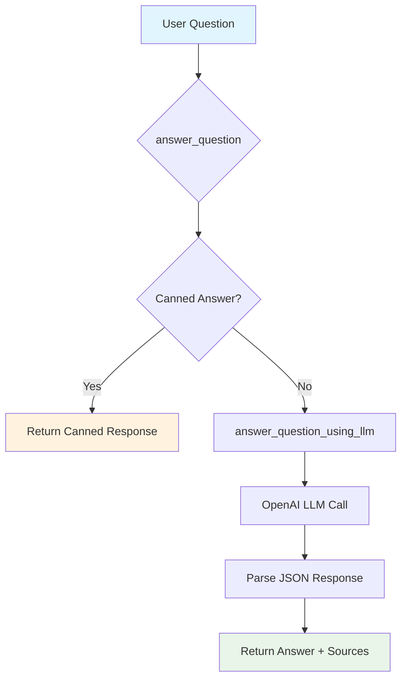
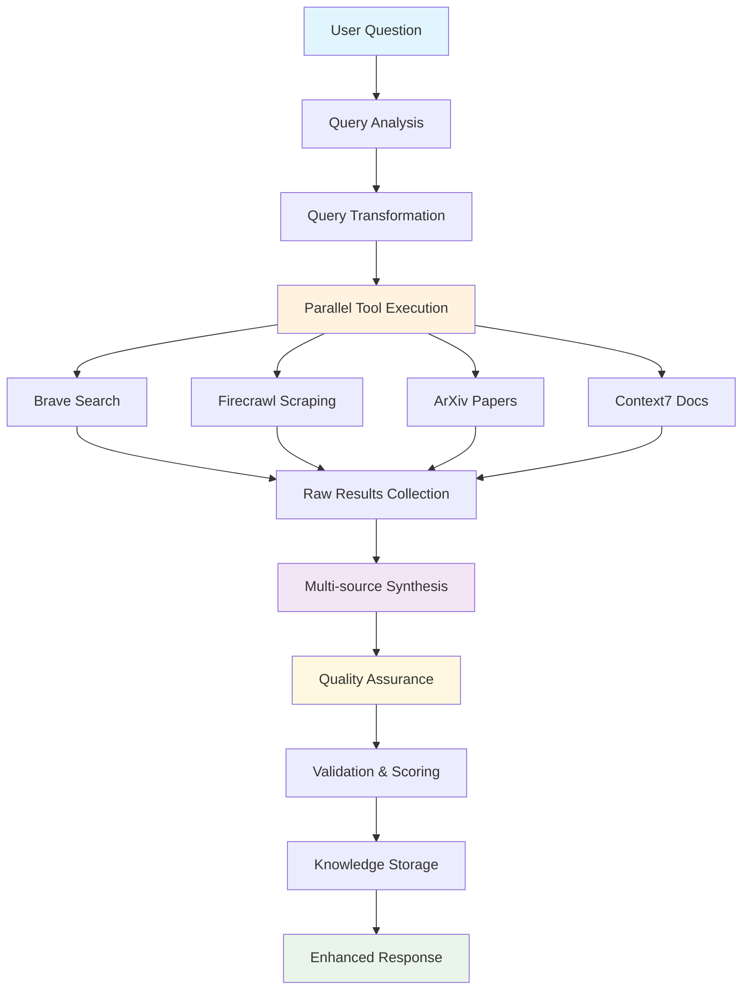

<!-- FILE_MAP_BEGIN 
<!--
{"file_metadata":{"title":"Current vs Desired State Analysis","description":"Comprehensive analysis comparing the current production research agent capabilities with the desired enhanced state, including capability gaps, implementation roadmap, architecture considerations, and success metrics.","last_updated":"2025-07-31","type":"documentation"},"ai_instructions":"Analyze the document by focusing on major thematic sections that group related content logically. Prioritize high-level navigation points over granular subheadings to maintain clarity and usability. Ensure all line numbers are accurate and sections do not overlap. Identify key elements such as code blocks, tables, diagrams, and references that are critical for understanding the document. Provide clear, concise section names and descriptions that reflect the document's structure and purpose. The output JSON must include file metadata, a single string of AI instructions, logically grouped sections with precise line ranges, and key elements with descriptions and line numbers.","sections":[{"name":"Introduction and Roadmap Overview","description":"Introduces the document purpose, date, and approach, and provides the ACCF Research Agent Enhancement Roadmap overview.","line_start":7,"line_end":15},{"name":"Current Production State Analysis","description":"Details the current functionality flow, capabilities, and limitations of the existing research agent system.","line_start":16,"line_end":55},{"name":"Desired Enhanced State","description":"Describes the desired functionality flow and enhanced capabilities planned for the research agent.","line_start":56,"line_end":98},{"name":"Capability Gap Analysis and Reference Implementations","description":"Analyzes capability gaps between current and desired states, including detailed reference code examples for external research tools, multi-source gathering, query transformation, and synthesis and validation.","line_start":99,"line_end":198},{"name":"Implementation Roadmap","description":"Outlines the phased implementation plan for enhancing the research agent, including goals, tasks, and reference files for each phase.","line_start":199,"line_end":259},{"name":"Architecture Considerations","description":"Discusses key architectural aspects such as maintainability, performance, error handling, and compliance requirements for the enhanced system.","line_start":260,"line_end":283},{"name":"Success Metrics","description":"Defines functional, performance, and quality metrics to evaluate the success of the research agent enhancements.","line_start":284,"line_end":312},{"name":"Next Steps","description":"Summarizes immediate actions to begin the implementation phases and integration with the current system.","line_start":313,"line_end":319}],"key_elements":[{"name":"Current Functionality Flow Diagram","description":"Mermaid diagram illustrating the current question answering flow using LLM and canned responses.","line":19},{"name":"Current Capabilities Table","description":"Table listing current system capabilities, their status, and implementation references.","line":36},{"name":"Current Limitations List","description":"Bullet list highlighting missing features and limitations in the current system.","line":46},{"name":"Desired Functionality Flow Diagram","description":"Mermaid diagram showing the enhanced multi-tool parallel execution and synthesis workflow.","line":59},{"name":"Desired Capabilities Table","description":"Table outlining desired capabilities with priorities and reference examples.","line":87},{"name":"Brave Search Integration Code Block","description":"Python class example demonstrating async Brave Search tool integration from reference implementation.","line":108},{"name":"Firecrawl Web Scraping Code Block","description":"Python class example showing async Firecrawl web scraping tool integration.","line":123},{"name":"Multi-source Gathering Async Code","description":"Async function example for parallel tool execution orchestration in the research agent.","line":138},{"name":"Query Transformation Function","description":"Async method illustrating query optimization and transformation for different tools.","line":159},{"name":"Synthesis Agent Code Example","description":"Synthesis function combining multi-source results into a coherent summary with quality scoring.","line":184},{"name":"Implementation Roadmap Phases","description":"Structured list of implementation phases with goals, tasks, and reference files for each phase.","line":200},{"name":"Architecture Considerations List","description":"Enumerated considerations covering maintainability, performance, error handling, and compliance.","line":261},{"name":"Success Metrics Categories","description":"Grouped metrics for functional, performance, and quality evaluation of the enhanced system.","line":285}]}
-->
<!-- FILE_MAP_END -->

# Current vs Desired State Analysis
## ACCF Research Agent Enhancement Roadmap

**Date**: 2025-07-30
**Purpose**: Analyze current production research agent vs desired enhanced capabilities
**Approach**: Use reference implementation as functional examples, not architectural targets

---

## 1. Current Production State Analysis

### 1.1 Current Functionality Flow



### 1.2 Current Capabilities

| Capability               | Status               | Implementation                |
| ------------------------ | -------------------- | ----------------------------- |
| **Basic LLM Research**   | ✅ Working            | `answer_question_using_llm()` |
| **Canned Answers**       | ✅ Working            | `answer_question()`           |
| **JSON Response Format** | ✅ Working            | OpenAI Responses API          |
| **Error Handling**       | ✅ Basic              | Try/catch with logging        |
| **Neo4j Integration**    | ✅ Via KnowledgeAgent | Separate component            |

### 1.3 Current Limitations

- ❌ **No External Research Tools**
- ❌ **No Multi-source Gathering**
- ❌ **No Query Optimization**
- ❌ **No Synthesis or Validation**
- ❌ **No Workflow Orchestration**
- ❌ **No Quality Assurance**

---

## 2. Desired Enhanced State

### 2.1 Desired Functionality Flow



### 2.2 Desired Capabilities

| Capability                  | Priority   | Reference Example                             |
| --------------------------- | ---------- | --------------------------------------------- |
| **External Research Tools** | 🔴 Critical | `mcp_search_tool.py`, `mcp_firecrawl_tool.py` |
| **Multi-source Gathering**  | 🔴 Critical | `research_agent.py` async orchestration       |
| **Query Transformation**    | 🟡 High     | `_transform_queries_for_tools()`              |
| **Synthesis**               | 🟡 High     | `synthesis_agent.py`                          |
| **Quality Assurance**       | 🟢 Medium   | `quality_assurance()` workflow                |
| **Workflow Orchestration**  | 🟢 Medium   | `research_workflow.py` phases                 |

---

## 3. Capability Gap Analysis

### 3.1 External Research Tools

**Current State**: No external research capabilities
**Desired State**: Multi-tool research orchestration
**Reference Examples**: Working MCP tool implementations

#### 3.1.1 Brave Search Integration
```python
# Reference: .reference/research_team/tools/mcp_search_tool.py
class MCPSearchTool:
    async def run(self, parameters: dict) -> dict:
        searcher = BraveMCPSearch()
        result = await searcher.search(parameters["query"], count=5)
        return {"results": [r.__dict__ for r in result.results]}
```

**Implementation Approach**:
- Extract `BraveMCPSearch` integration
- Add to current `ResearchAgent` class
- Maintain existing API compatibility

#### 3.1.2 Firecrawl Web Scraping
```python
# Reference: .reference/research_team/tools/mcp_firecrawl_tool.py
class MCPFirecrawlTool:
    async def run(self, parameters: dict) -> dict:
        client = FirecrawlMCPClient()
        results = await client.search(parameters["query"], limit=5)
        return {"results": [r.__dict__ for r in results]}
```

**Implementation Approach**:
- Extract `FirecrawlMCPClient` integration
- Add web content scraping capability
- Integrate with existing response format

### 3.2 Multi-source Gathering

**Current State**: Single LLM call
**Desired State**: Parallel tool execution
**Reference Example**: Async orchestration in reference research agent

```python
# Reference: .reference/research_team/agents/research_agent.py
async def gather(self, query: str) -> dict:
    tasks = {
        name: tool.run({"query": transformed_queries[name]})
        for name, tool in self.tools.items()
    }
    results = await asyncio.gather(*tasks.values(), return_exceptions=True)
```

**Implementation Approach**:
- Add async capabilities to current `ResearchAgent`
- Implement parallel tool execution
- Maintain backward compatibility with sync methods

### 3.3 Query Transformation

**Current State**: Direct question passing
**Desired State**: Intelligent query optimization
**Reference Example**: Query transformation logic

```python
# Reference: .reference/research_team/agents/research_agent.py
async def _transform_queries_for_tools(self, original_query: str) -> dict:
    # Transform query for each specific tool
    return {"search": optimized_query, "firecrawl": optimized_query}
```

**Implementation Approach**:
- Add query analysis and transformation
- Optimize queries for different tools
- Use LLM for intelligent query enhancement

### 3.4 Synthesis and Validation

**Current State**: No synthesis
**Desired State**: Multi-source synthesis with validation
**Reference Example**: Synthesis agent

```python
# Reference: .reference/research_team/agents/synthesis_agent.py
def synthesize(self, raw_results: dict) -> str:
    summary_parts = []
    # Process search results
    # Process Firecrawl results
    # Combine into coherent summary
    return "\n\n".join(summary_parts)
```

**Implementation Approach**:
- Extract synthesis logic
- Add to current research agent
- Implement quality scoring

---

## 4. Implementation Roadmap

### 4.1 Phase 1: External Research Tools (Week 1-2)
**Goal**: Add basic external research capabilities

**Tasks**:
1. Extract `BraveMCPSearch` integration from reference
2. Extract `FirecrawlMCPClient` integration from reference
3. Add tool classes to current `ResearchAgent`
4. Implement basic tool execution
5. Test with existing API

**Reference Files**:
- `.reference/research_team/tools/mcp_search_tool.py`
- `.reference/research_team/tools/mcp_firecrawl_tool.py`
- `.reference/research_team/mcp/brave_mcp_search.py`
- `.reference/research_team/mcp/firecrawl_mcp_client.py`

### 4.2 Phase 2: Multi-source Gathering (Week 3-4)
**Goal**: Enable parallel research execution

**Tasks**:
1. Add async capabilities to `ResearchAgent`
2. Implement parallel tool execution
3. Add error handling and fallbacks
4. Maintain sync API compatibility
5. Test parallel execution

**Reference Files**:
- `.reference/research_team/agents/research_agent.py` (async orchestration)
- `.reference/research_team/research_workflow.py` (parallel execution)

### 4.3 Phase 3: Query Transformation (Week 5-6)
**Goal**: Intelligent query optimization

**Tasks**:
1. Extract query transformation logic
2. Add query analysis capabilities
3. Implement tool-specific optimization
4. Test query enhancement
5. Validate performance improvements

**Reference Files**:
- `.reference/research_team/agents/research_agent.py` (`_transform_queries_for_tools`)

### 4.4 Phase 4: Synthesis and QA (Week 7-8)
**Goal**: Multi-source synthesis and validation

**Tasks**:
1. Extract synthesis logic from reference
2. Implement multi-source combination
3. Add quality assurance checks
4. Implement result scoring
5. Test synthesis quality

**Reference Files**:
- `.reference/research_team/agents/synthesis_agent.py`
- `.reference/research_team/research_workflow.py` (QA phases)

---

## 5. Architecture Considerations

### 5.1 Maintainability
- **Keep current API**: Maintain `answer_question()` and `answer_question_using_llm()` methods
- **Incremental enhancement**: Add capabilities without breaking existing functionality
- **Modular design**: Extract reusable components from reference

### 5.2 Performance
- **Async execution**: Parallel tool calls for faster research
- **Caching**: Cache research results to avoid redundant calls
- **Rate limiting**: Implement proper rate limiting for external APIs

### 5.3 Error Handling
- **Circuit breakers**: Prevent cascading failures
- **Fallback mechanisms**: Graceful degradation when tools fail
- **Comprehensive logging**: Track research process and errors

### 5.4 Compliance
- **Model constraints**: Use only approved OpenAI models (o4-mini, gpt-4.1-mini)
- **Security**: Sanitize inputs and outputs
- **Audit trails**: Log all research activities

---

## 6. Success Metrics

### 6.1 Functional Metrics
- **Research Coverage**: Number of sources consulted per query
- **Response Quality**: Accuracy and comprehensiveness of answers
- **Tool Reliability**: Success rate of external tool calls

### 6.2 Performance Metrics
- **Response Time**: Time from query to final answer
- **Tool Efficiency**: Parallel execution effectiveness
- **Resource Usage**: API calls and computational overhead

### 6.3 Quality Metrics
- **Synthesis Quality**: Coherence and relevance of combined results
- **Source Attribution**: Proper citation of information sources
- **Error Rate**: Frequency of failed research attempts

---

**Next Steps**:
1. Begin Phase 1 implementation (External Research Tools)
2. Extract working components from reference
3. Integrate with current `ResearchAgent` class
4. Test and validate enhancements
5. Proceed to Phase 2 (Multi-source Gathering)