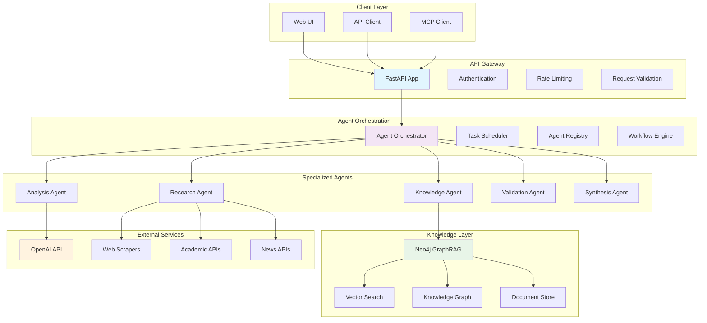
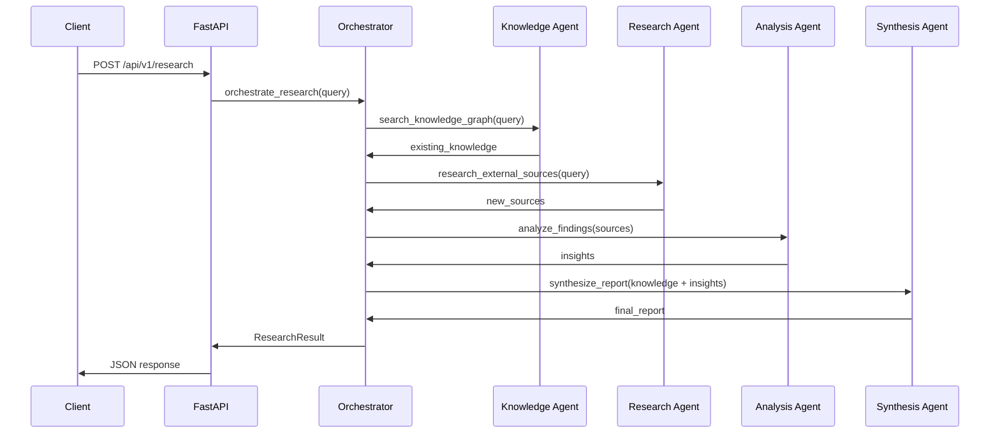
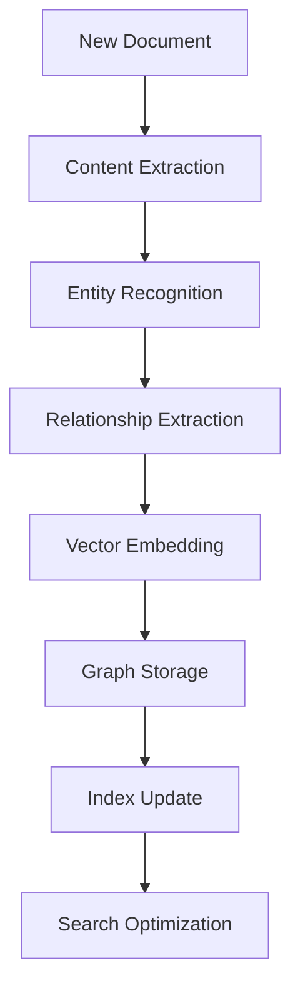
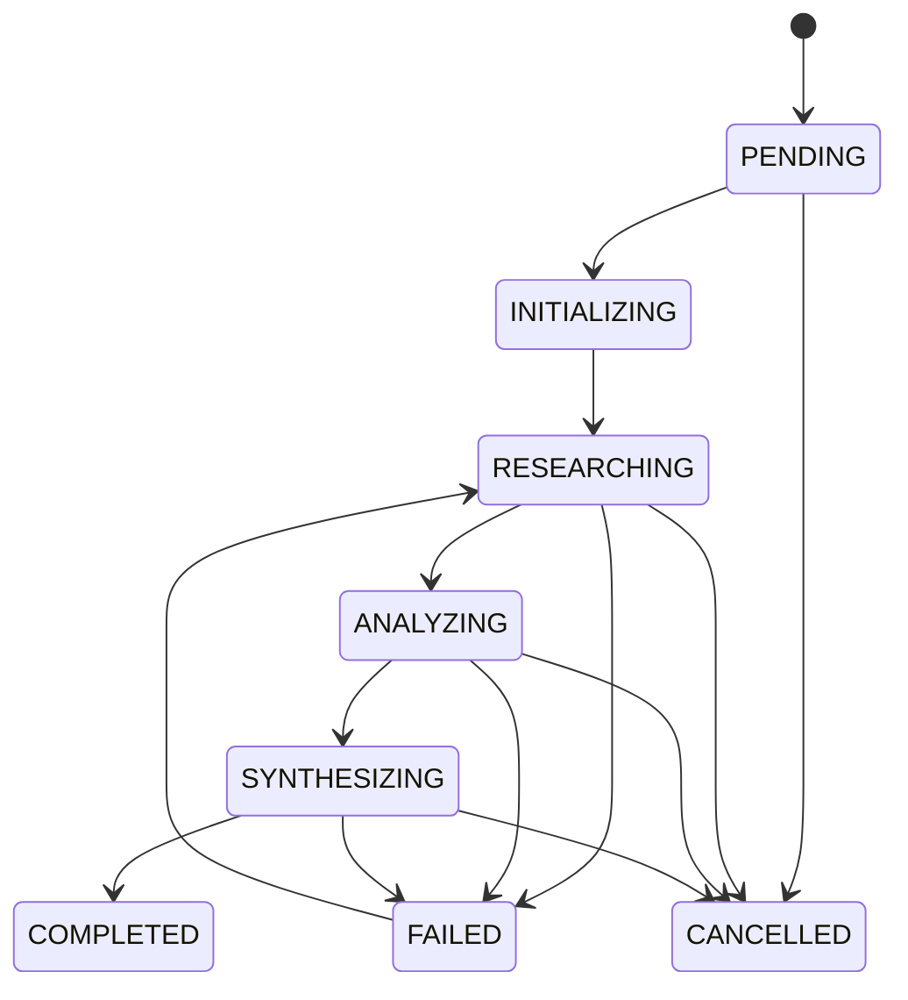
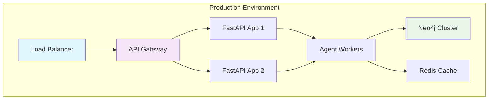

<!-- FILE_MAP_BEGIN 
<!--
{"file_metadata":{"title":"ACCF Research Agent Architecture","description":"Comprehensive architecture documentation for the ACCF Research Agent system, detailing system design, core components, data flow, state management, performance, security, configuration, monitoring, deployment, and future considerations.","last_updated":"2025-07-31","type":"documentation"},"ai_instructions":"Analyze the architecture.md documentation to provide structured navigation and comprehension support. Focus on major thematic sections reflecting system architecture, core components, data flow, state management, performance, security, configuration, monitoring, deployment, and future plans. Identify key code blocks, diagrams, tables, and conceptual elements that aid understanding. Ensure line numbers are precise and sections do not overlap. Provide a clear, concise file map for efficient document traversal and reference.","sections":[{"name":"Architecture Overview and System Architecture","description":"Introduction to the ACCF Research Agent architecture including the multi-agent orchestration approach and a mermaid diagram illustrating the system layers and components.","line_start":7,"line_end":79},{"name":"Core Components","description":"Detailed descriptions of the main system components including the FastAPI application, Agent Orchestrator, Specialized Agents, and Neo4j GraphRAG knowledge graph with schema and code examples.","line_start":80,"line_end":169},{"name":"Data Flow","description":"Explanation of the research request flow and knowledge graph operations with sequence and flowchart diagrams illustrating component interactions and data processing.","line_start":170,"line_end":210},{"name":"State Management","description":"Definition of workflow states and state transitions using Python enum and mermaid state diagram to describe the lifecycle of research workflows.","line_start":211,"line_end":248},{"name":"Performance Characteristics","description":"Overview of scalability strategies, performance targets with metrics tables, and resource requirements for various system components.","line_start":249,"line_end":275},{"name":"Security Architecture","description":"Details on authentication and authorization mechanisms, data protection strategies, and network security measures to safeguard the system.","line_start":276,"line_end":298},{"name":"Configuration Management","description":"Information on environment variables and feature flags used to configure the system, including code blocks with sample settings.","line_start":299,"line_end":333},{"name":"Monitoring and Observability","description":"Description of metrics collection, logging strategy, and alerting mechanisms to ensure system health and performance visibility.","line_start":334,"line_end":357},{"name":"Deployment Architecture","description":"Details on container strategy with a mermaid diagram and CI/CD pipeline steps for automated testing, deployment, and rollback.","line_start":358,"line_end":395},{"name":"Future Architecture Considerations","description":"Planned enhancements and technology evolution directions to guide future development and scalability of the system.","line_start":396,"line_end":420},{"name":"Closing Summary","description":"Final remarks summarizing the architecture's strengths and flexibility for future enhancements.","line_start":421,"line_end":425}],"key_elements":[{"name":"System Architecture Mermaid Diagram","description":"Graphical representation of the system layers and components including Client Layer, API Gateway, Agent Orchestration, Specialized Agents, Knowledge Layer, and External Services.","line":13},{"name":"FastAPI Application Features and Endpoints","description":"Description of the FastAPI app's purpose, key features, and main API endpoints for research, agent status, knowledge queries, and health checks.","line":84},{"name":"Agent Orchestrator Class Code","description":"Python class snippet showing key asynchronous methods for orchestrating research, task assignment, result aggregation, and failure handling.","line":97},{"name":"Specialized Agents Overview","description":"Summaries of five specialized agents (Knowledge, Research, Analysis, Validation, Synthesis) including their purposes, capabilities, and tools.","line":121},{"name":"Neo4j GraphRAG Schema Cypher Code","description":"Cypher code defining core entities and relationships in the knowledge graph including Document, Entity, Source, and their connections.","line":153},{"name":"Research Request Flow Sequence Diagram","description":"Mermaid sequence diagram illustrating the flow of a research request through client, API, orchestrator, agents, and back to client.","line":174},{"name":"Knowledge Graph Operations Flowchart","description":"Mermaid flowchart showing steps from new document ingestion to content extraction, entity recognition, vector embedding, and graph storage.","line":200},{"name":"Workflow States Python Enum","description":"Python enum defining the possible workflow states for research tasks including pending, initializing, researching, analyzing, synthesizing, completed, failed, and cancelled.","line":215},{"name":"State Transitions Mermaid Diagram","description":"State diagram showing allowed transitions between workflow states including failure recovery and cancellation paths.","line":231},{"name":"Performance Targets Table","description":"Table listing key performance metrics such as response time, throughput, concurrent users, and uptime with target values.","line":260},{"name":"Resource Requirements Table","description":"Table detailing CPU, memory, and storage requirements for FastAPI app, Neo4j database, agent workers, and Redis cache.","line":269},{"name":"Security Architecture Bullet Points","description":"Lists describing authentication methods, data protection techniques, and network security controls implemented in the system.","line":279},{"name":"Environment Variables Configuration Block","description":"Code block showing environment variable settings for application, database, external APIs, and performance tuning.","line":303},{"name":"Feature Flags Python Dictionary","description":"Python dictionary defining feature flags controlling vector search, advanced analysis, real-time monitoring, and auto scaling.","line":320},{"name":"Container Strategy Mermaid Diagram","description":"Diagram illustrating production environment components including load balancer, API gateway, FastAPI apps, agent workers, Neo4j cluster, and Redis cache.","line":363},{"name":"CI/CD Pipeline Steps","description":"Enumerated steps describing the continuous integration and deployment process from code commit to automated rollback.","line":378},{"name":"Future Architecture Planned Enhancements","description":"List of planned system improvements such as microservices, event-driven architecture, machine learning pipeline, edge computing, and federated learning.","line":400},{"name":"Technology Evolution Directions","description":"List of emerging technologies considered for future adoption including GraphQL, gRPC, service mesh, and serverless computing.","line":408}]}
-->
<!-- FILE_MAP_END -->

# Architecture Overview

The ACCF Research Agent is built on a **multi-agent orchestration architecture** with **Neo4j GraphRAG** for knowledge management and **FastAPI** for high-performance API delivery.

## 🏗️ System Architecture



## 🔧 Core Components

### 1. FastAPI Application (`agent_api.py`)

**Purpose**: High-performance async API gateway

**Key Features**:
- Automatic OpenAPI documentation
- Request/response validation with Pydantic
- Async request handling
- Built-in authentication and rate limiting
- Health check endpoints

**Endpoints**:
- `POST /api/v1/research` - Main research endpoint
- `GET /api/v1/agents/status` - Agent health monitoring
- `GET /api/v1/knowledge/query` - Knowledge graph queries
- `GET /health` - System health check

### 2. Agent Orchestrator

**Purpose**: Coordinates multi-agent workflows

**Responsibilities**:
- Task decomposition and assignment
- Agent lifecycle management
- Workflow state tracking
- Result aggregation and synthesis
- Error handling and recovery

**Key Methods**:
```python
class AgentOrchestrator:
    async def orchestrate_research(self, query: str) -> ResearchResult
    async def assign_task(self, task: Task) -> Agent
    async def aggregate_results(self, results: List[AgentResult]) -> FinalResult
    async def handle_failure(self, error: Exception) -> RecoveryAction
```

### 3. Specialized Agents

#### Knowledge Agent
- **Purpose**: Manages knowledge graph operations
- **Capabilities**: Vector search, graph traversal, knowledge synthesis
- **Tools**: Neo4j Cypher queries, vector similarity search

#### Research Agent
- **Purpose**: Performs external research and data collection
- **Capabilities**: Web scraping, API integration, source validation
- **Tools**: HTTP clients, parsing libraries, content extraction

#### Analysis Agent
- **Purpose**: Analyzes and processes research data
- **Capabilities**: Data analysis, pattern recognition, insight generation
- **Tools**: Statistical analysis, NLP processing, ML models

#### Validation Agent
- **Purpose**: Validates research quality and credibility
- **Capabilities**: Source verification, fact-checking, bias detection
- **Tools**: Credibility scoring, cross-reference validation

#### Synthesis Agent
- **Purpose**: Synthesizes findings into coherent reports
- **Capabilities**: Report generation, summary creation, recommendation synthesis
- **Tools**: LLM integration, template processing, formatting

### 4. Neo4j GraphRAG

**Purpose**: Knowledge graph with vector search capabilities

**Components**:
- **Knowledge Graph**: Entity-relationship storage
- **Vector Search**: Semantic similarity search
- **Document Store**: Raw document storage
- **Index Management**: Hybrid search optimization

**Schema**:
```cypher
// Core entities
(:Document {id, title, content, url, timestamp})
(:Entity {id, name, type, properties})
(:Source {id, domain, credibility_score})

// Relationships
(:Document)-[:CONTAINS]->(:Entity)
(:Document)-[:CITES]->(:Document)
(:Entity)-[:RELATES_TO]->(:Entity)
(:Document)-[:FROM_SOURCE]->(:Source)
```

## 📊 Data Flow

### 1. Research Request Flow



### 2. Knowledge Graph Operations



## 🔄 State Management

### Workflow States

```python
from enum import Enum

class WorkflowState(Enum):
    PENDING = "pending"
    INITIALIZING = "initializing"
    RESEARCHING = "researching"
    ANALYZING = "analyzing"
    SYNTHESIZING = "synthesizing"
    COMPLETED = "completed"
    FAILED = "failed"
    CANCELLED = "cancelled"
```

### State Transitions



## 🚀 Performance Characteristics

### Scalability

- **Horizontal Scaling**: Stateless agents support multiple instances
- **Vertical Scaling**: Async processing with connection pooling
- **Database Scaling**: Neo4j clustering and read replicas
- **Caching**: Redis for session state and frequent queries

### Performance Targets

| Metric               | Target      | Current |
| -------------------- | ----------- | ------- |
| **Response Time**    | P95 < 250ms | TBD     |
| **Throughput**       | 250 RPS     | TBD     |
| **Concurrent Users** | 1000+       | TBD     |
| **Uptime**           | 99.9%       | TBD     |

### Resource Requirements

| Component          | CPU         | Memory   | Storage  |
| ------------------ | ----------- | -------- | -------- |
| **FastAPI App**    | 2 cores     | 4GB      | 10GB     |
| **Neo4j Database** | 4 cores     | 16GB     | 100GB+   |
| **Agent Workers**  | 1 core each | 2GB each | 5GB each |
| **Redis Cache**    | 1 core      | 2GB      | 10GB     |

## 🔒 Security Architecture

### Authentication & Authorization

- **JWT Tokens**: Stateless authentication
- **API Keys**: Service-to-service communication
- **Role-Based Access**: User, admin, system roles
- **Rate Limiting**: Per-user and per-endpoint limits

### Data Protection

- **Encryption at Rest**: AES-256 for sensitive data
- **Encryption in Transit**: TLS 1.3 for all communications
- **Data Masking**: PII protection in logs
- **Audit Logging**: Complete request/response tracking

### Network Security

- **VPC Isolation**: Private subnets for internal services
- **Security Groups**: Minimal required access
- **WAF Protection**: Web application firewall
- **DDoS Protection**: Cloud-based mitigation

## 🔧 Configuration Management

### Environment Variables

```env
# Application
APP_ENV=production
LOG_LEVEL=INFO
DEBUG=false

# Database
NEO4J_URI=bolt://localhost:7687
NEO4J_USERNAME=neo4j
NEO4J_PASSWORD=secure-password
NEO4J_DATABASE=neo4j

# External APIs
OPENAI_API_KEY=your-key
NEWS_API_KEY=your-key
ACADEMIC_API_KEY=your-key

# Performance
MAX_CONCURRENT_AGENTS=10
AGENT_TIMEOUT=300
CACHE_TTL=3600
```

### Feature Flags

```python
FEATURE_FLAGS = {
    "enable_vector_search": True,
    "enable_advanced_analysis": True,
    "enable_real_time_monitoring": True,
    "enable_auto_scaling": False,
}
```

## 📈 Monitoring & Observability

### Metrics Collection

- **Application Metrics**: Request rate, response time, error rate
- **Agent Metrics**: Task completion, processing time, success rate
- **Database Metrics**: Query performance, connection pool, cache hit rate
- **Infrastructure Metrics**: CPU, memory, disk, network

### Logging Strategy

- **Structured Logging**: JSON format for machine processing
- **Log Levels**: DEBUG, INFO, WARNING, ERROR, CRITICAL
- **Log Aggregation**: Centralized log management
- **Log Retention**: 30 days for production, 7 days for development

### Alerting

- **Critical Alerts**: Service down, high error rate
- **Warning Alerts**: Performance degradation, resource usage
- **Info Alerts**: Deployment notifications, feature releases

## 🔄 Deployment Architecture

### Container Strategy



### CI/CD Pipeline

1. **Code Commit** → Automated testing
2. **Test Success** → Build Docker image
3. **Security Scan** → Vulnerability assessment
4. **Deployment** → Blue/green deployment
5. **Health Check** → Automated rollback if needed

## 🔮 Future Architecture Considerations

### Planned Enhancements

- **Microservices**: Decompose into smaller, focused services
- **Event-Driven**: Kafka for asynchronous communication
- **Machine Learning**: Dedicated ML pipeline for insights
- **Edge Computing**: Local processing for privacy-sensitive data
- **Federated Learning**: Distributed model training

### Technology Evolution

- **GraphQL**: Alternative to REST for complex queries
- **gRPC**: High-performance inter-service communication
- **Service Mesh**: Istio for advanced traffic management
- **Serverless**: Lambda functions for sporadic workloads

---

This architecture provides a solid foundation for scalable, maintainable, and high-performance research automation while maintaining flexibility for future enhancements.