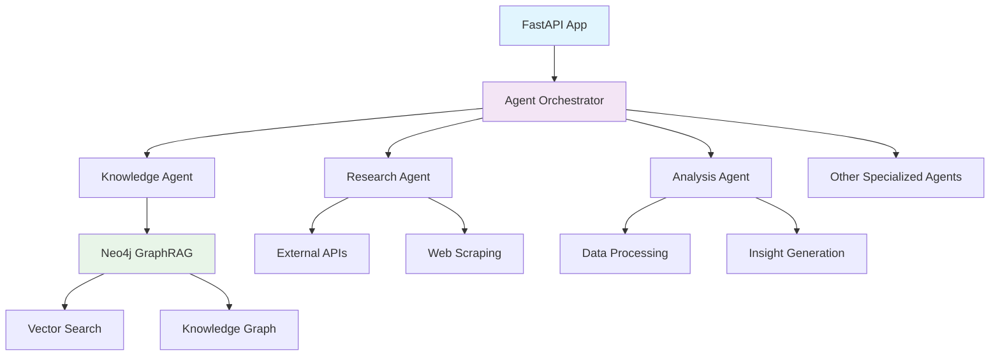

<!-- FILE_MAP_BEGIN 
<!--
{"file_metadata":{"title":"ACCF Research Agent","description":"Comprehensive documentation for the ACCF Research Agent system, covering features, setup, architecture, technology stack, performance, contribution guidelines, licensing, and support.","last_updated":"2025-07-31","type":"documentation"},"ai_instructions":"Analyze the document to identify logical sections based on headings and content themes. Ensure all line numbers are accurate and non-overlapping. Capture key elements such as code blocks, tables, diagrams, and important links. Provide clear, descriptive section names and element descriptions to facilitate navigation and comprehension of the ACCF Research Agent documentation.","sections":[{"name":"Introduction and Overview","description":"Introduces the ACCF Research Agent, its purpose, and key features highlighting the system's capabilities and technologies.","line_start":7,"line_end":19},{"name":"Quick Start Instructions","description":"Step-by-step commands to clone, set up, install dependencies, and start the application, including a code block with shell commands and a link to the API documentation.","line_start":20,"line_end":22},{"name":"Clone and Setup","description":"Brief section heading introducing the cloning and setup process, integrated within the Quick Start code block.","line_start":23,"line_end":27},{"name":"Install Dependencies","description":"Section heading for installing required packages, part of the Quick Start instructions.","line_start":28,"line_end":30},{"name":"Start the Application","description":"Instructions to launch the application server with live reload, concluding the Quick Start setup steps.","line_start":31,"line_end":36},{"name":"Documentation Sections Overview","description":"Lists documentation categories for Users, Developers, and Administrators with links to detailed guides, facilitating targeted navigation.","line_start":37,"line_end":56},{"name":"Architecture Overview","description":"Visual representation of the system architecture using a Mermaid diagram illustrating components and their interactions.","line_start":57,"line_end":81},{"name":"Technology Stack","description":"Table detailing the core technologies used in the system, their components, and purposes.","line_start":82,"line_end":94},{"name":"Performance Metrics","description":"Key performance indicators including response time, uptime, test coverage, security, and CI/CD pipeline runtime.","line_start":95,"line_end":102},{"name":"Contributing Guidelines","description":"Information encouraging contributions with a link to the contributing guide and summary of contribution processes.","line_start":103,"line_end":111},{"name":"License Information","description":"Details about the project's MIT license with a link to the full license file.","line_start":112,"line_end":115},{"name":"Support and Community Resources","description":"Provides links and contact information for documentation, issue reporting, discussions, and security support.","line_start":116,"line_end":125},{"name":"Closing and Quick Start Reminder","description":"Final call to action encouraging users to begin with the Quick Start Guide, reinforcing navigation to key resources.","line_start":126,"line_end":128}],"key_elements":[{"name":"Quick Start Shell Commands","description":"Code block containing shell commands to clone the repository, set environment variables, install dependencies, and start the application.","line":21},{"name":"Mermaid Architecture Diagram","description":"Mermaid syntax diagram illustrating the architecture of the ACCF Research Agent system, showing components and their relationships.","line":58},{"name":"Technology Stack Table","description":"Markdown table listing components, technologies, and their purposes within the ACCF Research Agent system.","line":83},{"name":"Documentation Sections Links","description":"Lists of categorized documentation links for Users, Developers, and Administrators to facilitate targeted access to guides.","line":38},{"name":"Contributing Guide Link","description":"Reference link to the contributing guide providing detailed instructions on how to contribute to the project.","line":105},{"name":"License Link","description":"Hyperlink to the MIT License file in the project's GitHub repository.","line":113},{"name":"Support Links and Contact","description":"Links to GitHub Issues, Discussions, and an email address for security reporting, providing multiple support channels.","line":117}]}
-->
<!-- FILE_MAP_END -->

# ACCF Research Agent

A production-ready research agent system built with **Neo4j GraphRAG**, **vector search**, and **multi-agent orchestration** for advanced knowledge discovery and research automation.

## 🚀 Key Features

- **🧠 Neo4j GraphRAG Integration**: Advanced knowledge graph with vector search capabilities
- **🤖 Multi-Agent Architecture**: 15+ specialized research agents working in orchestration
- **⚡ FastAPI Backend**: High-performance async API with automatic documentation
- **🔧 MCP Integration**: Model Context Protocol for seamless tool interoperability
- **🐳 Production Ready**: Docker containerization, CI/CD, security, and monitoring
- **📊 Real-time Analytics**: Live research progress tracking and insights

## 🎯 Quick Start

```bash
# Clone and setup
git clone https://github.com/accf/research-agent.git
cd accf-research-agent
cp .env.example .env

# Install dependencies
pip install -r requirements.txt

# Start the application
python -m uvicorn agent_api:app --reload
```

Visit `http://localhost:8000/docs` for the interactive API documentation.

## 📚 Documentation Sections

### For Users
- **[Quick Start](user/quick-start.md)** - Get up and running in 5 minutes
- **[Installation](user/installation.md)** - Detailed setup instructions
- **[Configuration](user/configuration.md)** - Environment and agent configuration
- **[First Research Query](user/first-query.md)** - Run your first research workflow

### For Developers
- **[Architecture](developer/architecture.md)** - System design and component overview
- **[Development Setup](developer/development-setup.md)** - Local development environment
- **[Contributing](developer/contributing.md)** - How to contribute to the project
- **[Testing](developer/testing.md)** - Testing strategies and guidelines

### For Administrators
- **[Deployment](admin/deployment.md)** - Production deployment guide
- **[Monitoring](admin/monitoring.md)** - Observability and alerting setup
- **[Security](admin/security.md)** - Security best practices and configuration
- **[Performance Tuning](admin/performance.md)** - Optimization and scaling

## 🏗️ Architecture Overview



## 🔧 Technology Stack

| Component         | Technology                | Purpose                           |
| ----------------- | ------------------------- | --------------------------------- |
| **Backend**       | FastAPI + Python 3.11     | High-performance async API        |
| **Database**      | Neo4j 5.15                | Knowledge graph and relationships |
| **Vector Search** | Neo4j Vector Search       | Semantic similarity and retrieval |
| **Agents**        | Custom Python + LangChain | Multi-agent orchestration         |
| **MCP**           | Model Context Protocol    | Tool interoperability             |
| **Container**     | Docker                    | Consistent deployment             |
| **CI/CD**         | GitHub Actions            | Automated quality gates           |
| **Monitoring**    | CloudWatch                | Observability and metrics         |

## 📊 Performance Metrics

- **Response Time**: P95 < 250ms @ 250 RPS
- **Uptime**: ≥99.9% availability
- **Test Coverage**: ≥60% automated tests
- **Security**: Zero critical vulnerabilities
- **CI/CD**: ≤8 minute pipeline runtime

## 🤝 Contributing

We welcome contributions! Please see our [Contributing Guide](developer/contributing.md) for details on:

- Code standards and style guidelines
- Testing requirements
- Pull request process
- Development setup

## 📄 License

This project is licensed under the MIT License - see the [LICENSE](https://github.com/accf/research-agent/blob/main/LICENSE) file for details.

## 🆘 Support

- **Documentation**: Browse this site for detailed guides
- **Issues**: Report bugs and feature requests on [GitHub Issues](https://github.com/accf/research-agent/issues)
- **Discussions**: Join community discussions on [GitHub Discussions](https://github.com/accf/research-agent/discussions)
- **Security**: Report security issues to security@accf.org

---

**Ready to start?** Check out our [Quick Start Guide](user/quick-start.md) to get up and running in minutes!