<!-- FILE_MAP_BEGIN 
<!--
{"file_metadata":{"title":"ACCF Research & Knowledge Agent System Architecture","description":"Comprehensive documentation detailing the architecture, data flow, storage, features, and workflow of the ACCF Research Agent system designed for multi-source research synthesis and knowledge management.","last_updated":"2025-07-31","type":"documentation"},"ai_instructions":"Analyze the document to provide a structured navigation map that reflects the logical architecture and workflow of the ACCF Research Agent system. Focus on capturing major sections and subsections with precise line boundaries, highlighting key diagrams, code blocks, and JSON examples. Ensure sections do not overlap and that key elements such as architecture diagrams, data flow sequences, storage system graphs, feature lists, and workflow steps are clearly identified with line references to facilitate quick understanding and retrieval.","sections":[{"name":"Document Introduction and System Overview","description":"Introduces the ACCF Research Agent system and provides a high-level overview of its purpose and capabilities.","line_start":7,"line_end":12},{"name":"Architecture Diagram","description":"Detailed mermaid diagram illustrating the components, interactions, and classifications within the ACCF Research Agent architecture.","line_start":13,"line_end":163},{"name":"Data Flow Sequence","description":"Mermaid sequence diagram describing the step-by-step flow of data and interactions between system components during a research query lifecycle.","line_start":164,"line_end":203},{"name":"Storage & Reference System","description":"Graph diagram showing the persistent storage, session storage, monitoring, and output reference systems and their relationships within the architecture.","line_start":204,"line_end":276},{"name":"Key System Features","description":"Describes the main features of the system, grouped into research capabilities, data processing, storage & reference, and output format, including a JSON example of the output.","line_start":277,"line_end":319},{"name":"Intelligent Research Workflow","description":"Stepwise explanation of the intelligent research workflow guiding the system's sequential and context-aware querying and synthesis process.","line_start":320,"line_end":341}],"key_elements":[{"name":"Architecture Diagram Mermaid Block","description":"Mermaid graph diagram illustrating the ACCF Research Agent's components, including user input, orchestrator, research sources, LLM integration, synthesis, storage, logs, and output with styling classes.","line":14},{"name":"Data Flow Sequence Mermaid Block","description":"Mermaid sequence diagram detailing the interactions and parallel research execution steps between user, research agent, knowledge graph, academic and web research, synthesis agent, LLM, and database.","line":165},{"name":"Storage & Reference System Mermaid Block","description":"Mermaid graph diagram showing the persistent storage (Neo4j), session storage, monitoring logs, and output & references subsystems and their internal components and relationships.","line":205},{"name":"Key System Features Lists","description":"Bullet lists enumerating the system's research capabilities, data processing features, storage & reference mechanisms, and output format details.","line":278},{"name":"Output Format JSON Example","description":"JSON code block illustrating the structured output format of the system's research synthesis results including answer, confidence, sources, and metadata.","line":303},{"name":"Intelligent Research Workflow Steps","description":"Numbered list describing the sequential steps of the intelligent research workflow from web search to storage.","line":321}]}
-->
<!-- FILE_MAP_END -->

# ACCF Research & Knowledge Agent System Architecture

## System Overview

The ACCF Research Agent is a comprehensive system that orchestrates multiple research sources to provide detailed, well-sourced answers to complex questions.

## Architecture Diagram

```mermaid
graph TB
    %% User Input
    UQ["User Question: What are the latest research papers on transformer architecture?"]

    %% Main Research Agent
    RA["Research Agent - Main Orchestrator"]
    RA1["• Coordinates all research sources"]
    RA2["• Manages async operations"]
    RA3["• Handles error recovery"]
    RA4["• Routes to appropriate sources"]

    %% Research Sources
    KG["Knowledge Graph - Neo4j Database"]
    KG1["• Persistent storage"]
    KG2["• Semantic search"]
    KG3["• Previous research results"]

        AR["Academic Research - ArXiv Integration"]
    AR1["• Latest research papers"]
    AR2["• Academic citations"]
    AR3["• Technical depth"]

    WR["Web Research - Brave + Firecrawl"]
    WR1["• Current web content"]
    WR2["• Real-time information"]
    WR3["• Diverse sources"]

    CT7["Technical Documentation - Context7"]
    CT71["• Library documentation"]
    CT72["• API references"]
    CT73["• Implementation guides"]

    %% LLM Integration
    LLM["OpenAI GPT-4.1-mini - Structured Outputs"]
    LLM1["• JSON schema validation"]
    LLM2["• Reliable parsing"]
    LLM3["• Quality assessment"]

    %% Synthesis
    SA["Synthesis Agent - Multi-Source Aggregation"]
    SA1["• Combines all sources"]
    SA2["• Ranks by relevance"]
    SA3["• Calculates confidence"]

    %% Storage
    RDB[("Research Database - In-Memory Storage")]
    RDB1["• Current session data"]
    RDB2["• Research history"]
    RDB3["• Performance metrics"]

    LOG[("Log Files - Debug & Monitoring")]
    LOG1["• Execution logs"]
    LOG2["• Error tracking"]
    LOG3["• Audit trail"]

    %% Output
    RES["Structured Results"]
    RES1["• Comprehensive answer"]
    RES2["• Confidence score"]
    RES3["• Source citations"]

    REF["References"]
    REF1["• Academic papers"]
    REF2["• Web sources"]
    REF3["• Knowledge graph nodes"]

    %% Flow Connections
    UQ --> RA
    RA --> RA1
    RA --> RA2
    RA --> RA3
    RA --> RA4

    RA --> KG
        RA --> AR
    RA --> WR
    RA --> CT7

    KG --> KG1
    KG --> KG2
    KG --> KG3

    AR --> AR1
    AR --> AR2
    AR --> AR3

    WR --> WR1
    WR --> WR2
    WR --> WR3

    CT7 --> CT71
    CT7 --> CT72
    CT7 --> CT73

    KG --> SA
    AR --> SA
    WR --> SA
    CT7 --> SA

    SA --> SA1
    SA --> SA2
    SA --> SA3

    SA --> LLM
    LLM --> LLM1
    LLM --> LLM2
    LLM --> LLM3

    LLM --> SA

    SA --> RES
    RES --> RES1
    RES --> RES2
    RES --> RES3

    SA --> REF
    REF --> REF1
    REF --> REF2
    REF --> REF3

    RA --> RDB
    RDB --> RDB1
    RDB --> RDB2
    RDB --> RDB3

    RA --> LOG
    LOG --> LOG1
    LOG --> LOG2
    LOG --> LOG3

    %% Styling
    classDef userInput fill:#e1f5fe,stroke:#01579b,stroke-width:2px,color:#000
    classDef orchestrator fill:#f3e5f5,stroke:#4a148c,stroke-width:2px,color:#000
    classDef researchSource fill:#e8f5e8,stroke:#1b5e20,stroke-width:2px,color:#000
    classDef synthesis fill:#fff3e0,stroke:#e65100,stroke-width:2px,color:#000
    classDef storage fill:#fce4ec,stroke:#880e4f,stroke-width:2px,color:#000
    classDef output fill:#f1f8e9,stroke:#33691e,stroke-width:2px,color:#000
    classDef llm fill:#e0f2f1,stroke:#004d40,stroke-width:2px,color:#000

    class UQ userInput
    class RA,RA1,RA2,RA3,RA4 orchestrator
    class KG,KG1,KG2,KG3,AR,AR1,AR2,AR3,WR,WR1,WR2,WR3,CT7,CT71,CT72,CT73 researchSource
    class SA,SA1,SA2,SA3 synthesis
    class RDB,RDB1,RDB2,RDB3,LOG,LOG1,LOG2,LOG3 storage
    class RES,RES1,RES2,RES3,REF,REF1,REF2,REF3 output
    class LLM,LLM1,LLM2,LLM3 llm
```



## Data Flow Sequence


## Storage & Reference System

```mermaid
graph LR
    subgraph "Persistent Storage"
        NEO[("Neo4j Knowledge Graph")]
        NEO1["• Research nodes"]
        NEO2["• Content relationships"]
        NEO3["• Semantic search"]
        NEO4["• Long-term memory"]
    end

    subgraph "Session Storage"
        MEM[("Research Database")]
        MEM1["• Current session"]
        MEM2["• Query history"]
        MEM3["• Performance metrics"]
        MEM4["• Temporary cache"]
    end

    subgraph "Monitoring & Debug"
        LOGS[("Log Files")]
        LOGS1["• Execution traces"]
        LOGS2["• Error logs"]
        LOGS3["• Performance data"]
        LOGS4["• Audit trail"]
    end

    subgraph "Output & References"
        RES["Structured Results"]
        RES1["• JSON responses"]
        RES2["• Confidence scores"]
        RES3["• Source citations"]
        RES4["• Metadata"]

        REFS["Reference System"]
        REFS1["• Academic paper URLs"]
        REFS2["• Web source links"]
        REFS3["• Knowledge graph IDs"]
        REFS4["• Citation chains"]
    end

    NEO --> NEO1
    NEO --> NEO2
    NEO --> NEO3
    NEO --> NEO4

    MEM --> MEM1
    MEM --> MEM2
    MEM --> MEM3
    MEM --> MEM4

    LOGS --> LOGS1
    LOGS --> LOGS2
    LOGS --> LOGS3
    LOGS --> LOGS4

    RES --> RES1
    RES --> RES2
    RES --> RES3
    RES --> RES4

    REFS --> REFS1
    REFS --> REFS2
    REFS --> REFS3
    REFS --> REFS4

    NEO --> RES
    MEM --> RES
    LOGS --> RES
    RES --> REFS
```



## Key System Features

### Research Capabilities:
- **🔬 Academic Research**: ArXiv integration with intelligent query generation
- **🌐 Web Research**: Brave search + Firecrawl scraping for context education
- **📚 Technical Documentation**: Context7 integration for library/framework docs
- **🗄️ Knowledge Graph**: Neo4j for persistent knowledge and vector storage
- **🤖 LLM Synthesis**: GPT-4.1-mini with structured outputs
- **🧠 Intelligent Query Generation**: Sequential research with context-aware query optimization

### Data Processing:
- **⚡ Async Orchestration**: Parallel research execution
- **📊 Multi-Source Aggregation**: Combines all research sources
- **🎯 Relevance Ranking**: Intelligent source prioritization
- **✅ Confidence Scoring**: Quality assessment for results

### Storage & Reference:
- **🗄️ Persistent Storage**: Neo4j knowledge graph
- **💾 Session Storage**: In-memory research database
- **📝 Logging**: Comprehensive audit trail
- **🔗 Citations**: Complete source attribution

### Output Format:
```json
{
  "answer": "Comprehensive research synthesis...",
  "confidence": "0.85",
  "sources": [
    "http://arxiv.org/pdf/2206.01136v3",
    "https://example.com/research-paper",
    "neo4j://knowledge-graph/node/123"
  ],
  "metadata": {
    "research_duration": "5.06s",
    "sources_analyzed": 5,
    "academic_papers": 3,
    "web_sources": 2
  }
}
```

This system provides **comprehensive research capabilities** with **intelligent sequential logic**, **persistent knowledge storage**, **multi-source synthesis**, and **complete traceability** of all research activities.

## 🔄 **Intelligent Research Workflow:**

1. **Web Search First**: Educate the model with current web content
2. **Context Extraction**: Analyze web results to understand the topic
3. **Specialized Queries**: Generate tool-specific queries based on context
4. **Academic Research**: Use intelligent ArXiv queries for academic papers
5. **Technical Docs**: Use intelligent Context7 queries for library documentation
6. **Synthesis**: Combine all sources with confidence scoring
7. **Storage**: Persist results in Neo4j for future RAG reference

This workflow ensures that specialized tools like ArXiv and Context7 receive well-informed, contextually appropriate queries rather than generic searches.