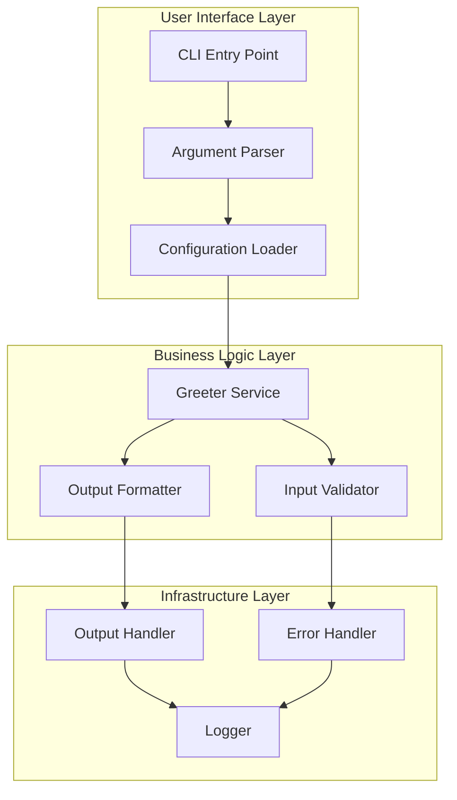
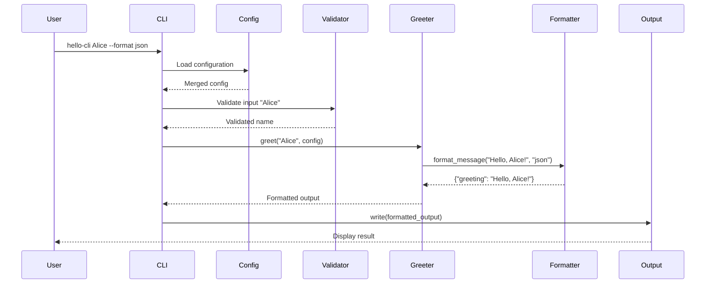
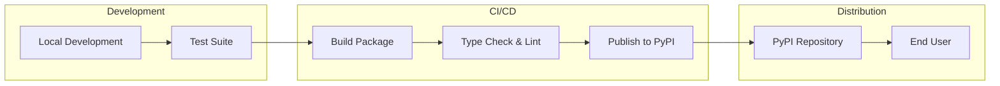

# Hello World CLI - Technical Design Document
## Design Phase Output

### 1. System Architecture Overview

The Hello World CLI follows a modular, layered architecture designed for maintainability, testability, and extensibility.



### 2. Component Architecture

#### 2.1 Module Structure

```
apps/hello-cli/
├── hello_cli/
│   ├── __init__.py          # Package initialization
│   ├── __main__.py          # Entry point for python -m
│   ├── cli.py               # CLI interface & argument parsing
│   ├── config.py            # Configuration management
│   ├── core/
│   │   ├── __init__.py
│   │   ├── greeter.py       # Core business logic
│   │   ├── formatter.py     # Output formatting
│   │   └── validator.py     # Input validation
│   ├── utils/
│   │   ├── __init__.py
│   │   ├── output.py        # Output handling
│   │   ├── errors.py        # Error definitions
│   │   └── logging.py       # Logging configuration
│   └── version.py           # Version management
├── tests/
│   ├── __init__.py
│   ├── test_cli.py
│   ├── test_greeter.py
│   ├── test_formatter.py
│   └── test_validator.py
├── pyproject.toml           # Package configuration
├── README.md                # User documentation
└── docs/
    ├── 1-requirements.md    # Requirements (existing)
    ├── 2-design.md          # This document
    └── 3-planning.md        # Implementation plan (next phase)
```

#### 2.2 Component Responsibilities

| Component | Responsibility | Dependencies |
|-----------|---------------|--------------|
| **cli.py** | Parse arguments, orchestrate execution | argparse, config, core.greeter |
| **config.py** | Load/merge configuration from file & env | json, os |
| **greeter.py** | Generate greeting messages | formatter, validator |
| **formatter.py** | Format output (plain/json/colored) | json, colorama (optional) |
| **validator.py** | Validate and sanitize input | re |
| **output.py** | Handle stdout/file output | sys, pathlib |
| **errors.py** | Define custom exceptions | - |
| **logging.py** | Configure logging | logging |

### 3. Technology Stack

#### 3.1 Core Technologies

| Technology | Version | Justification |
|------------|---------|---------------|
| **Python** | 3.8+ | Minimum supported version per requirements |
| **argparse** | Built-in | Lightweight, no dependencies, follows opsvi patterns |
| **pytest** | 7.x | Testing framework already in use |
| **mypy** | 1.x | Type checking enforcement |
| **setuptools** | 60+ | Package building and distribution |

#### 3.2 Optional Dependencies

| Technology | Purpose | Condition |
|------------|---------|-----------|
| **colorama** | Terminal colors | Only if colored output requested |
| **pydantic** | Config validation | If complex config needed (future) |

### 4. Interface Specifications

#### 4.1 Command Line Interface

```bash
# Basic usage
hello-cli [OPTIONS] [NAME]

# Options
--version, -v          Show version and exit
--help, -h            Show help message and exit
--config FILE, -c     Load configuration from file
--format FORMAT, -f   Output format: plain|json|color (default: plain)
--output FILE, -o     Write output to file instead of stdout
--verbose             Enable verbose output
--quiet, -q          Suppress all but essential output

# Examples
hello-cli                        # Output: Hello, World!
hello-cli Alice                  # Output: Hello, Alice!
hello-cli --format json Alice   # Output: {"greeting": "Hello, Alice!"}
hello-cli --config ~/.hello.json
```

#### 4.2 Configuration File Format

```json
{
  "default_name": "World",
  "format": "plain",
  "colors": {
    "greeting": "green",
    "name": "blue"
  },
  "verbose": false,
  "log_level": "INFO"
}
```

#### 4.3 Environment Variables

```bash
HELLO_CLI_NAME=Alice         # Default name
HELLO_CLI_FORMAT=json        # Output format
HELLO_CLI_CONFIG=~/.hello    # Config file path
HELLO_CLI_VERBOSE=1          # Verbose mode
```

#### 4.4 Python API

```python
from hello_cli import Greeter, OutputFormat

# Basic usage
greeter = Greeter()
message = greeter.greet("Alice")  # Returns: "Hello, Alice!"

# With formatting
greeter = Greeter(format=OutputFormat.JSON)
result = greeter.greet("Bob")  # Returns: {"greeting": "Hello, Bob!"}

# Custom configuration
from hello_cli import Config
config = Config.from_file("config.json")
greeter = Greeter(config=config)
```

### 5. Data Flow Design



### 6. Error Handling Strategy

#### 6.1 Error Hierarchy

```python
HelloCliError (Base)
├── ConfigurationError
│   ├── ConfigFileNotFoundError
│   ├── ConfigParseError
│   └── InvalidConfigError
├── ValidationError
│   ├── InvalidNameError
│   └── InvalidFormatError
├── OutputError
│   ├── FileWriteError
│   └── FormatterError
└── InternalError
```

#### 6.2 Exit Codes

| Code | Meaning | Example |
|------|---------|---------|
| 0 | Success | Normal execution |
| 1 | General error | Unhandled exception |
| 2 | Invalid arguments | Wrong CLI usage |
| 3 | Configuration error | Bad config file |
| 4 | Validation error | Invalid input |
| 5 | Output error | Cannot write file |

### 7. Security Considerations

#### 7.1 Input Validation
- **Name parameter**: Sanitize to prevent injection
- **File paths**: Validate absolute/relative paths
- **Config files**: Validate JSON structure
- **Size limits**: Max 100 chars for name

#### 7.2 File Operations
- **Config loading**: Read-only, validate permissions
- **Output files**: Check write permissions before opening
- **Path traversal**: Prevent ../ attacks

#### 7.3 Sensitive Data
- **No logging**: Personal names not logged
- **Config masking**: Hide sensitive config in verbose mode
- **Error messages**: Generic messages for security errors

### 8. Performance Considerations

#### 8.1 Optimization Points
- **Lazy imports**: Import colorama only when needed
- **Config caching**: Cache parsed configuration
- **Single pass**: Process arguments in one pass

#### 8.2 Resource Limits
- **Memory**: < 50MB footprint (monitored)
- **Startup**: < 100ms (measured in tests)
- **File size**: Config files < 1MB

### 9. Testing Strategy

#### 9.1 Test Coverage

| Component | Unit Tests | Integration Tests | Coverage Target |
|-----------|------------|-------------------|-----------------|
| CLI | ✓ | ✓ | 100% |
| Greeter | ✓ | ✓ | 100% |
| Formatter | ✓ | ✓ | 100% |
| Validator | ✓ | - | 100% |
| Config | ✓ | ✓ | 95% |
| Output | ✓ | ✓ | 90% |

#### 9.2 Test Scenarios
- **Happy path**: Basic greeting works
- **Edge cases**: Empty name, special characters
- **Error cases**: Invalid config, write failures
- **Performance**: Startup time validation

### 10. Extensibility Design

#### 10.1 Plugin Architecture (Future)

```python
class GreeterPlugin(ABC):
    @abstractmethod
    def transform(self, message: str) -> str:
        pass

# Example plugin
class EmojiPlugin(GreeterPlugin):
    def transform(self, message: str) -> str:
        return f"👋 {message} 🎉"
```

#### 10.2 Extension Points
- **Custom formatters**: Register new output formats
- **Message transformers**: Modify greeting message
- **Config providers**: Load from different sources
- **Output handlers**: Send to different destinations

### 11. Integration Points

#### 11.1 Monorepo Integration
- **Import pattern**: `from hello_cli import Greeter`
- **Shared utilities**: Use opsvi-core for base errors
- **Testing**: Integrate with monorepo test suite
- **CI/CD**: Hook into existing pipelines

#### 11.2 External Integrations
- **Shell scripts**: Exit codes for scripting
- **JSON output**: Machine-readable format
- **Config files**: Standard locations (~/.config/)
- **Logging**: Standard Python logging

### 12. Design Decisions & Trade-offs

| Decision | Alternative | Rationale |
|----------|------------|-----------|
| **argparse over click** | click/typer | No dependencies, sufficient for needs |
| **JSON config** | YAML/TOML | Built-in support, simple structure |
| **Modular architecture** | Single file | Maintainability, testability |
| **Type hints throughout** | Dynamic typing | Better IDE support, documentation |
| **Abstract formatters** | If-else chains | Extensibility, clean code |

### 13. Deployment Architecture



### 14. Compliance with Requirements

| Requirement | Design Element | Status |
|-------------|---------------|--------|
| FR1-11 | CLI interface, core logic | ✓ Addressed |
| NFR1-3 | Performance optimizations | ✓ Designed |
| NFR4-7 | POSIX CLI, cross-platform | ✓ Included |
| NFR8-11 | Testing strategy, type hints | ✓ Planned |
| NFR12-14 | Security considerations | ✓ Specified |

### 15. Design Validation Checklist

- [x] **SOLID Principles**: Each component has single responsibility
- [x] **DRY**: Shared utilities, no duplication
- [x] **KISS**: Simple argparse over complex frameworks
- [x] **YAGNI**: No premature optimization
- [x] **Separation of Concerns**: Clear layer boundaries
- [x] **Testability**: All components independently testable
- [x] **Security**: Input validation, safe file operations
- [x] **Performance**: Meets <100ms startup requirement
- [x] **Extensibility**: Plugin architecture prepared
- [x] **Documentation**: Comprehensive interface specs

---
*Generated during SDLC Design Phase*
*Date: 2025-08-16*
*Status: Complete*
*Next Phase: Planning - Create implementation tasks*
