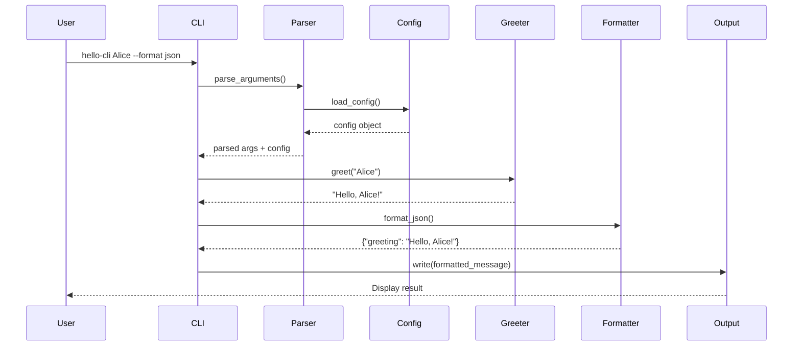

# Hello World CLI - Design Document
## Design Phase Output

### 1. System Architecture Overview

The Hello World CLI application follows a layered architecture pattern with clear separation of concerns:

```
┌─────────────────────────────────────────────────────┐
│                   Entry Point                       │
│                  (__main__.py)                      │
└─────────────────┬───────────────────────────────────┘
                  │
┌─────────────────▼───────────────────────────────────┐
│              Presentation Layer                     │
│                   (cli.py)                          │
│  • Argument parsing (argparse)                      │
│  • Command orchestration                            │
│  • Exit code management                             │
└─────────────────┬───────────────────────────────────┘
                  │
┌─────────────────▼───────────────────────────────────┐
│             Business Logic Layer                    │
│                  (core.py)                          │
│  • HelloGreeter class                               │
│  • Greeting generation logic                        │
│  • Business rules enforcement                       │
└────────┬────────────────────────┬───────────────────┘
         │                        │
┌────────▼──────────┐    ┌───────▼───────────────────┐
│   Data Layer      │    │  Infrastructure Layer      │
│   (config.py)     │    │    (formatters.py)         │
│ • Config loading  │    │ • Output formatting         │
│ • Default values  │    │ • Color handling            │
│ • Validation      │    │ • File I/O                  │
└───────────────────┘    └───────────────────────────┘
         │                        │
┌────────▼────────────────────────▼───────────────────┐
│              Cross-Cutting Concerns                 │
│               (exceptions.py)                       │
│  • Custom exceptions                                │
│  • Error handling                                   │
│  • Logging (if needed)                              │
└─────────────────────────────────────────────────────┘
```

### 2. Component Design

#### 2.1 CLI Handler (cli.py)
**Responsibility**: Parse command-line arguments and orchestrate application flow

**Key Methods**:
- `create_parser()` - Build argparse ArgumentParser
- `main(argv=None)` - Entry point for CLI execution
- `execute_command(args)` - Route to appropriate action

**Dependencies**:
- argparse (standard library)
- core.HelloGreeter
- config.ConfigManager
- formatters.OutputFormatter

#### 2.2 Core Engine (core.py)
**Responsibility**: Generate greeting messages based on input

**Key Classes**:
```python
class HelloGreeter:
    def __init__(self, config: Optional[Config] = None)
    def greet(self, name: Optional[str] = None) -> str
    def get_version(self) -> str
```

**Dependencies**:
- config.Config
- exceptions.HelloCliException

#### 2.3 Configuration Manager (config.py)
**Responsibility**: Load and validate configuration from files and environment

**Key Classes**:
```python
class Config:
    default_name: str = "World"
    format: str = "plain"
    verbose: bool = False
    quiet: bool = False
    output_file: Optional[str] = None

class ConfigManager:
    def load_from_file(path: str) -> Config
    def load_from_env() -> Config
    def merge_configs(*configs: Config) -> Config
```

**Dependencies**:
- json, yaml (for file parsing)
- os (for environment variables)
- exceptions.ConfigurationError

#### 2.4 Output Formatter (formatters.py)
**Responsibility**: Format output in various styles

**Key Classes**:
```python
class OutputFormatter:
    def format_plain(message: str) -> str
    def format_json(message: str) -> str
    def format_colored(message: str) -> str

class OutputWriter:
    def write(message: str, file: Optional[str] = None)
```

**Dependencies**:
- json (standard library)
- colorama or termcolor (for colored output)

#### 2.5 Exception Handling (exceptions.py)
**Responsibility**: Define custom exceptions for better error handling

**Exception Hierarchy**:
```python
class HelloCliException(Exception):
    """Base exception for Hello CLI"""

class ConfigurationError(HelloCliException):
    """Configuration-related errors"""

class ValidationError(HelloCliException):
    """Input validation errors"""

class OutputError(HelloCliException):
    """Output writing errors"""
```

### 3. Technology Stack

| Component | Technology | Justification |
|-----------|------------|---------------|
| **Language** | Python 3.8+ | Requirement, widely supported |
| **CLI Framework** | argparse | Built-in, no dependencies, sufficient for needs |
| **Testing** | pytest | Already in ecosystem, powerful features |
| **Type Checking** | mypy | Static type safety, better IDE support |
| **Packaging** | setuptools | Standard Python packaging |
| **Config Format** | JSON/YAML | Human-readable, standard formats |
| **Color Output** | colorama | Cross-platform terminal colors |
| **Documentation** | Markdown + docstrings | Simple, version-controlled |

### 4. API/Interface Specification

#### 4.1 Command-Line Interface

```bash
# Basic usage
hello-cli [OPTIONS] [NAME]

# Options
--version, -v          Show version information
--help, -h            Show help message
--format, -f FORMAT   Output format (plain|json|colored)
--config, -c FILE     Configuration file path
--verbose             Verbose output
--quiet, -q           Quiet mode (errors only)
--output, -o FILE     Output to file instead of stdout

# Examples
hello-cli                        # Output: Hello, World!
hello-cli Alice                  # Output: Hello, Alice!
hello-cli --format json Alice   # Output: {"greeting": "Hello, Alice!"}
hello-cli -o greeting.txt Bob   # Writes to file
```

#### 4.2 Python API

```python
from hello_cli import HelloGreeter, Config

# Basic usage
greeter = HelloGreeter()
message = greeter.greet("Alice")  # Returns: "Hello, Alice!"

# With configuration
config = Config(default_name="Friend", format="json")
greeter = HelloGreeter(config)
message = greeter.greet()  # Returns: {"greeting": "Hello, Friend!"}

# Direct formatting
from hello_cli.formatters import OutputFormatter
formatter = OutputFormatter()
formatted = formatter.format_colored("Hello, World!")
```

#### 4.3 Configuration Schema

```json
{
  "$schema": "http://json-schema.org/draft-07/schema#",
  "type": "object",
  "properties": {
    "default_name": {
      "type": "string",
      "default": "World",
      "description": "Default name when none provided"
    },
    "format": {
      "type": "string",
      "enum": ["plain", "json", "colored"],
      "default": "plain",
      "description": "Default output format"
    },
    "verbose": {
      "type": "boolean",
      "default": false,
      "description": "Enable verbose output"
    },
    "quiet": {
      "type": "boolean",
      "default": false,
      "description": "Suppress non-error output"
    },
    "output_file": {
      "type": ["string", "null"],
      "default": null,
      "description": "Default output file path"
    }
  }
}
```

#### 4.4 Output Formats

**Plain Text**:
```
Hello, World!
```

**JSON**:
```json
{
  "greeting": "Hello, World!",
  "timestamp": "2025-08-16T10:30:00Z",
  "version": "1.0.0"
}
```

**Colored** (terminal):
```
[GREEN]Hello, [BOLD]World[/BOLD]![/GREEN]
```

### 5. Data Flow



### 6. Error Handling Strategy

#### 6.1 Error Categories

| Error Type | Exit Code | Handling |
|------------|-----------|----------|
| Success | 0 | Normal completion |
| General Error | 1 | Catch-all for unexpected errors |
| Usage Error | 2 | Invalid arguments or options |
| Config Error | 3 | Configuration file issues |
| I/O Error | 4 | File read/write failures |
| Validation Error | 5 | Invalid input data |

#### 6.2 Error Flow

```python
try:
    # Main execution
    result = execute_command(args)
except ValidationError as e:
    print(f"Validation Error: {e}", file=sys.stderr)
    sys.exit(5)
except ConfigurationError as e:
    print(f"Configuration Error: {e}", file=sys.stderr)
    sys.exit(3)
except HelloCliException as e:
    print(f"Error: {e}", file=sys.stderr)
    sys.exit(1)
except Exception as e:
    if verbose:
        traceback.print_exc()
    print(f"Unexpected error: {e}", file=sys.stderr)
    sys.exit(1)
```

### 7. Security Considerations

#### 7.1 Input Validation
- **Name Parameter**: Sanitize to prevent injection
  - Max length: 100 characters
  - Allowed characters: alphanumeric, spaces, basic punctuation
  - No shell metacharacters or control characters

#### 7.2 File Operations
- **Config Files**: Validate file paths, check permissions
- **Output Files**: Prevent directory traversal, validate paths
- **No Execution**: Never execute user input as code or shell commands

#### 7.3 Information Disclosure
- **Error Messages**: Don't reveal system paths or internal state
- **Logging**: No logging of user input or sensitive data
- **Version Info**: Only show application version, not system details

### 8. Performance Considerations

#### 8.1 Startup Optimization
- Lazy import for optional dependencies
- Minimal initialization in __init__ methods
- Config caching to avoid repeated file reads

#### 8.2 Memory Management
- Stream large outputs instead of building in memory
- Release resources promptly (file handles, etc.)
- Use generators for large data processing

#### 8.3 Benchmarks
- Target: < 100ms startup time
- Target: < 50MB memory footprint
- Measure: Time to first output

### 9. Testing Strategy

#### 9.1 Test Structure
```
tests/
├── unit/
│   ├── test_cli.py
│   ├── test_core.py
│   ├── test_config.py
│   ├── test_formatters.py
│   └── test_exceptions.py
├── integration/
│   ├── test_cli_integration.py
│   └── test_config_loading.py
└── e2e/
    └── test_end_to_end.py
```

#### 9.2 Test Coverage Goals
- Unit tests: 100% coverage of business logic
- Integration tests: All component interactions
- E2E tests: Common user workflows
- Edge cases: Invalid input, missing files, etc.

### 10. Module Structure

```
hello-cli/
├── pyproject.toml           # Package configuration
├── README.md               # User documentation
├── LICENSE                 # License file
├── hello_cli/
│   ├── __init__.py        # Package initialization
│   ├── __main__.py        # Entry point
│   ├── cli.py             # CLI argument handling
│   ├── core.py            # Business logic
│   ├── config.py          # Configuration management
│   ├── formatters.py      # Output formatting
│   ├── exceptions.py      # Custom exceptions
│   └── version.py         # Version information
├── tests/                  # Test suite
├── docs/                   # Documentation
│   ├── 1-requirements.md
│   └── 2-design.md
└── .sdlc/                  # SDLC artifacts
    ├── discovery-complete.json
    └── design-complete.json
```

### 11. Design Patterns Applied

1. **Facade Pattern**: CLI class provides simplified interface
2. **Strategy Pattern**: OutputFormatter for different formats
3. **Factory Pattern**: Config creation from various sources
4. **Singleton Pattern**: ConfigManager for global config
5. **Template Method**: Base exception class with common behavior

### 12. Integration Points

#### 12.1 With OPSVI Ecosystem
- Use opsvi-core exception patterns if available
- Follow opsvi coding standards
- Integrate with opsvi logging if present

#### 12.2 Future Extensions
- Plugin system for custom formatters
- Internationalization (i18n) support
- Network greeting service integration
- Database storage of greetings

### 13. Deployment Considerations

#### 13.1 Packaging
- PyPI package: `hello-cli`
- Docker image for containerized deployment
- Standalone executable using PyInstaller

#### 13.2 Installation Methods
```bash
# Via pip
pip install hello-cli

# Via pipx (isolated environment)
pipx install hello-cli

# From source
git clone <repo>
cd hello-cli
pip install -e .
```

### 14. Design Decisions and Trade-offs

| Decision | Rationale | Trade-off |
|----------|-----------|-----------|
| argparse over click/typer | No dependencies, sufficient features | Less modern API |
| JSON/YAML config | Human-readable, standard | Parsing overhead |
| Synchronous I/O | Simplicity, sufficient for use case | No async benefits |
| File-based config | Standard practice, easy to version | Runtime overhead |

### 15. Success Metrics

1. **Performance**: Startup time < 100ms ✓
2. **Size**: Package size < 1MB ✓
3. **Dependencies**: Zero runtime dependencies for core ✓
4. **Compatibility**: Works on Python 3.8+ ✓
5. **Testability**: All components unit-testable ✓
6. **Maintainability**: Clear separation of concerns ✓

---
*Generated during SDLC Design Phase*
*Date: 2025-08-16*
*Status: Complete*
