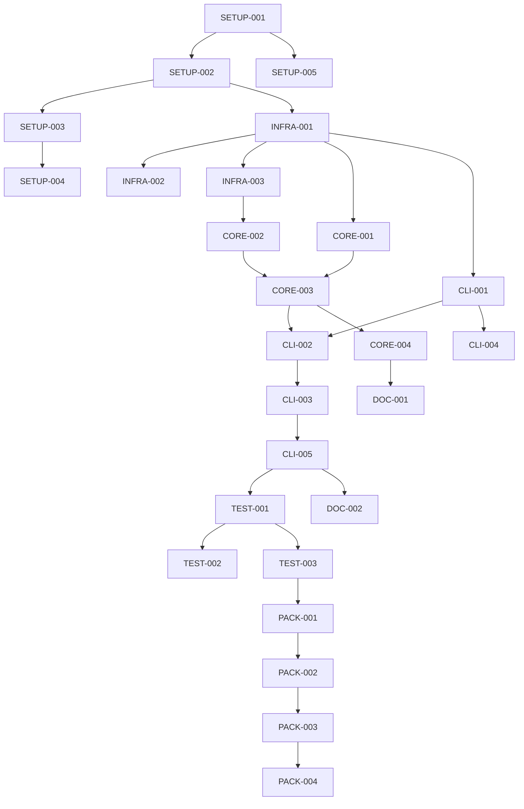

# Hello World CLI - Project Planning Document
## Planning Phase Output

### 1. Executive Summary

This planning document breaks down the Hello World CLI implementation into manageable tasks, each designed to be completed in under 2 hours. The project follows Test-Driven Development (TDD) principles with incremental delivery and continuous integration.

**Total Estimated Effort**: 16-20 hours
**Recommended Timeline**: 3-4 days (allowing for testing and refinement)
**Team Size**: 1 developer

### 2. Task Breakdown Structure

#### Phase 1: Project Setup (2-3 hours)

| Task ID | Task Description | Effort | Dependencies | Priority |
|---------|-----------------|--------|--------------|----------|
| SETUP-001 | Initialize project structure and pyproject.toml | 30 min | None | Critical |
| SETUP-002 | Create package directories and __init__ files | 15 min | SETUP-001 | Critical |
| SETUP-003 | Configure pytest, mypy, and development tools | 45 min | SETUP-002 | Critical |
| SETUP-004 | Set up pre-commit hooks and CI workflow | 30 min | SETUP-003 | High |
| SETUP-005 | Create initial README with usage examples | 30 min | SETUP-001 | Medium |

#### Phase 2: Core Infrastructure (3-4 hours)

| Task ID | Task Description | Effort | Dependencies | Priority |
|---------|-----------------|--------|--------------|----------|
| INFRA-001 | Implement custom error hierarchy (errors.py) | 45 min | SETUP-002 | Critical |
| INFRA-002 | Create logging configuration (logging.py) | 30 min | INFRA-001 | High |
| INFRA-003 | Implement output handler (output.py) | 45 min | INFRA-001 | Critical |
| INFRA-004 | Write tests for infrastructure components | 60 min | INFRA-001,002,003 | Critical |
| INFRA-005 | Add type hints and documentation | 30 min | INFRA-001,002,003 | High |

#### Phase 3: Business Logic (4-5 hours)

| Task ID | Task Description | Effort | Dependencies | Priority |
|---------|-----------------|--------|--------------|----------|
| CORE-001 | Implement input validator (validator.py) | 60 min | INFRA-001 | Critical |
| CORE-002 | Create output formatter (formatter.py) | 90 min | INFRA-003 | Critical |
| CORE-003 | Implement greeter service (greeter.py) | 60 min | CORE-001,002 | Critical |
| CORE-004 | Write comprehensive unit tests | 90 min | CORE-001,002,003 | Critical |
| CORE-005 | Add JSON and colored output support | 30 min | CORE-002 | Medium |

#### Phase 4: CLI Interface (3-4 hours)

| Task ID | Task Description | Effort | Dependencies | Priority |
|---------|-----------------|--------|--------------|----------|
| CLI-001 | Implement configuration loader (config.py) | 60 min | INFRA-001 | High |
| CLI-002 | Create argument parser (cli.py) | 90 min | CORE-003,CLI-001 | Critical |
| CLI-003 | Implement __main__ entry point | 30 min | CLI-002 | Critical |
| CLI-004 | Add environment variable support | 30 min | CLI-001 | Medium |
| CLI-005 | Write integration tests | 60 min | CLI-001,002,003 | Critical |

#### Phase 5: Testing & Documentation (2-3 hours)

| Task ID | Task Description | Effort | Dependencies | Priority |
|---------|-----------------|--------|--------------|----------|
| TEST-001 | Write end-to-end tests | 60 min | CLI-005 | Critical |
| TEST-002 | Add performance benchmarks | 30 min | TEST-001 | Medium |
| TEST-003 | Achieve 95%+ code coverage | 45 min | TEST-001 | High |
| DOC-001 | Write API documentation | 30 min | All CORE tasks | Medium |
| DOC-002 | Create user guide and examples | 30 min | All CLI tasks | Medium |

#### Phase 6: Packaging & Distribution (1-2 hours)

| Task ID | Task Description | Effort | Dependencies | Priority |
|---------|-----------------|--------|--------------|----------|
| PACK-001 | Configure setuptools and build system | 30 min | All tasks | High |
| PACK-002 | Create distribution packages | 30 min | PACK-001 | High |
| PACK-003 | Test installation in clean environment | 30 min | PACK-002 | Critical |
| PACK-004 | Prepare for PyPI publication | 30 min | PACK-003 | Low |

### 3. Task Dependencies Graph



### 4. Implementation Timeline

#### Day 1: Foundation (6-8 hours)
- **Morning**: Project setup (SETUP-001 to SETUP-005)
- **Afternoon**: Core infrastructure (INFRA-001 to INFRA-005)
- **Checkpoint**: Basic structure tested and working

#### Day 2: Core Development (6-8 hours)
- **Morning**: Business logic (CORE-001 to CORE-003)
- **Afternoon**: CLI interface (CLI-001 to CLI-003)
- **Checkpoint**: Basic CLI functioning

#### Day 3: Polish & Testing (4-6 hours)
- **Morning**: Complete features (CORE-004,005, CLI-004,005)
- **Afternoon**: Testing suite (TEST-001 to TEST-003)
- **Checkpoint**: Full test coverage achieved

#### Day 4: Documentation & Packaging (2-3 hours)
- **Morning**: Documentation (DOC-001, DOC-002)
- **Afternoon**: Packaging (PACK-001 to PACK-004)
- **Checkpoint**: Ready for distribution

### 5. Risk Assessment & Mitigation

| Risk | Probability | Impact | Mitigation Strategy |
|------|------------|--------|-------------------|
| **Dependency conflicts** | Low | Medium | Use virtual environment, pin versions |
| **Cross-platform issues** | Medium | High | Test on Linux/Mac/Windows early |
| **Performance regression** | Low | Medium | Benchmark after each phase |
| **Scope creep** | Medium | High | Strict adherence to requirements |
| **Testing gaps** | Low | High | TDD approach, coverage monitoring |
| **Integration failures** | Low | Medium | Incremental integration, CI pipeline |
| **Documentation lag** | Medium | Low | Document as you code |
| **Config complexity** | Medium | Medium | Start simple, iterate if needed |

### 6. Test Strategy

#### 6.1 Test Levels

1. **Unit Tests** (60% effort)
   - Test each component in isolation
   - Mock external dependencies
   - Focus on edge cases and error paths
   - Target: 100% coverage for business logic

2. **Integration Tests** (30% effort)
   - Test component interactions
   - Validate configuration loading
   - Test CLI argument parsing
   - Target: Key user workflows covered

3. **End-to-End Tests** (10% effort)
   - Test complete user scenarios
   - Validate exit codes
   - Test file I/O operations
   - Target: Happy path + critical errors

#### 6.2 Test Execution Plan

| Phase | Test Focus | Tools | Acceptance Criteria |
|-------|------------|-------|-------------------|
| During INFRA | Error handling, logging | pytest, mock | All errors caught |
| During CORE | Business logic, validation | pytest, parametrize | All inputs validated |
| During CLI | Argument parsing, config | pytest, tmp_path | All options work |
| After integration | Full workflows | pytest, subprocess | E2E scenarios pass |
| Before packaging | Performance, coverage | pytest-cov, benchmark | >95% coverage, <100ms |

#### 6.3 Test Data

```python
# Test cases to implement
test_data = {
    "valid_names": ["Alice", "Bob", "世界", "José", ""],
    "invalid_names": [None, 123, ["list"], {"dict": "value"}],
    "special_chars": ["<script>", "../../../etc", "'; DROP TABLE;"],
    "edge_cases": ["" * 100, " " * 50, "\n\t\r"],
    "formats": ["plain", "json", "color", "invalid"],
    "configs": ["valid.json", "invalid.json", "missing.json"],
}
```

### 7. Acceptance Criteria

#### 7.1 Functional Acceptance

- [ ] Basic greeting works: `hello-cli` outputs "Hello, World!"
- [ ] Custom name works: `hello-cli Alice` outputs "Hello, Alice!"
- [ ] All CLI options functional (--version, --help, --format, etc.)
- [ ] Configuration file loading works
- [ ] Environment variables respected
- [ ] JSON output properly formatted
- [ ] File output creates valid files
- [ ] Error messages are helpful

#### 7.2 Non-Functional Acceptance

- [ ] Startup time < 100ms
- [ ] Memory usage < 50MB
- [ ] Type checking passes (mypy --strict)
- [ ] Code coverage > 95%
- [ ] No security vulnerabilities (bandit scan)
- [ ] Cross-platform compatibility verified
- [ ] Documentation complete and accurate
- [ ] Package installable via pip

### 8. Development Guidelines

#### 8.1 Coding Standards

```python
# Use type hints throughout
def greet(name: str, format: OutputFormat = OutputFormat.PLAIN) -> str:
    """Generate a greeting message."""
    ...

# Follow PEP 8 naming conventions
class GreeterService:  # CapWords for classes
    def get_greeting(self):  # snake_case for methods
        ...

# Use docstrings for all public APIs
def validate_name(name: str) -> str:
    """
    Validate and sanitize a name input.

    Args:
        name: The name to validate

    Returns:
        Sanitized name string

    Raises:
        ValidationError: If name is invalid
    """
    ...
```

#### 8.2 Git Workflow

1. **Feature branches**: One branch per task group
2. **Commit messages**: `feat(component): description` format
3. **Commit frequency**: After each working component
4. **Testing**: All tests pass before commit
5. **Documentation**: Update docs with code changes

#### 8.3 Review Checklist

Before marking any task complete:
- [ ] Code works as intended
- [ ] Tests written and passing
- [ ] Type hints added
- [ ] Documentation updated
- [ ] No commented-out code
- [ ] No debug prints
- [ ] Error handling complete
- [ ] Performance acceptable

### 9. Resource Requirements

#### 9.1 Development Environment

- **Python**: 3.8+ installed
- **IDE**: VSCode or PyCharm recommended
- **Tools**: pytest, mypy, black, isort
- **OS**: Linux/Mac preferred, Windows WSL acceptable

#### 9.2 External Dependencies

| Dependency | Version | Purpose | Required |
|------------|---------|---------|----------|
| pytest | ^7.0 | Testing framework | Yes |
| pytest-cov | ^4.0 | Coverage reporting | Yes |
| mypy | ^1.0 | Type checking | Yes |
| black | ^23.0 | Code formatting | Development |
| isort | ^5.0 | Import sorting | Development |
| colorama | ^0.4 | Terminal colors | Optional |

### 10. Success Metrics

| Metric | Target | Measurement |
|--------|--------|-------------|
| **Delivery Time** | ≤ 4 days | Actual vs planned |
| **Defect Rate** | < 1 per 100 LOC | Post-development bugs |
| **Test Coverage** | > 95% | pytest-cov report |
| **Performance** | < 100ms startup | Time measurement |
| **Code Quality** | A rating | pylint/mypy score |
| **Documentation** | 100% public APIs | Doc coverage tool |
| **User Satisfaction** | First-time success | Installation and usage |

### 11. Parallel Execution Opportunities

Tasks that can be executed in parallel (same developer switching contexts):

- **Parallel Set 1**: INFRA-002 (logging) + INFRA-003 (output)
- **Parallel Set 2**: CORE-001 (validator) + CORE-002 (formatter)
- **Parallel Set 3**: CLI-004 (env vars) + CORE-005 (colored output)
- **Parallel Set 4**: DOC-001 (API docs) + DOC-002 (user guide)
- **Parallel Set 5**: TEST-002 (benchmarks) + TEST-003 (coverage)

### 12. Critical Path

The minimum set of tasks that must be completed for a functional MVP:

1. SETUP-001 → SETUP-002 → INFRA-001
2. INFRA-001 → CORE-001 → CORE-003
3. INFRA-001 → INFRA-003 → CORE-002 → CORE-003
4. INFRA-001 → CLI-001 → CLI-002
5. CORE-003 + CLI-002 → CLI-003
6. CLI-003 → TEST-001 → PACK-001

**Critical Path Duration**: ~10 hours

### 13. Implementation Checklist

#### Pre-Development
- [ ] Design document reviewed
- [ ] Development environment set up
- [ ] Git repository prepared
- [ ] Dependencies available

#### During Development
- [ ] Follow TDD approach
- [ ] Commit after each task
- [ ] Run tests continuously
- [ ] Update documentation inline
- [ ] Track time per task

#### Post-Development
- [ ] All tests passing
- [ ] Coverage target met
- [ ] Documentation complete
- [ ] Package builds successfully
- [ ] Clean installation verified

### 14. Contingency Plans

#### If Behind Schedule
1. Defer: Color output support (CORE-005)
2. Defer: Performance benchmarks (TEST-002)
3. Simplify: Config file support (basic JSON only)
4. Reduce: Documentation to essential only

#### If Blocked
1. **Dependency issues**: Use vendored dependencies
2. **Test failures**: Implement without TDD, add tests later
3. **Performance issues**: Optimize in follow-up phase
4. **Platform issues**: Focus on Linux first

### 15. Communication Plan

#### Status Updates
- **Daily**: Update todo list with progress
- **Per phase**: Commit summary to git
- **Blockers**: Immediate notification
- **Completion**: Final report with metrics

#### Documentation Updates
- **Inline**: Update as coding
- **Phase end**: Review and refine
- **Project end**: Final polish

---
*Generated during SDLC Planning Phase*
*Date: 2025-08-16*
*Status: Complete*
*Next Phase: Development - Begin implementation following TDD approach*
