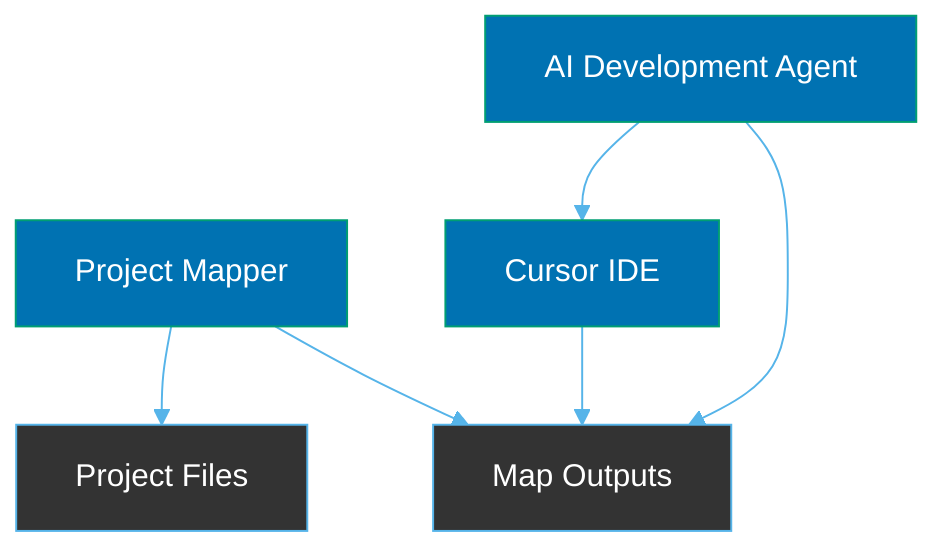
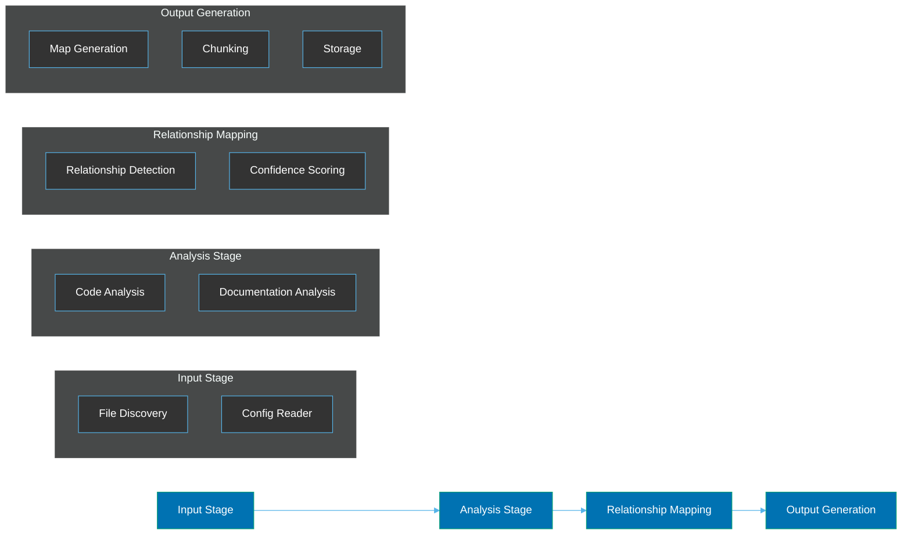
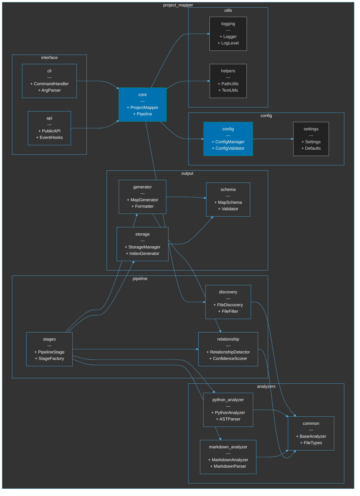
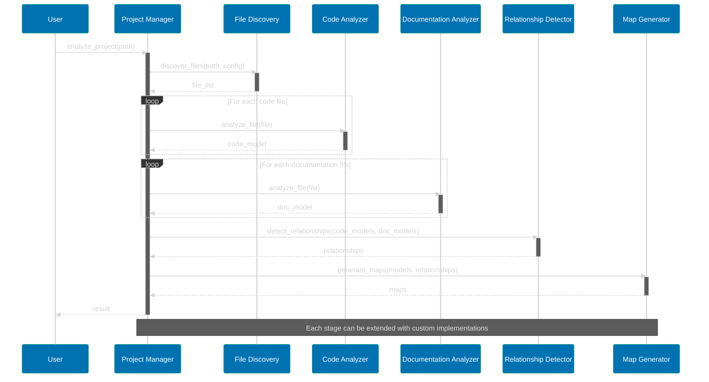
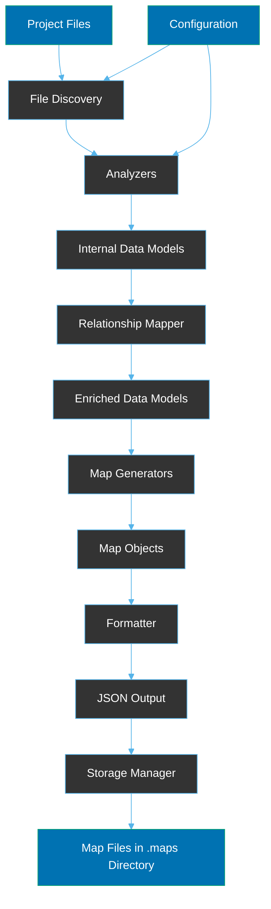
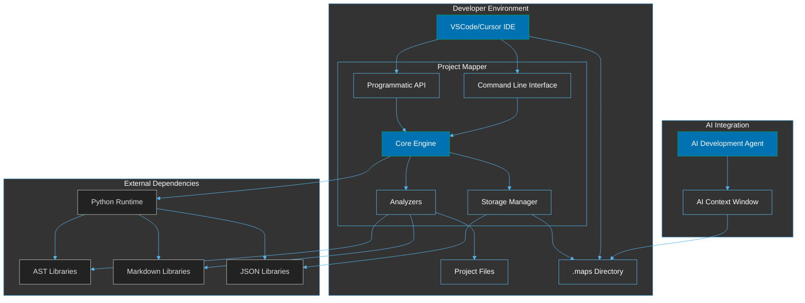

# System Architecture

**Version:** 1.0.0  
**Last Updated:** 2023-11-05  
**Status:** Draft

## Document Purpose

This document defines the high-level system architecture for the Project Mapper system. It outlines the system composition, component relationships, data flows, and key architectural decisions with specific focus on the pipeline architecture and VSCode/Cursor IDE integration for AI development agents.

## Architectural Overview

The Project Mapper follows a modular, pipeline-based architecture designed to analyze code and documentation files to produce structured maps. These maps are specifically optimized for consumption by AI development agents in VSCode-based IDEs, particularly the Cursor IDE.

### System Context



### Pipeline Architecture

The Project Mapper system employs a pipeline architecture to process files in sequential stages, allowing for modular extension and customization.



## Component Architecture

The system is divided into the following subsystems:

### Core Subsystem

Responsible for coordinating the overall mapping process:

- **Project Manager**: Handles project-level operations including configuration and coordination
- **Pipeline Coordinator**: Manages the sequence of pipeline stages
- **File Discovery**: Identifies files to be analyzed based on configuration
- **Event Bus**: Facilitates communication between components

### Analysis Subsystem

Responsible for analyzing different file types:

- **Code Analyzer**: Analyzes code files to extract structure and elements
  - _Python Analyzer_: Analyzes Python files (initial implementation)
  - _Analyzer Interface_: Common interface for future language analyzers
- **Documentation Analyzer**: Analyzes documentation files
  - _Markdown Analyzer_: Analyzes Markdown files (initial implementation)
  - _Analyzer Interface_: Common interface for future documentation format analyzers

### Relationship Mapping Subsystem

Identifies and maps relationships between elements:

- **Relationship Detector**: Identifies relationships between elements
- **Cross-Reference Resolver**: Resolves references between code and documentation
- **Confidence Scorer**: Assigns confidence scores to inferred relationships

### Output Generation Subsystem

Generates and formats map outputs:

- **Map Generator**: Creates different types of maps
- **JSON Formatter**: Formats maps in JSON
- **Chunking Engine**: Splits large maps into manageable chunks
- **Storage Manager**: Manages storage of generated maps in the `.maps` directory

### Integration Subsystem

Facilitates integration with external systems:

- **CLI Interface**: Command-line interface
- **API Interface**: Programmatic API
- **IDE Connector**: Integration with VSCode/Cursor IDE

### Configuration Subsystem

Manages system configuration:

- **Config Manager**: Handles configuration loading and validation
- **Setting Provider**: Provides configuration to components

## Component Relationships

The following class diagram illustrates the key components and their relationships:

```mermaid
%%{init: {
  'theme': 'dark',
  'themeVariables': {
    'primaryColor': '#0072B2',
    'primaryTextColor': '#FFFFFF',
    'primaryBorderColor': '#009E73',
    'lineColor': '#56B4E9',
    'secondaryColor': '#333333',
    'tertiaryColor': '#222222',
    'textColor': '#DDDDDD',
    'classText': '#FFFFFF',
    'classBorder': '#009E73',
    'classBackground': '#0072B2',
    'nodeBorder': '#56B4E9',
    'edgeColor': '#56B4E9'
  }
}}%%
classDiagram
    direction TB

    class ProjectMapper {
        +analyze_project(path, config) Result
        +update_project(path) Result
        -initialize_pipeline() Pipeline
    }

    class Pipeline {
        +process(input_data) output_data
        +add_stage(stage) void
        -validate_stage(stage) boolean
    }

    class FileDiscovery {
        +discover_files(path, config) FileList
        -filter_files(files, patterns) FileList
        -is_supported_type(file) boolean
    }

    class PipelineStage {
        <<interface>>
        +process(context, input_data) output_data
        +validate_input(input_data) boolean
    }

    class ConfigManager {
        +load_config(path) Config
        +get_setting(key) any
        +validate_config(config) boolean
    }

    class Analyzer {
        <<interface>>
        +can_analyze(file) boolean
        +analyze(file, content) AnalysisResult
    }

    class PythonAnalyzer {
        +can_analyze(file) boolean
        +analyze(file, content) CodeModel
        -parse_ast(content) ast.AST
        -extract_elements(ast) Elements
    }

    class MarkdownAnalyzer {
        +can_analyze(file) boolean
        +analyze(file, content) DocModel
        -parse_markdown(content) Document
        -extract_sections(document) Sections
    }

    class RelationshipDetector {
        +detect_relationships(models) Relationships
        -detect_inheritance(models) InheritanceRels
        -detect_dependencies(models) DependencyRels
        -detect_calls(models) CallRels
        -detect_documentation(code_models, doc_models) DocRels
    }

    class MapGenerator {
        +generate_maps(models, relationships) Maps
        -generate_file_maps(models) FileMaps
        -generate_project_map(models) ProjectMap
        -generate_relationship_map(relationships) RelMap
    }

    class StorageManager {
        +store_maps(maps, output_dir) void
        -create_directory_structure(output_dir) void
        -store_file(map, path) void
        -create_index(maps, output_dir) void
    }

    ProjectMapper --> Pipeline : uses
    ProjectMapper --> ConfigManager : uses
    Pipeline --> PipelineStage : contains
    FileDiscovery ..|> PipelineStage : implements
    PythonAnalyzer ..|> Analyzer : implements
    MarkdownAnalyzer ..|> Analyzer : implements
    PythonAnalyzer ..|> PipelineStage : implements
    MarkdownAnalyzer ..|> PipelineStage : implements
    RelationshipDetector ..|> PipelineStage : implements
    MapGenerator ..|> PipelineStage : implements
    StorageManager ..|> PipelineStage : implements
```



## Package Organization

The following package diagram illustrates the organization of system modules and their dependencies:



## Pipeline Processing Sequence

The following sequence diagram illustrates how files flow through the pipeline stages during processing:



## Data Flow



1. **File Discovery**: Project files are discovered based on configuration
2. **Analysis**: Files are analyzed according to their type to extract structure and elements
3. **Internal Models**: Analysis results are stored in internal data models
4. **Relationship Mapping**: Relationships between elements are identified and mapped
5. **Enriched Models**: Data models are enriched with relationship information
6. **Map Generation**: Various maps are generated from the enriched models
7. **Formatting**: Maps are formatted in JSON
8. **Storage**: Maps are stored in the `.maps` directory with appropriate naming conventions

## Key Architectural Decisions

### Pipeline Architecture

**Decision**: Implement a pipeline architecture with clearly defined stages.

**Rationale**:

- Enables modular extension with new file types and analyzers
- Provides clear separation of concerns
- Allows for focused unit testing of each stage
- Supports reconfiguration of the pipeline for different use cases

### Output Location and Naming

**Decision**: Store all generated maps in a `.maps` directory with standardized naming conventions.

**Rationale**:

- Provides a predictable location for AI agents to look for maps
- Follows the convention of hidden directories for metadata (similar to `.git`)
- Standardized naming enables easy identification of map types
- Timestamp-based versioning supports maintaining history

```
.maps/
  ├── project_20231105120000.json
  ├── file_myfile_20231105120000.json
  ├── relationship_20231105120000.json
  ├── index_20231105120000.json
  └── realtime/
      ├── project_latest.json
      ├── file_myfile_latest.json
      └── relationship_latest.json
```

### Modular Analyzer Design

**Decision**: Implement analyzers as pluggable components following a common interface.

**Rationale**:

- Enables adding support for new languages and documentation formats
- Allows for specialized analyzers for different file types
- Facilitates version upgrades of analyzers
- Supports testing analyzers in isolation

### Cursor IDE Optimization

**Decision**: Specifically optimize for Cursor IDE and its AI agent capabilities.

**Rationale**:

- Focuses development on a concrete use case
- Cursor IDE has specific AI agent integration features
- Enables deeper integration with Cursor's context window and token optimization
- Allows for targeted testing against a specific IDE

### Schema Versioning

**Decision**: Include explicit schema version in all outputs.

**Rationale**:

- Enables backward compatibility as the system evolves
- Provides AI agents with information on how to interpret the output
- Supports future migration tools
- Helps track and debug issues related to format changes

## Deployment View

The Project Mapper is deployed as a Python package that can be installed via pip. It operates as:

1. A command-line tool
2. A library that can be integrated into other applications
3. A potential VSCode/Cursor extension (future)

### Dependencies

The system relies on:

- Python 3.8+ runtime
- AST parsing libraries (e.g., ast module for Python)
- Markdown parsing libraries
- JSON processing libraries

## Deployment Architecture

The following deployment diagram illustrates how the Project Mapper integrates with development environments:



## Quality Attributes

### Performance

- Analyzers are designed to process files in parallel where possible
- Incremental updates avoid reanalyzing unchanged files
- Chunking supports efficient processing of large projects

### Extensibility

- Pipeline stages can be extended with custom implementations
- Analyzer interfaces allow adding support for new languages
- Output formatters can be added to support new formats

### Reliability

- Error handling at pipeline stage boundaries
- Graceful degradation on parsing errors
- Partial results provided even with some failures

## Limitations and Constraints

- Initial version supports Python code and Markdown documentation only
- Designed for projects up to 500 files
- Optimized for VSCode-based IDEs, particularly Cursor
- Not designed for real-time collaborative editing scenarios

## Future Architecture Evolution

Future versions may include:

- Support for additional programming languages
- More documentation format parsers
- Enhanced relationship detection algorithms
- Real-time collaborative mapping
- Visual map representation
- IDE-specific extensions

## Related Documents

- [Functional Requirements](../requirements/functional_requirements.md)
- [Non-Functional Requirements](../requirements/non_functional_requirements.md)
- [Data Model](../models/data_model.md)
- [Interface Specifications](../interface/interface_specifications.md)

---

_End of System Architecture Document_
