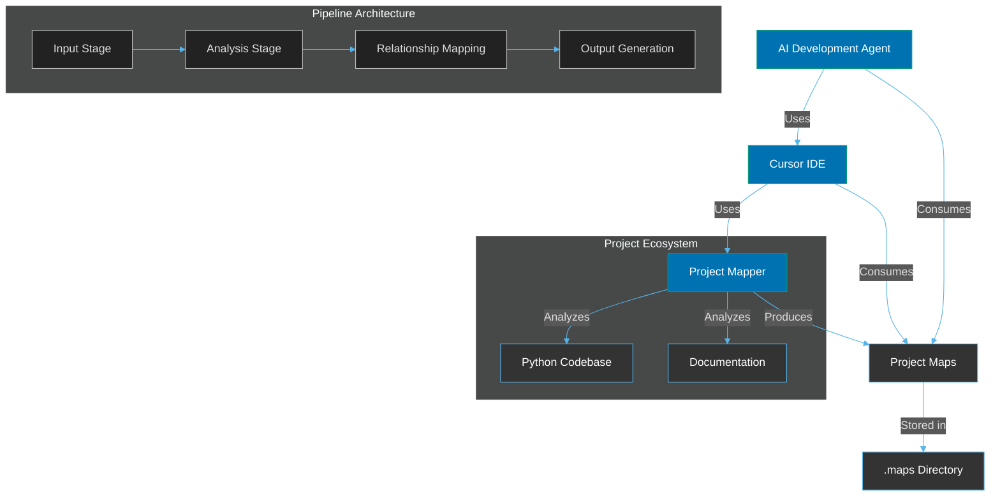
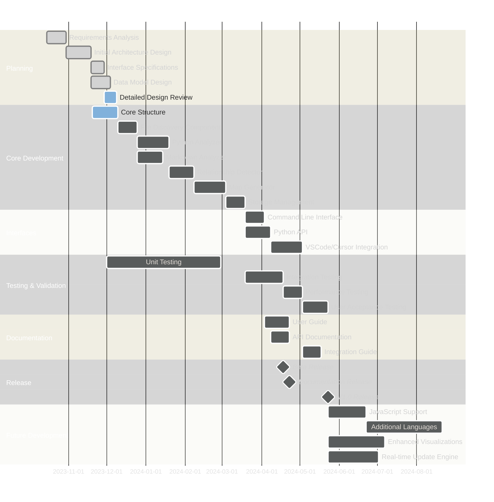

# Project Mapper Design Documentation

**Version:** 1.0.0  
**Last Updated:** 2023-11-05  
**Status:** Draft

## Overview

This documentation set contains the comprehensive design for the Project Mapper system, a tool designed to analyze Python projects and generate structured maps of their code and documentation components. The system uses a pipeline architecture optimized for AI agent consumption within VSCode-based IDEs, particularly Cursor.

## Purpose

The purpose of this design documentation is to:

1. Define the system requirements clearly
2. Outline the pipeline architecture and interfaces
3. Provide specifications for implementation
4. Establish standards for AI-optimized development
5. Serve as a reference for AI development agents

## Document Index

### Requirements

Documents that define what the system should do and under what constraints.

- [Functional Requirements](requirements/functional_requirements.md): Defines the core functionality of the system
- [Non-Functional Requirements](requirements/non_functional_requirements.md): Defines quality attributes and constraints

### Architecture

Documents that outline the high-level structure and composition of the system.

- [System Architecture](architecture/system_architecture.md): Defines the pipeline components and their interactions

### Interface

Documents that provide detailed definitions for interfaces.

- [Interface Specifications](interface/interface_specifications.md): Defines the APIs, output formats, and integration points with Cursor IDE

### Implementation Guidelines

Guidelines for implementing the system based on the design.

- [Coding Standards](appendices/coding_standards.md): Standards for AI-optimized code quality and consistency
- [Testing Strategy](appendices/testing_strategy.md): Approach to testing the system, including AI agent consumption tests
- [Release Process](appendices/release_process.md): Process for releasing new versions

## Key System Characteristics

The Project Mapper system is designed with the following key characteristics:

1. **Pipeline Architecture**: Sequential processing stages with clear interfaces
2. **Extensible Design**: Well-defined interfaces for adding new analyzers and formatters
3. **VSCode/Cursor Integration**: Optimized for use within Cursor IDE by AI development agents
4. **AI-Optimized Output**: Generates structured data with deterministic formatting for efficient AI consumption
5. **Multi-level Mapping**: Provides both project-level maps and file-level embedded maps
6. **Comprehensive Relationship Detection**: Identifies and scores relationships between code and documentation
7. **Standardized Storage**: Stores all maps in a `.maps` directory with consistent naming
8. **Flexible Configuration**: Multiple configuration sources with clear priority hierarchy

## System Context

The Project Mapper operates in the following context:

## Technical Stack

The Project Mapper system is built using the following technical stack:

- **Programming Language**: Python 3.8+
- **Core Libraries**:
  - **ast**: Python's built-in Abstract Syntax Tree module for code analysis
  - **markdown-it-py**: For parsing Markdown documentation
  - **PyYAML**: For configuration file support
  - **json**: For JSON output format support
- **Development Tools**:
  - **pytest**: For test-driven development
  - **black**: For code formatting
  - **isort**: For import sorting
  - **mypy**: For static type checking

## Getting Started with the Documentation

To navigate this documentation effectively:

1. Start with the [Functional Requirements](requirements/functional_requirements.md) to understand what the system does
2. Review the [System Architecture](architecture/system_architecture.md) to understand the pipeline structure
3. Dive into the [Interface Specifications](interface/interface_specifications.md) for implementation details
4. Refer to the appropriate appendices for specific guidelines

## Development Status

The Project Mapper system is currently in the design phase. The documentation reflects the intended design for the initial implementation (version 1.0.0).

## AI Agent Optimization

The Project Mapper system is specifically designed for use by AI development agents with the following optimizations:

1. **Token-Efficient Output**: Maps are structured to minimize token usage by AI models
2. **Deterministic Output**: Consistent ordering and formatting for reliable parsing
3. **Confidence Scoring**: Relationships include confidence scores to aid AI decision-making
4. **VSCode-Compatible References**: Location references follow VSCode conventions for navigation
5. **Chunking Support**: Large maps can be split into chunks for context window limitations
6. **Schema Versioning**: All outputs include schema version for backward compatibility

## Related Systems

- **VSCode/Cursor IDE**: Primary integration target for the Project Mapper
- **AI Development Agents**: Primary consumers of the generated maps
- **Python Language Server**: Complementary system for real-time code intelligence

## Development Roadmap

The roadmap outlines key development milestones, current progress, and future enhancement plans.

---

_Copyright © 2023 Project Mapper Team. All rights reserved._
