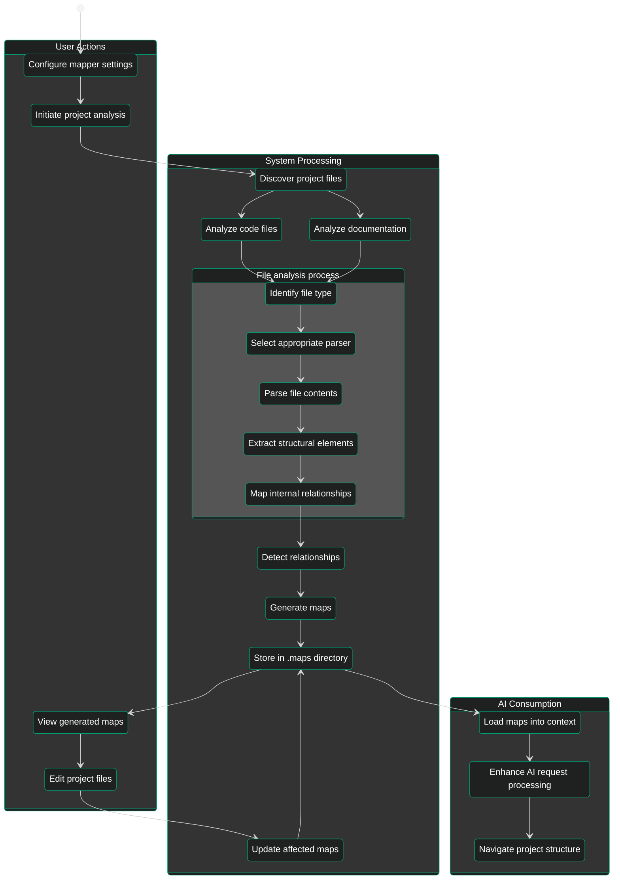

# Functional Requirements

**Version:** 1.0.0  
**Last Updated:** 2023-11-05  
**Status:** Draft

## Purpose

This document specifies the functional requirements for the Project Mapper system. These requirements define the specific behaviors and features that the system must provide to fulfill its purpose of generating code and documentation maps optimized for AI agent consumption within VSCode-based IDEs like Cursor.

## Core Requirements

### FR-1: Project Analysis

The system shall analyze project source code and documentation to extract structured information including:

- File structure and organization
- Code elements (classes, functions, variables, etc.)
- Documentation elements (sections, references, etc.)
- Relationships between elements
- Code and documentation metadata

### FR-2: Code Analysis

The system shall parse and analyze code files to:

- Extract structural elements (classes, functions, methods, variables)
- Identify import/dependency relationships
- Extract docstrings and comments
- Detect code patterns and conventions
- Support Python files in the initial version, with extension points for other languages

### FR-3: Documentation Analysis

The system shall parse and analyze documentation files to:

- Extract document structure (headings, sections, subsections)
- Identify cross-references within documentation
- Detect references to code elements
- Support Markdown files in the initial version, with extension points for other formats

### FR-4: Relationship Mapping

The system shall identify and map relationships between:

- Code elements and other code elements (inheritance, calls, uses)
- Documentation elements and other documentation elements (references, inclusions)
- Code elements and documentation elements (documentation for code)
- Assign confidence scores to inferred relationships

### FR-5: Map Generation

The system shall generate the following types of maps:

- **File maps**: Structure and content outline of individual files
- **Module maps**: Relationships between files in a module
- **Project maps**: High-level project organization and structure
- **Relationship maps**: Interconnections between elements across the project
- **Documentation maps**: Documentation structure and cross-references

### FR-6: Map Output

The system shall:

- Generate maps in structured JSON format
- Include schema version information in all outputs
- Support splitting large maps into connected chunks
- Store all maps in a `.maps` directory at the project root
- Follow the naming convention `<maptype>_<timestamp>.json`
- Generate an index file named `index_<timestamp>.json` containing references to all maps
- Provide real-time maps in `.maps/realtime` with appropriate versioning

### FR-7: AI Development and Maintenance Support

The system shall provide features specifically optimized for AI development agents:

- Generate output formats optimized for AI token efficiency
- Support incremental updates to maps as files change
- Provide relationship confidence scoring for AI decision-making
- Include location references (file paths, line numbers) compatible with VSCode/Cursor navigation
- Support request-specific map generation for targeted queries

### FR-8: Output Format Extensions

The system shall support:

- Custom output formats beyond JSON
- Output formatter configuration
- Transformation of maps into visualization formats

## Primary User Workflow

The following activity diagram illustrates the standard workflow for using Project Mapper to analyze a codebase:

The workflow illustrates how user actions trigger system processes, ultimately enabling AI-enhanced project understanding.

## IDE Integration Requirements

### FR-9: Cursor IDE Integration

The system shall integrate with the Cursor IDE by:

- Generating outputs compatible with Cursor's AI context retrieval mechanisms
- Supporting VSCode-compatible location references for navigation
- Providing real-time map updates during editing sessions
- Generating maps that align with Cursor's AI agent consumption patterns
- Supporting optimal chunking for Cursor's context window sizes

### FR-10: VSCode Extension API Compatibility

The system shall:

- Use data structures compatible with VSCode's extension API
- Support VSCode workspace folder structures
- Generate outputs that can be consumed by VSCode extensions
- Follow VSCode conventions for file paths and line references

## Configuration and Control Requirements

### FR-11: Configuration

The system shall provide configuration options for:

- Map types to generate
- Depth of analysis
- File inclusion/exclusion patterns
- Output location and format
- Chunking thresholds and strategies
- Language-specific parsing options

### FR-12: Command Line Interface

The system shall provide a command line interface that supports:

- Analyzing a specified project directory
- Generating specific map types
- Setting configuration options
- Updating existing maps incrementally
- Outputting maps to specified locations

### FR-13: Programmatic API

The system shall provide a Python API that allows:

- Embedding the mapper in other applications
- Customizing the analysis process
- Receiving maps as Python objects
- Event hooks for analysis stages
- Integration with IDE extensions

## Extension and Customization Requirements

### FR-14: Analyzer Extensions

The system shall support extending analysis capabilities through:

- Custom language analyzers
- Custom documentation format analyzers
- Custom relationship detectors
- Analyzer configuration options

### FR-15: Output Format Extensions

The system shall support:

- Custom output formats beyond JSON
- Output formatter configuration
- Transformation of maps into visualization formats

## Related Documents

- [Non-Functional Requirements](non_functional_requirements.md)
- [System Architecture](../architecture/system_architecture.md)
- [Interface Specifications](../interface/interface_specifications.md)
- [Data Model](../models/data_model.md)

---

_End of Functional Requirements Document_
