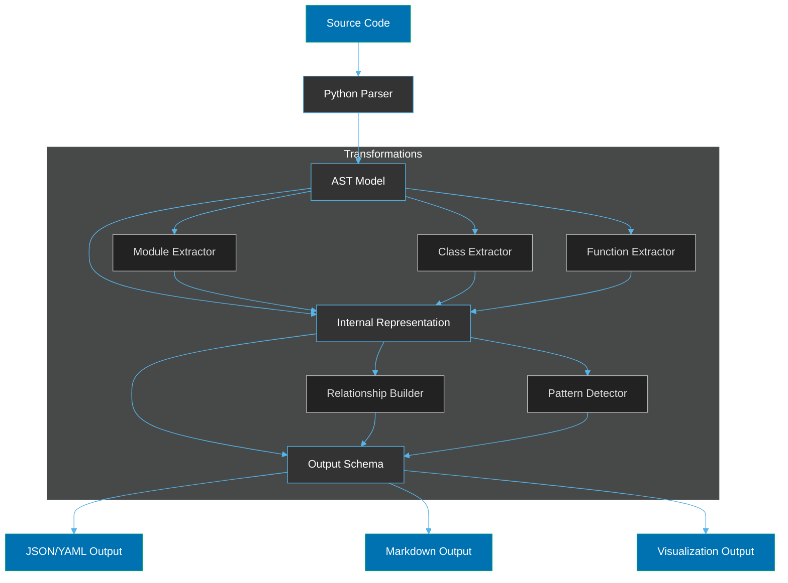
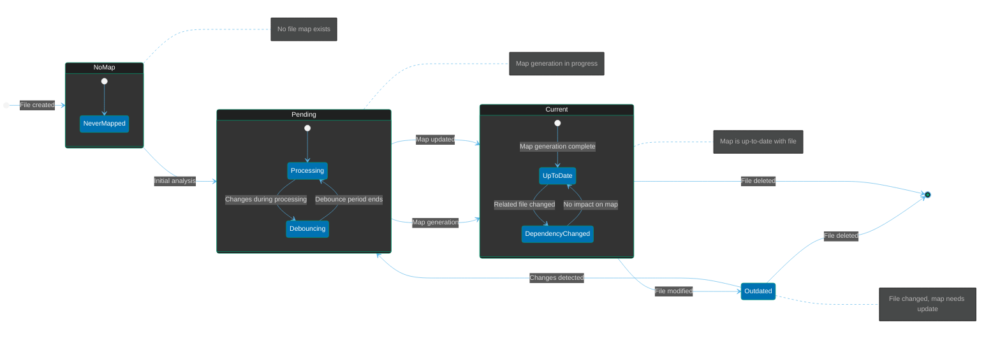

# Data Model

**Version:** 1.0.0  
**Last Updated:** 2023-11-05  
**Status:** Draft

## Document Purpose

This document defines the data model for the Project Mapper system. It describes the key data entities, their attributes, relationships, and how they are represented in the system's internal structures and output formats.

## Data Model Overview

The Project Mapper data model represents the structural elements of Python projects, their relationships, and the metadata associated with them. The model is designed to capture:

1. Project structure (modules, packages, files)
2. Code elements (classes, functions, variables)
3. Relationships (inheritance, dependencies, calls)
4. Architectural patterns
5. Metadata (docstrings, locations, metrics)

## Core Data Entities

### Project

The top-level entity representing a complete Python project.

**Attributes:**

- name: String (Project name)
- root_path: String (Root directory path)
- packages: List[Package] (Top-level packages)
- modules: List[Module] (Top-level modules)
- entry_points: List[EntryPoint] (Project entry points)
- metadata: ProjectMetadata (Project-level metadata)

### Package

Represents a Python package (directory with **init**.py).

**Attributes:**

- name: String (Package name)
- path: String (Relative path from project root)
- subpackages: List[Package] (Nested packages)
- modules: List[Module] (Modules in this package)
- is_namespace: Boolean (Whether it's a namespace package)
- metadata: PackageMetadata (Package-level metadata)

### Module

Represents a Python module (individual .py file).

**Attributes:**

- name: String (Module name)
- path: String (Relative path from project root)
- imports: List[Import] (Import statements)
- classes: List[Class] (Class definitions)
- functions: List[Function] (Function definitions)
- variables: List[Variable] (Module-level variables)
- metadata: ModuleMetadata (Module-level metadata)

### Class

Represents a Python class definition.

**Attributes:**

- name: String (Class name)
- qualified_name: String (Fully qualified name)
- parent_classes: List[ClassReference] (Base classes)
- methods: List[Function] (Class methods)
- attributes: List[Variable] (Class attributes)
- is_abstract: Boolean (Whether class is abstract)
- metadata: ClassMetadata (Class-level metadata)

### Function

Represents a Python function or method.

**Attributes:**

- name: String (Function name)
- qualified_name: String (Fully qualified name)
- parameters: List[Parameter] (Function parameters)
- return_type: String (Return type if specified)
- decorators: List[String] (Applied decorators)
- is_method: Boolean (Whether it's a class method)
- method_type: String (Static, class, or instance method)
- called_functions: List[FunctionReference] (Functions called by this function)
- metadata: FunctionMetadata (Function-level metadata)

### Variable

Represents a variable or attribute.

**Attributes:**

- name: String (Variable name)
- type_hint: String (Type hint if specified)
- value: String (Initial value if constant/literal)
- scope: String (Module, class, or function scope)
- metadata: VariableMetadata (Variable-level metadata)

### Import

Represents an import statement.

**Attributes:**

- source: String (Import source)
- alias: String (Import alias if any)
- is_from_import: Boolean (Whether it's a from import)
- imported_names: List[String] (Names imported with from)
- metadata: ImportMetadata (Import-level metadata)

### EntryPoint

Represents a potential entry point to the application.

**Attributes:**

- type: String (Script, CLI, API, etc.)
- path: String (Path to entry point)
- function: FunctionReference (Main function if applicable)
- metadata: EntryPointMetadata (Entry point metadata)

### Reference Types

#### ClassReference

- name: String (Referenced class name)
- module: String (Module containing the class)
- resolution_status: String (Resolved, unresolved, etc.)

#### FunctionReference

- name: String (Referenced function name)
- module: String (Module containing the function)
- class_name: String (Class name if method)
- resolution_status: String (Resolved, unresolved, etc.)

### Metadata Types

#### ProjectMetadata

- description: String (Project description)
- version: String (Project version)
- license: String (Project license)
- repository: String (Repository URL)
- documentation: String (Documentation URL)

#### PackageMetadata

- description: String (From docstring)
- internal: Boolean (Whether package is internal)
- location: Location (File location)

#### ModuleMetadata

- description: String (From docstring)
- authors: List[String] (Author information)
- location: Location (File location)
- metrics: CodeMetrics (Code metrics)

#### ClassMetadata

- description: String (From docstring)
- location: Location (Code location)
- metrics: CodeMetrics (Code metrics)

#### FunctionMetadata

- description: String (From docstring)
- location: Location (Code location)
- metrics: CodeMetrics (Code metrics)
- complexity: Integer (Cyclomatic complexity)

#### VariableMetadata

- description: String (From docstring or comments)
- location: Location (Code location)

#### ImportMetadata

- location: Location (Code location)
- is_external: Boolean (Whether import is external)

#### Location

- file_path: String (File path)
- start_line: Integer (Starting line number)
- end_line: Integer (Ending line number)
- start_column: Integer (Starting column)
- end_column: Integer (Ending column)

#### CodeMetrics

- loc: Integer (Lines of code)
- lloc: Integer (Logical lines of code)
- comments: Integer (Number of comments)
- docstring_lines: Integer (Docstring lines)
- complexity: Integer (Overall complexity)

## Relationships

### Inheritance Relationships

Represents inheritance between classes.

**Attributes:**

- child: ClassReference (Child class)
- parent: ClassReference (Parent class)
- inheritance_type: String (Direct, mixin, interface, etc.)

### Dependency Relationships

Represents dependencies between modules.

**Attributes:**

- source: String (Source module)
- target: String (Target module)
- strength: Integer (Dependency strength)
- type: String (Import, usage, etc.)

### Call Relationships

Represents function calls.

**Attributes:**

- caller: FunctionReference (Calling function)
- callee: FunctionReference (Called function)
- frequency: Integer (Call frequency)
- locations: List[Location] (Call locations)

## Architectural Patterns

### Pattern

Represents a detected architectural pattern.

**Attributes:**

- name: String (Pattern name)
- confidence: Float (Detection confidence)
- components: List[PatternComponent] (Involved components)
- description: String (Pattern description)

### PatternComponent

Represents a component in a pattern.

**Attributes:**

- role: String (Component role in pattern)
- element_type: String (Class, module, etc.)
- element_reference: Reference (Reference to the element)

## Output Schemas

### JSON/YAML Schema

The primary output schema for machine-readable formats.

```json
{
  "project": {
    "name": "string",
    "version": "string",
    "root_path": "string",
    "metadata": {
      "description": "string",
      "license": "string",
      "repository": "string"
    },
    "structure": {
      "packages": [
        {
          "name": "string",
          "path": "string",
          "is_namespace": "boolean",
          "description": "string",
          "subpackages": ["recursive-reference"],
          "modules": ["module-reference"]
        }
      ],
      "modules": [
        {
          "name": "string",
          "path": "string",
          "description": "string",
          "classes": ["class-reference"],
          "functions": ["function-reference"],
          "imports": ["import-reference"]
        }
      ]
    },
    "components": {
      "classes": [
        {
          "name": "string",
          "qualified_name": "string",
          "description": "string",
          "parent_classes": ["class-reference"],
          "methods": ["function-reference"],
          "attributes": ["variable-reference"],
          "location": {
            "file_path": "string",
            "start_line": "integer",
            "end_line": "integer"
          }
        }
      ],
      "functions": [
        {
          "name": "string",
          "qualified_name": "string",
          "description": "string",
          "parameters": [
            {
              "name": "string",
              "type_hint": "string",
              "default_value": "string"
            }
          ],
          "return_type": "string",
          "location": {
            "file_path": "string",
            "start_line": "integer",
            "end_line": "integer"
          },
          "metrics": {
            "complexity": "integer"
          }
        }
      ]
    },
    "relationships": {
      "inheritance": [
        {
          "child": "class-reference",
          "parent": "class-reference",
          "type": "string"
        }
      ],
      "dependencies": [
        {
          "source": "module-reference",
          "target": "module-reference",
          "strength": "integer"
        }
      ],
      "calls": [
        {
          "caller": "function-reference",
          "callee": "function-reference",
          "frequency": "integer"
        }
      ]
    },
    "patterns": [
      {
        "name": "string",
        "confidence": "float",
        "components": [
          {
            "role": "string",
            "element_type": "string",
            "element_reference": "reference"
          }
        ]
      }
    ],
    "entry_points": [
      {
        "type": "string",
        "path": "string",
        "description": "string"
      }
    ]
  }
}
```

## Entity Relationship Diagram

```mermaid
%%{init: {
  'theme': 'dark',
  'themeVariables': {
    'primaryColor': '#0072B2',
    'primaryTextColor': '#FFFFFF',
    'primaryBorderColor': '#009E73',
    'lineColor': '#56B4E9',
    'secondaryColor': '#333333',
    'tertiaryColor': '#222222',
    'textColor': '#DDDDDD',
    'entityBorder': '#009E73',
    'entityLabelBackground': '#0072B2',
    'entityLabelColor': '#FFFFFF',
    'attributeBackgroundColor': '#333333',
    'attributeBorderColor': '#56B4E9',
    'attributeTextColor': '#DDDDDD'
  }
}}%%
erDiagram
    Project ||--o{ Package : contains
    Project ||--o{ Module : contains
    Project ||--o{ EntryPoint : has
    Package ||--o{ Package : contains
    Package ||--o{ Module : contains
    Module ||--o{ Class : defines
    Module ||--o{ Function : defines
    Module ||--o{ Variable : defines
    Module ||--o{ Import : includes
    Class ||--o{ Function : has
    Class ||--o{ Variable : has
    Class ||--o{ Class : inherits
    Function ||--o{ Parameter : has
    Function ||--o{ Function : calls
    Project ||--o{ Pattern : exhibits
    Pattern ||--o{ PatternComponent : comprises

    Project {
        string name
        string root_path
        ProjectMetadata metadata
    }

    Package {
        string name
        string path
        boolean is_namespace
        PackageMetadata metadata
    }

    Module {
        string name
        string path
        ModuleMetadata metadata
    }

    Class {
        string name
        string qualified_name
        boolean is_abstract
        ClassMetadata metadata
    }

    Function {
        string name
        string qualified_name
        string return_type
        boolean is_method
        string method_type
        FunctionMetadata metadata
    }

    Variable {
        string name
        string type_hint
        string value
        string scope
        VariableMetadata metadata
    }

    Import {
        string source
        string alias
        boolean is_from_import
        ImportMetadata metadata
    }

    EntryPoint {
        string type
        string path
    }

    Pattern {
        string name
        float confidence
        string description
    }

    PatternComponent {
        string role
        string element_type
    }
```

## Data Flow Between Models



## Data Storage

The Project Mapper system does not persist data between runs but generates output files in the following formats:

1. **JSON/YAML Files**: Machine-readable structured data

   - Default: `project_map.json` or `project_map.yaml`
   - Schema follows the JSON schema described above

2. **Markdown Files**: Human-readable documentation

   - Main index: `project_map.md`
   - Component details: `components/*.md`
   - Relationship maps: `relationships/*.md`

3. **Visualization Files**: Graphical representations
   - Module diagram: `diagrams/modules.svg`
   - Class diagram: `diagrams/classes.svg`
   - Dependency diagram: `diagrams/dependencies.svg`

## Data Integrity

To maintain data integrity, the system implements the following:

1. **Validation**: Input and output schema validation
2. **Resolution**: Reference resolution for cross-references
3. **Consistency Checks**: Verification of relationship consistency
4. **Error Handling**: Graceful handling of incomplete or invalid data

## Related Documents

- [System Architecture](../architecture/system_architecture.md)
- [Interface Specifications](interface_specifications.md)
- [Functional Requirements](../requirements/functional_requirements.md)

## File Map Lifecycle

The following state diagram illustrates the lifecycle of a file map, including creation, updates, and invalidation:



## Output Data Formats

### File Maps

File maps are embedded within source files as single-line JSON comments at the top of the file. They provide a compact representation of the file's structure and content to help AI agents understand the file without reading it entirely.

#### Format Structure

```
// FILE_MAP_BEGIN {"sections":{"imports":"1-10","class_definitions":"12-45","helper_functions":"47-80","main":"82-95"},"key_concepts":["authentication","data_validation","error_handling"],"relationships":{"imports":["module_a","module_b"],"used_by":["service.py"]},"hash":"a1b2c3d4e5f6"} FILE_MAP_END
```

#### Core Components

- **schema_version**: String (Version of the file map schema)
- **sections**: Object (Named sections with line ranges)
- **key_concepts**: Array[String] (Primary concepts in the file)
- **relationships**: Object (Imports, dependencies, etc.)
- **complexity**: Object (Metrics about file complexity)
- **api_info**: Object (Public interfaces exposed by the file)
- **hash**: String (Hash value for detecting changes, computed from file content excluding the file map itself)
- **last_updated**: Timestamp (When the file map was last generated)
- **update_info**: Object (Metadata about update process and system state)

#### Change Detection Data

The file map includes specific metadata used in the change detection and debouncing system:

```json
{
  "update_info": {
    "content_hash": "a1b2c3d4e5f6g7h8i9j0k1l2m3n4o5p6",
    "map_generation": 3,
    "last_updated": "2023-11-07T14:32:17.345Z",
    "update_source": "file_change|map_refresh|dependency_update",
    "map_version": "1.1"
  }
}
```

The `content_hash` is the critical component for preventing update loops. It is calculated as follows:

1. Extract the original file content by removing the file map (content between FILE_MAP_BEGIN and FILE_MAP_END)
2. Normalize whitespace and line endings
3. Calculate SHA-256 hash of the normalized content
4. Store hash in the file map

This approach ensures that updates to the file map itself don't trigger new map generation cycles, avoiding infinite update loops while correctly detecting actual content changes.

#### Python File Map Schema

```json
{
  "schema_version": "1.0",
  "sections": {
    "imports": "1-15",
    "constants": "17-25",
    "classes": {
      "MyClass": "27-150",
      "AnotherClass": "152-200"
    },
    "functions": {
      "main": "202-250",
      "helpers": "252-300"
    }
  },
  "key_concepts": ["data_processing", "authentication", "api_client"],
  "relationships": {
    "imports": ["os", "sys", "requests"],
    "imported_by": ["app.py", "utils.py"],
    "depends_on": ["config.py", "models.py"]
  },
  "complexity": {
    "loc": 300,
    "classes": 2,
    "functions": 8,
    "cyclomatic": 24
  },
  "api_info": {
    "public_classes": ["MyClass"],
    "public_functions": ["process_data", "validate_input"]
  },
  "hash": "a1b2c3d4e5f6g7h8i9j0",
  "update_info": {
    "content_hash": "a1b2c3d4e5f6g7h8i9j0k1l2m3n4o5p6",
    "map_generation": 3,
    "last_updated": "2023-11-07T14:32:17.345Z"
  }
}
```

#### Markdown File Map Schema

```json
{
  "schema_version": "1.0",
  "sections": {
    "title": "1-1",
    "introduction": "3-10",
    "usage": "12-25",
    "api": "27-50",
    "examples": "52-80"
  },
  "key_concepts": ["installation", "configuration", "advanced_usage"],
  "relationships": {
    "references": ["README.md", "CONTRIBUTING.md"],
    "referenced_by": ["index.md"],
    "code_references": ["main.py", "utils.py"]
  },
  "complexity": {
    "loc": 80,
    "sections": 5,
    "code_blocks": 6
  },
  "hash": "k1l2m3n4o5p6q7r8s9t0",
  "update_info": {
    "content_hash": "k1l2m3n4o5p6q7r8s9t0u1v2w3x4y5z6",
    "map_generation": 2,
    "last_updated": "2023-11-07T14:30:12.123Z"
  }
}
```

#### JavaScript File Map Schema

```json
{
  "schema_version": "1.0",
  "sections": {
    "imports": "1-10",
    "constants": "12-20",
    "components": {
      "MainComponent": "22-100",
      "HelperComponent": "102-150"
    },
    "hooks": {
      "useData": "152-180"
    },
    "exports": "182-185"
  },
  "key_concepts": ["react_component", "data_fetching", "state_management"],
  "relationships": {
    "imports": ["react", "axios", "./utils"],
    "imported_by": ["App.js", "Router.js"]
  },
  "complexity": {
    "loc": 185,
    "components": 2,
    "hooks": 1
  },
  "api_info": {
    "exports": ["MainComponent", "useData"]
  },
  "hash": "u1v2w3x4y5z6a7b8c9d0",
  "update_info": {
    "content_hash": "u1v2w3x4y5z6a7b8c9d0e1f2g3h4i5j6",
    "map_generation": 5,
    "last_updated": "2023-11-07T15:40:22.567Z"
  }
}
```

---

_End of Data Model Document_
