# Claude Code MCP Server Architecture Visualization

## Multi-Tiered Recursive Call Architecture

### Complete System Hierarchy - Enhanced View

```mermaid
graph TB
    %% Styling definitions
    classDef parentStyle fill:#1e88e5,stroke:#1565c0,stroke-width:3px,color:#ffffff
    classDef managerStyle fill:#ff9800,stroke:#f57c00,stroke-width:2px,color:#ffffff
    classDef l1Style fill:#9c27b0,stroke:#7b1fa2,stroke-width:2px,color:#ffffff
    classDef l2Style fill:#4caf50,stroke:#388e3c,stroke-width:2px,color:#ffffff
    classDef l3Style fill:#ffc107,stroke:#ffa000,stroke-width:2px,color:#000000
    classDef l4Style fill:#e91e63,stroke:#c2185b,stroke-width:2px,color:#ffffff
    classDef storageStyle fill:#607d8b,stroke:#455a64,stroke-width:2px,color:#ffffff

    subgraph "🎯 Parent Process (Level 0)"
        P["🚀 Parent Claude Agent"]
        FJM["⚡ FireAndForgetJobManager"]
        RC["📊 ResultCollector"]
    end

    subgraph "🔄 L1 Agents (Decoupled - Fire & Forget)"
        A1["🔧 L1 Agent A<br/>Process A1"]
        A2["🔧 L1 Agent B<br/>Process A2"]
        A3["🔧 L1 Agent C<br/>Process A3"]
    end

    subgraph "⚙️ L2 Agents (Coupled within L1)"
        B1["🛠️ L2 Agent A1<br/>Managed by A1"]
        B2["🛠️ L2 Agent A2<br/>Managed by A1"]
        B3["🛠️ L2 Agent B1<br/>Managed by A2"]
        B4["🛠️ L2 Agent B2<br/>Managed by A2"]
        B5["🛠️ L2 Agent C1<br/>Managed by A3"]
    end

    subgraph "🔨 L3 Agents (Coupled within L2)"
        C1["⚡ L3 Agent A1.1<br/>Managed by B1"]
        C2["⚡ L3 Agent A1.2<br/>Managed by B1"]
        C3["⚡ L3 Agent A2.1<br/>Managed by B2"]
        C4["⚡ L3 Agent B1.1<br/>Managed by B3"]
        C5["⚡ L3 Agent C1.1<br/>Managed by B5"]
    end

    subgraph "🔬 L4 Agents (Deep Recursion)"
        D1["🎯 L4 Agent A1.1.1<br/>Managed by C1"]
        D2["🎯 L4 Agent A1.1.2<br/>Managed by C1"]
        D3["🎯 L4 Agent C1.1.1<br/>Managed by C5"]
    end

    subgraph "💾 Result Storage (File-Based)"
        R1["📄 Result A1.json<br/>File-based"]
        R2["📄 Result A2.json<br/>File-based"]
        R3["📄 Result A3.json<br/>File-based"]
    end

    %% Connections with enhanced styling
    P --> FJM
    P --> RC

    %% L1 connections (decoupled - dotted lines)
    FJM -.->|"🚀 Spawns & Forgets"| A1
    FJM -.->|"🚀 Spawns & Forgets"| A2
    FJM -.->|"🚀 Spawns & Forgets"| A3

    %% L1 to L2 connections (coupled - solid lines)
    A1 -->|"🔗 Coupled Management"| B1
    A1 -->|"🔗 Coupled Management"| B2
    A2 -->|"🔗 Coupled Management"| B3
    A2 -->|"🔗 Coupled Management"| B4
    A3 -->|"🔗 Coupled Management"| B5

    %% L2 to L3 connections (coupled)
    B1 -->|"🔗 Coupled Management"| C1
    B1 -->|"🔗 Coupled Management"| C2
    B2 -->|"🔗 Coupled Management"| C3
    B3 -->|"🔗 Coupled Management"| C4
    B5 -->|"🔗 Coupled Management"| C5

    %% L3 to L4 connections (coupled)
    C1 -->|"🔗 Coupled Management"| D1
    C1 -->|"🔗 Coupled Management"| D2
    C5 -->|"🔗 Coupled Management"| D3

    %% Result collection
    A1 -->|"💾 Writes Result"| R1
    A2 -->|"💾 Writes Result"| R2
    A3 -->|"💾 Writes Result"| R3
    RC -->|"📥 Collects Results"| R1
    RC -->|"📥 Collects Results"| R2
    RC -->|"📥 Collects Results"| R3

    %% Apply styles
    class P,FJM,RC parentStyle
    class A1,A2,A3 l1Style
    class B1,B2,B3,B4,B5 l2Style
    class C1,C2,C3,C4,C5 l3Style
    class D1,D2,D3 l4Style
    class R1,R2,R3 storageStyle
```

### Enhanced L1 Agent Internal Structure

```mermaid
graph TB
    %% Styling definitions
    classDef l1AgentStyle fill:#9c27b0,stroke:#7b1fa2,stroke-width:3px,color:#ffffff
    classDef managerStyle fill:#ff9800,stroke:#f57c00,stroke-width:2px,color:#ffffff
    classDef l2Style fill:#4caf50,stroke:#388e3c,stroke-width:2px,color:#ffffff
    classDef l3Style fill:#ffc107,stroke:#ffa000,stroke-width:2px,color:#000000
    classDef resultStyle fill:#607d8b,stroke:#455a64,stroke-width:2px,color:#ffffff

    subgraph "🏗️ L1 Agent A Internal Architecture"
        L1A["🔧 L1 Agent A<br/>Process A1<br/>Independent Process"]
        L1JM["⚡ JobManager A<br/>Manages L2+ Agents"]
        L1RM["🛡️ RecursionManager A<br/>Enforces Limits"]
        L1PM["📊 PerformanceMonitor A<br/>Tracks Metrics"]
    end

    subgraph "🔗 L1 Agent A's Coupled Subtree"
        L2A1["🛠️ L2 Agent A1<br/>Managed by A1"]
        L2A2["🛠️ L2 Agent A2<br/>Managed by A1"]
        L3A1["⚡ L3 Agent A1.1<br/>Managed by L2A1"]
        L3A2["⚡ L3 Agent A1.2<br/>Managed by L2A1"]
        L3A3["⚡ L3 Agent A2.1<br/>Managed by L2A2"]
    end

    subgraph "💾 L1 Agent A's Result Aggregation"
        L1Result["📄 Final Result A1.json<br/>Aggregated Output"]
    end

    %% Internal management connections
    L1A --> L1JM
    L1A --> L1RM
    L1A --> L1PM

    %% Coupled subtree management
    L1JM -->|"🔗 Spawns & Manages"| L2A1
    L1JM -->|"🔗 Spawns & Manages"| L2A2
    L2A1 -->|"🔗 Spawns & Manages"| L3A1
    L2A1 -->|"🔗 Spawns & Manages"| L3A2
    L2A2 -->|"🔗 Spawns & Manages"| L3A3

    %% Result aggregation flow
    L3A1 -->|"📤 Returns Result"| L1Result
    L3A2 -->|"📤 Returns Result"| L1Result
    L3A3 -->|"📤 Returns Result"| L1Result
    L1A -->|"💾 Writes Final Result"| L1Result

    %% Apply styles
    class L1A l1AgentStyle
    class L1JM,L1RM,L1PM managerStyle
    class L2A1,L2A2 l2Style
    class L3A1,L3A2,L3A3 l3Style
    class L1Result resultStyle
```

### Enhanced Recursive Call Flow and Result Collection

```mermaid
sequenceDiagram
    participant P as 🚀 Parent Agent
    participant FJM as ⚡ FireAndForgetJobManager
    participant A1 as 🔧 L1 Agent A
    participant A2 as 🔧 L1 Agent B
    participant B1 as 🛠️ L2 Agent A1
    participant B2 as 🛠️ L2 Agent B1
    participant C1 as ⚡ L3 Agent A1.1
    participant RC as 📊 ResultCollector
    participant FS as 💾 File System

    Note over P,FS: 🎯 Phase 1: Parent Spawns L1 Agents (Decoupled)

    P->>FJM: 🚀 spawn_agent(task_A)
    FJM->>A1: 🔄 Spawn detached process
    FJM-->>P: ✅ {"job_id": "A", "result_location": "/tmp/A.json"}

    P->>FJM: 🚀 spawn_agent(task_B)
    FJM->>A2: 🔄 Spawn detached process
    FJM-->>P: ✅ {"job_id": "B", "result_location": "/tmp/B.json"}

    Note over P: 🎉 Parent continues with other work<br/>✅ No API violation - Immediate tool results

    Note over A1,FS: 🔗 Phase 2: L1 Agent A Manages Its Subtree (Coupled)

    A1->>A1: 🔧 claude_run_async(L2_task_A1)
    A1->>B1: 🔗 Spawn subprocess
    A1->>A1: 🔧 claude_run_async(L2_task_A2)
    A1->>B2: 🔗 Spawn subprocess

    Note over B1,FS: 🔗 Phase 3: L2 Agent A1 Manages Its Subtree (Coupled)

    B1->>B1: 🛠️ claude_run_async(L3_task_A1.1)
    B1->>C1: 🔗 Spawn subprocess

    Note over C1: ⚡ Phase 4: L3 Agent Executes

    C1->>C1: 🎯 Execute task
    C1-->>B1: 📤 Return result

    Note over A1,FS: 📤 Phase 5: Results Flow Back Up Hierarchy

    B1-->>A1: 📤 L2 result with L3 data
    B2-->>A1: 📤 L2 result
    A1->>FS: 💾 Write aggregated result to /tmp/A.json

    Note over A2,FS: 🔗 Phase 6: L1 Agent B Manages Its Subtree

    A2->>A2: 🔧 claude_run_async(L2_task_B1)
    A2->>B2: 🔗 Spawn subprocess
    B2-->>A2: 📤 L2 result
    A2->>FS: 💾 Write result to /tmp/B.json

    Note over P,FS: 📥 Phase 7: Parent Collects Results

    P->>RC: 📥 collect_results()
    RC->>FS: 🔍 Poll for completed results
    FS-->>RC: 📄 Results available
    RC-->>P: 📊 Collected results

    Note over P: 🎉 All recursive results<br/>📊 collected and aggregated
```

### Enhanced Coupling vs Decoupling Comparison

```mermaid
graph TB
    %% Styling definitions
    classDef parentStyle fill:#1e88e5,stroke:#1565c0,stroke-width:3px,color:#ffffff
    classDef l1Style fill:#9c27b0,stroke:#7b1fa2,stroke-width:2px,color:#ffffff
    classDef l2Style fill:#4caf50,stroke:#388e3c,stroke-width:2px,color:#ffffff
    classDef storageStyle fill:#607d8b,stroke:#455a64,stroke-width:2px,color:#ffffff
    classDef coupledStyle fill:#ff5722,stroke:#d84315,stroke-width:2px,color:#ffffff
    classDef decoupledStyle fill:#4caf50,stroke:#388e3c,stroke-width:2px,color:#ffffff

    subgraph "🚀 Level 1 - Decoupled (Fire & Forget)"
        P["🚀 Parent Agent"]
        A1["🔧 L1 Agent A"]
        A2["🔧 L1 Agent B"]
        A3["🔧 L1 Agent C"]

        P -.->|"🚀 Spawns & Forgets"| A1
        P -.->|"🚀 Spawns & Forgets"| A2
        P -.->|"🚀 Spawns & Forgets"| A3
    end

    subgraph "🔗 Level 2+ - Coupled (Within Each L1)"
        B1["🛠️ L2 Agent A1"]
        B2["🛠️ L2 Agent A2"]
        B3["🛠️ L2 Agent B1"]
        C1["⚡ L3 Agent A1.1"]
        C2["⚡ L3 Agent A1.2"]

        A1 -->|"🔗 Coupled Management"| B1
        A1 -->|"🔗 Coupled Management"| B2
        A2 -->|"🔗 Coupled Management"| B3
        B1 -->|"🔗 Coupled Management"| C1
        B1 -->|"🔗 Coupled Management"| C2
    end

    subgraph "💾 Result Collection Patterns"
        R1["📄 File-based for L1<br/>Decoupled Collection"]
        R2["📤 Direct for L2+<br/>Coupled Collection"]

        A1 --> R1
        A2 --> R1
        A3 --> R1
        B1 --> R2
        B2 --> R2
        C1 --> R2
    end

    %% Apply styles
    class P parentStyle
    class A1,A2,A3 l1Style
    class B1,B2,B3 l2Style
    class C1,C2 l2Style
    class R1,R2 storageStyle
```

### Enhanced Protocol Compliance Comparison

```mermaid
graph LR
    %% Styling definitions
    classDef errorStyle fill:#f44336,stroke:#d32f2f,stroke-width:3px,color:#ffffff
    classDef successStyle fill:#4caf50,stroke:#388e3c,stroke-width:3px,color:#ffffff
    classDef parentStyle fill:#1e88e5,stroke:#1565c0,stroke-width:2px,color:#ffffff
    classDef resultStyle fill:#607d8b,stroke:#455a64,stroke-width:2px,color:#ffffff

    subgraph "❌ Original - Protocol Violation Risk"
        P1["🚀 Parent"]
        T1["🔧 tool_use_id_123"]
        T2["🔧 tool_use_id_456"]
        E1["💥 ERROR!<br/>API Violation"]

        P1 --> T1
        P1 --> T2
        T1 --> E1
        T2 --> E1
    end

    subgraph "✅ V2 - Protocol Compliant"
        P2["🚀 Parent"]
        R1["📄 {'job_id': 'A',<br/>'result_location': '/tmp/A.json'}"]
        R2["📄 {'job_id': 'B',<br/>'result_location': '/tmp/B.json'}"]
        C1["🎉 Continue working<br/>No API Violation"]

        P2 --> R1
        P2 --> R2
        R1 --> C1
        R2 --> C1
    end

    %% Apply styles
    class E1 errorStyle
    class C1 successStyle
    class P1,P2 parentStyle
    class R1,R2 resultStyle
```

### Enhanced Recursion Depth and Concurrency Management

```mermaid
graph TB
    %% Styling definitions
    classDef managerStyle fill:#ff9800,stroke:#f57c00,stroke-width:3px,color:#ffffff
    classDef limitStyle fill:#4caf50,stroke:#388e3c,stroke-width:2px,color:#ffffff
    classDef countStyle fill:#9c27b0,stroke:#7b1fa2,stroke-width:2px,color:#ffffff
    classDef resourceStyle fill:#607d8b,stroke:#455a64,stroke-width:2px,color:#ffffff

    subgraph "🛡️ Recursion Management System"
        RL["🛡️ RecursionManager<br/>Central Control"]
        DL["📏 Depth Limit: 5<br/>Maximum Levels"]
        CL["⚡ Concurrency Limit: 10<br/>Parallel Agents"]
        TL["📊 Total Jobs Limit: 100<br/>Overall Capacity"]
    end

    subgraph "📈 Current System State"
        L1Count["🔧 L1 Agents: 3<br/>Decoupled Processes"]
        L2Count["🛠️ L2 Agents: 8<br/>Coupled Subprocesses"]
        L3Count["⚡ L3 Agents: 15<br/>Deep Recursion"]
        L4Count["🎯 L4 Agents: 5<br/>Maximum Depth"]
    end

    subgraph "💻 Resource Distribution"
        PRes["🚀 Parent: 1 process<br/>Main Controller"]
        L1Res["🔧 L1: 3 processes<br/>Independent Execution"]
        L2Res["🛠️ L2: 8 subprocesses<br/>Managed by L1"]
        L3Res["⚡ L3: 15 subprocesses<br/>Deep Management"]
        L4Res["🎯 L4: 5 subprocesses<br/>Maximum Depth"]
    end

    %% Connections
    RL --> DL
    RL --> CL
    RL --> TL

    L1Count --> L1Res
    L2Count --> L2Res
    L3Count --> L3Res
    L4Count --> L4Res

    %% Apply styles
    class RL managerStyle
    class DL,CL,TL limitStyle
    class L1Count,L2Count,L3Count,L4Count countStyle
    class PRes,L1Res,L2Res,L3Res,L4Res resourceStyle
```

### Enhanced Failure Isolation Comparison

```mermaid
graph TB
    %% Styling definitions
    classDef parentStyle fill:#1e88e5,stroke:#1565c0,stroke-width:3px,color:#ffffff
    classDef agentStyle fill:#9c27b0,stroke:#7b1fa2,stroke-width:2px,color:#ffffff
    classDef failureStyle fill:#f44336,stroke:#d32f2f,stroke-width:3px,color:#ffffff
    classDef isolatedStyle fill:#4caf50,stroke:#388e3c,stroke-width:2px,color:#ffffff

    subgraph "💥 Original - Cascade Failures"
        P1["🚀 Parent Agent"]
        A1["🔧 Agent A"]
        A2["🔧 Agent B"]
        A3["🔧 Agent C"]

        P1 --> A1
        P1 --> A2
        P1 --> A3

        A1 -.->|"💥 Failure affects"| P1
        A2 -.->|"💥 Failure affects"| P1
        A3 -.->|"💥 Failure affects"| P1
    end

    subgraph "🛡️ V2 - Isolated Failures"
        P2["🚀 Parent Agent"]
        A4["🔧 Agent A Script"]
        A5["🔧 Agent B Script"]
        A6["🔧 Agent C Script"]

        P2 -.->|"🚀 Spawns & forgets"| A4
        P2 -.->|"🚀 Spawns & forgets"| A5
        P2 -.->|"🚀 Spawns & forgets"| A6

        A4 -.->|"🛡️ Failure isolated"| P2
        A5 -.->|"🛡️ Failure isolated"| P2
        A6 -.->|"🛡️ Failure isolated"| P2
    end

    %% Apply styles
    class P1,P2 parentStyle
    class A1,A2,A3,A4,A5,A6 agentStyle
    class P1 failureStyle
    class P2 isolatedStyle
```

---

## 🎯 Key Architectural Insights

### 🔄 Hybrid Coupling Pattern
- **L1 agents**: Decoupled from parent (fire-and-forget)
- **L2+ agents**: Coupled within their respective L1 agent's subtree

### 📈 Scalable Recursion
- **Parent**: Can spawn unlimited L1 agents without blocking
- **L1 agents**: Each manages its own recursion depth and concurrency

### 💾 Result Aggregation
- **L1 results**: Collected via file system (decoupled)
- **L2+ results**: Aggregated within each L1 agent's subtree (coupled)

### 🛡️ Failure Isolation
- **L1 agent failures**: Don't affect parent or other L1 agents
- **L2+ failures**: Isolated within their L1 agent's scope

### ✅ Protocol Compliance
- **Parent**: Gets immediate tool results for L1 spawns
- **L1 agents**: Handle their own API compliance for L2+ calls

This enhanced architecture enables **true parallel execution** at the top level while maintaining **controlled recursion** within each agent's domain, solving the critical API protocol violation problem.
