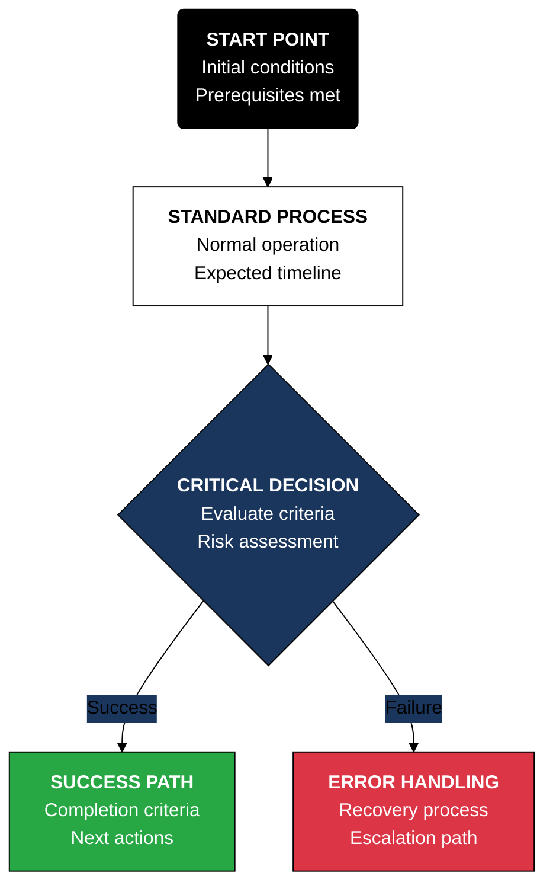
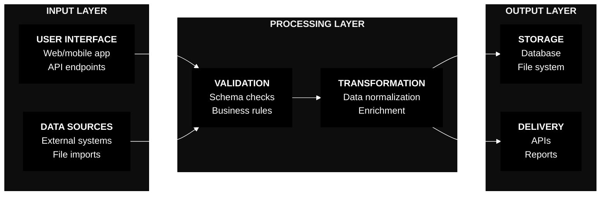
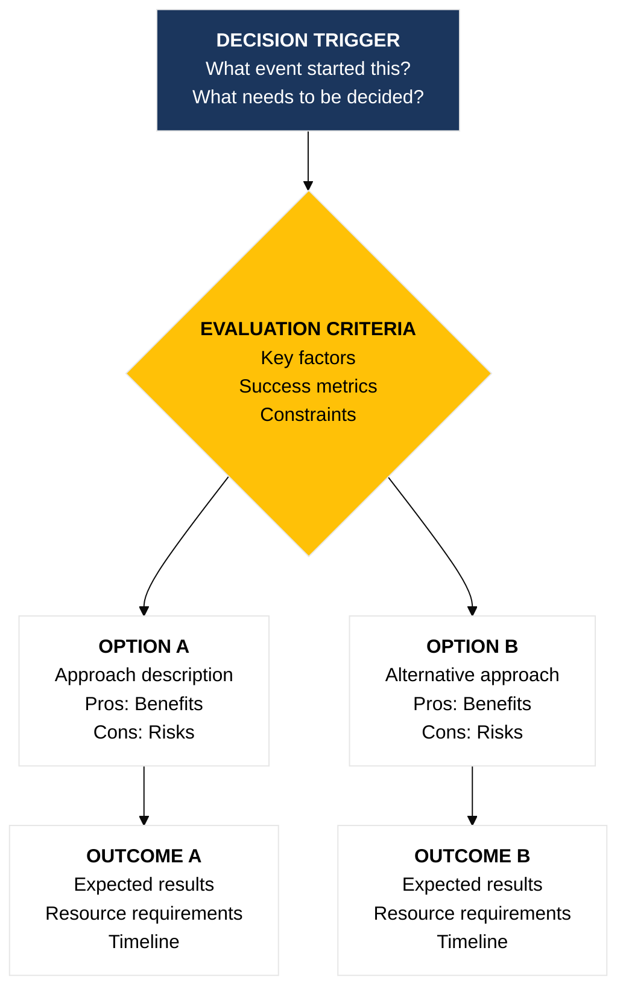

# High-Contrast Base Templates

## Standard Process Flow

```mermaid
%%{init: {'theme':'base', 'themeVariables': {'primaryColor':'#FFFFFF', 'primaryTextColor':'#000000', 'primaryBorderColor':'#000000', 'lineColor':'#000000', 'secondaryColor':'#1B365D', 'secondaryTextColor':'#FFFFFF', 'tertiaryColor':'#F8F9FA'}}}%%
flowchart TD
    START("`**START POINT**<br/>Initial conditions<br/>Prerequisites met`") --> PROCESS["`**STANDARD PROCESS**<br/>Normal operation<br/>Expected timeline`"]

    PROCESS --> DECISION{"`**CRITICAL DECISION**<br/>Evaluate criteria<br/>Risk assessment`"}

    DECISION -->|Success| SUCCESS["`**SUCCESS PATH**<br/>Completion criteria<br/>Next actions`"]

    DECISION -->|Failure| ERROR["`**ERROR HANDLING**<br/>Recovery process<br/>Escalation path`"]

    style START fill:#000000,color:#FFFFFF
    style DECISION fill:#1B365D,color:#FFFFFF
    style SUCCESS fill:#28A745,color:#FFFFFF
    style ERROR fill:#DC3545,color:#FFFFFF
```

## System Architecture Template

```mermaid
%%{init: {'theme':'base', 'themeVariables': {'primaryColor':'#000000', 'primaryTextColor':'#FFFFFF', 'lineColor':'#FFFFFF'}}}%%
graph LR
    subgraph INPUT ["`**INPUT LAYER**`"]
        A["`**USER INTERFACE**<br/>Web/mobile app<br/>API endpoints`"]
        B["`**DATA SOURCES**<br/>External systems<br/>File imports`"]
    end

    subgraph PROCESS ["`**PROCESSING LAYER**`"]
        C["`**VALIDATION**<br/>Schema checks<br/>Business rules`"]
        D["`**TRANSFORMATION**<br/>Data normalization<br/>Enrichment`"]
    end

    subgraph OUTPUT ["`**OUTPUT LAYER**`"]
        E["`**STORAGE**<br/>Database<br/>File system`"]
        F["`**DELIVERY**<br/>APIs<br/>Reports`"]
    end

    A --> C
    B --> C
    C --> D
    D --> E
    D --> F
```

## Decision Matrix Template

```mermaid
%%{init: {'theme':'base', 'themeVariables': {'primaryColor':'#FFFFFF', 'primaryTextColor':'#000000'}}}%%
flowchart TD
    TRIGGER["`**DECISION TRIGGER**<br/>What event started this?<br/>What needs to be decided?`"] --> CRITERIA{"`**EVALUATION CRITERIA**<br/>Key factors<br/>Success metrics<br/>Constraints`"}

    CRITERIA --> OPTION1["`**OPTION A**<br/>Approach description<br/>Pros: Benefits<br/>Cons: Risks`"]

    CRITERIA --> OPTION2["`**OPTION B**<br/>Alternative approach<br/>Pros: Benefits<br/>Cons: Risks`"]

    OPTION1 --> RESULT1["`**OUTCOME A**<br/>Expected results<br/>Resource requirements<br/>Timeline`"]

    OPTION2 --> RESULT2["`**OUTCOME B**<br/>Expected results<br/>Resource requirements<br/>Timeline`"]

    style TRIGGER fill:#1B365D,color:#FFFFFF
    style CRITERIA fill:#FFC107,color:#000000
```
