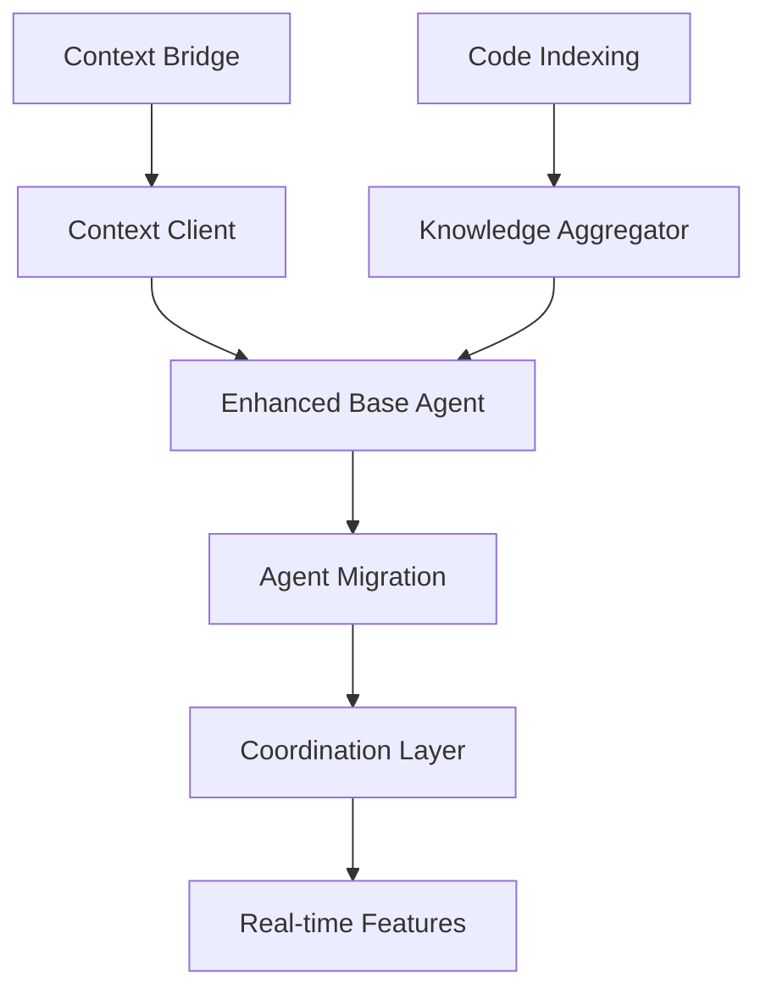

# Agent-IDE Integration Implementation Roadmap

## Current State Assessment

### Existing Assets
- ✅ Claude Code MCP server with recursive execution
- ✅ Multiple specialized MCP agents (research, code, docs, etc.)
- ✅ SDLC agent framework with 10+ specialized agents
- ✅ Neo4j knowledge graph integration
- ✅ IDE diagnostic access via `mcp__ide__getDiagnostics`

### Missing Components
- ❌ Context bridge between IDE and agents
- ❌ Local code indexing/embedding system
- ❌ Knowledge aggregation layer
- ❌ Agent context awareness
- ❌ Real-time IDE event streaming

## Major Implementation Steps

### PHASE 1: Foundation (Days 1-3)
**Goal**: Establish core infrastructure for context sharing

1. **Create Context Bridge MCP Server**
   - Build FastMCP server for context management
   - Implement IDE event capture hooks
   - Create context state management
   - Add pub/sub for context updates

2. **Implement Context Client Library**
   - Python client for agents to access context
   - Async context subscription system
   - Context caching and invalidation
   - Error handling and fallbacks

3. **Test Basic Context Flow**
   - Verify IDE → Bridge → Agent communication
   - Test with simple echo agent
   - Validate diagnostic capture
   - Performance benchmarking

### PHASE 2: Knowledge Infrastructure (Days 4-7)
**Goal**: Build intelligent knowledge aggregation system

4. **Deploy Local Code Indexing**
   - Set up Qdrant/ChromaDB vector store
   - Implement tree-sitter AST parsing
   - Generate code embeddings (CodeBERT/local model)
   - Create incremental index updates

5. **Build Knowledge Aggregator Service**
   - Unified query interface
   - Multi-source search orchestration
   - Result ranking and merging
   - Caching layer for performance

6. **Connect Existing Knowledge Sources**
   - Neo4j graph database integration
   - Project intelligence (.proj-intel) parser
   - Documentation index connector
   - Git history analyzer

### PHASE 3: Agent Enhancement (Days 8-11)
**Goal**: Upgrade agents with context awareness

7. **Create Enhanced Agent Base Class**
   - Abstract context integration
   - Knowledge query methods
   - Enhanced prompt building
   - Telemetry and logging

8. **Migrate Priority Agents**
   - claude-code-wrapper enhancement
   - Research agent upgrade
   - Code generation agent
   - Documentation agent

9. **Implement Agent Coordination**
   - Context handoff between agents
   - Shared memory/state management
   - Agent result aggregation
   - Workflow orchestration updates

### PHASE 4: Advanced Features (Days 12-14)
**Goal**: Add real-time capabilities and optimization

10. **Real-time IDE Integration**
    - WebSocket connection for live updates
    - File watcher integration
    - Cursor position tracking
    - Selection change events

11. **Performance Optimization**
    - Implement lazy loading
    - Add request batching
    - Optimize embedding generation
    - Cache warming strategies

12. **Visual Feedback System**
    - Agent status indicators
    - Progress notifications
    - Result preview panels
    - Error highlighting

### PHASE 5: Testing & Documentation (Days 15-16)
**Goal**: Ensure reliability and usability

13. **Comprehensive Testing**
    - Unit tests for all components
    - Integration test suite
    - Performance benchmarks
    - Load testing

14. **Documentation & Training**
    - API documentation
    - Usage examples
    - Migration guide for existing agents
    - Video tutorials

## Critical Path Dependencies

## Success Metrics

- **Context Latency**: < 50ms for context queries
- **Knowledge Query Time**: < 200ms for RAG queries
- **Agent Enhancement**: 70% reduction in prompt size
- **Code Coverage**: 80% test coverage
- **Migration Completion**: 100% of priority agents enhanced

## Risk Mitigation

| Risk | Impact | Mitigation |
|------|--------|------------|
| Performance degradation | High | Implement caching, lazy loading |
| Complex integration bugs | Medium | Incremental rollout, feature flags |
| Agent compatibility issues | Medium | Maintain backward compatibility |
| Index maintenance overhead | Low | Incremental updates, background jobs |

## Next Immediate Actions

1. Set up development environment for Context Bridge
2. Create project structure for new components
3. Install required dependencies (Qdrant, tree-sitter)
4. Begin Context Bridge implementation
5. Create test harness for integration testing