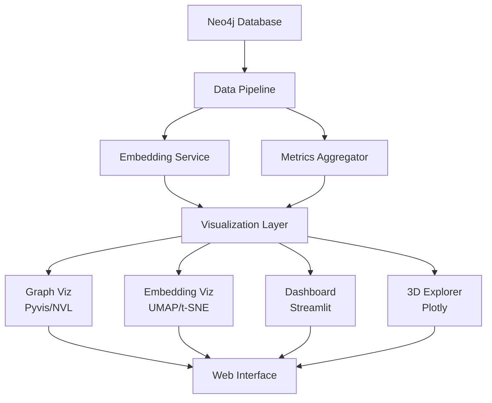

# Knowledge Base Visualization Architecture
## Comprehensive Visualization Strategy for Vectorized Knowledge Graph

### Executive Summary
This document outlines a multi-layered visualization architecture for the knowledge base, covering graph structure, embedding spaces, real-time metrics, and interactive exploration of the vectorized data.

## 1. Visualization Layers

### Layer 1: Graph Structure Visualization
**Purpose**: Visualize knowledge nodes and relationships as an interactive network

#### Recommended Tools:
1. **Neo4j Bloom** (Enterprise)
   - Native Neo4j visualization
   - Real-time graph exploration
   - Pattern detection and filtering

2. **Pyvis** (Python)
   ```python
   from pyvis.network import Network
   import networkx as nx

   # Create interactive HTML visualizations
   net = Network(height="750px", width="100%", notebook=True)
   net.add_node(1, label="Knowledge Node", color="#162347")
   net.add_edge(1, 2, title="RELATED_TO", weight=0.87)
   net.show("knowledge_graph.html")
   ```

3. **Neo4j Visualization Library (NVL)**
   - TypeScript/JavaScript library
   - Customizable graph rendering
   - Integrates with React/Vue/Angular

4. **Neovis.js**
   - JavaScript library for web apps
   - Direct Neo4j integration
   - Cypher query visualization

### Layer 2: Embedding Space Visualization
**Purpose**: Visualize high-dimensional embeddings in 2D/3D space

#### Techniques:

1. **UMAP (Uniform Manifold Approximation and Projection)**
   ```python
   import umap
   import plotly.express as px

   # Reduce 384-dim embeddings to 2D
   reducer = umap.UMAP(n_components=2, n_neighbors=15, min_dist=0.1)
   embedding_2d = reducer.fit_transform(embeddings)

   # Interactive scatter plot
   fig = px.scatter(
       x=embedding_2d[:, 0],
       y=embedding_2d[:, 1],
       color=knowledge_types,
       hover_data=['content', 'confidence_score'],
       title="Knowledge Embedding Space"
   )
   ```

2. **t-SNE (t-distributed Stochastic Neighbor Embedding)**
   ```python
   from sklearn.manifold import TSNE

   # For smaller datasets (<5000 points)
   tsne = TSNE(n_components=2, perplexity=30, n_iter=1000)
   embedding_2d = tsne.fit_transform(embeddings)
   ```

3. **3D Visualization with Plotly**
   ```python
   import plotly.graph_objects as go

   # 3D scatter plot of embeddings
   fig = go.Figure(data=[go.Scatter3d(
       x=embedding_3d[:, 0],
       y=embedding_3d[:, 1],
       z=embedding_3d[:, 2],
       mode='markers+text',
       marker=dict(
           size=confidence_scores * 10,
           color=usage_counts,
           colorscale='Viridis',
           showscale=True
       ),
       text=knowledge_ids,
       hovertemplate='<b>%{text}</b><br>' +
                     'Confidence: %{marker.size}<br>' +
                     'Usage: %{marker.color}'
   )])
   ```

### Layer 3: Real-Time Metrics Dashboard
**Purpose**: Monitor knowledge base performance and usage patterns

#### Dashboard Framework Comparison:

| Framework | Best For | Pros | Cons |
|-----------|----------|------|------|
| **Streamlit** | Rapid prototyping | Simple Python API, Fast development | Limited customization |
| **Dash/Plotly** | Production dashboards | Highly customizable, Enterprise-ready | Steeper learning curve |
| **Grafana** | Time-series metrics | Industry standard, Alerting | Requires data source setup |
| **Panel** | Scientific visualization | Jupyter integration, Flexible | Less mature ecosystem |

#### Recommended Architecture: **Streamlit + Plotly**

```python
import streamlit as st
import plotly.graph_objects as go
from neo4j import GraphDatabase

st.title("Knowledge Base Analytics Dashboard")

# Sidebar filters
knowledge_type = st.sidebar.selectbox(
    "Knowledge Type",
    ["ALL", "WORKFLOW", "CODE_PATTERN", "ERROR_SOLUTION"]
)

# Main metrics
col1, col2, col3, col4 = st.columns(4)
with col1:
    st.metric("Total Nodes", total_nodes, delta=new_nodes_today)
with col2:
    st.metric("Avg Confidence", f"{avg_confidence:.2%}", delta=confidence_change)
with col3:
    st.metric("Success Rate", f"{success_rate:.2%}", delta=success_delta)
with col4:
    st.metric("Active Agents", active_agents, delta=agent_change)

# Interactive visualizations
st.plotly_chart(create_knowledge_graph(), use_container_width=True)
st.plotly_chart(create_embedding_visualization(), use_container_width=True)
```

### Layer 4: Interactive Exploration Tools
**Purpose**: Enable deep exploration of knowledge patterns

#### Components:

1. **Search & Filter Interface**
   ```python
   # Semantic search using embeddings
   def semantic_search(query, top_k=10):
       query_embedding = embed_text(query)
       similarities = cosine_similarity(query_embedding, all_embeddings)
       return top_k_indices(similarities, k=top_k)
   ```

2. **Cluster Analysis**
   ```python
   from sklearn.cluster import DBSCAN

   # Identify knowledge clusters
   clustering = DBSCAN(eps=0.5, min_samples=5)
   clusters = clustering.fit_predict(embeddings)
   ```

3. **Pattern Discovery**
   - Frequent subgraph mining
   - Community detection
   - Anomaly detection in embedding space

## 2. Implementation Architecture

### System Components



### Data Pipeline

```python
class KnowledgeVisualizationPipeline:
    def __init__(self, neo4j_driver):
        self.driver = neo4j_driver
        self.embeddings_cache = {}

    def extract_graph_data(self):
        """Extract nodes and relationships from Neo4j"""
        query = """
        MATCH (k:Knowledge)
        OPTIONAL MATCH (k)-[r:RELATED_TO]-(related)
        RETURN k, collect(r) as relationships, collect(related) as related_nodes
        """
        # Process and return graph structure

    def prepare_embeddings(self):
        """Prepare embeddings for visualization"""
        # Fetch embeddings
        embeddings = self.fetch_embeddings()

        # Reduce dimensions
        umap_2d = self.reduce_dimensions(embeddings, n_components=2)
        umap_3d = self.reduce_dimensions(embeddings, n_components=3)

        return {
            'original': embeddings,
            '2d': umap_2d,
            '3d': umap_3d
        }

    def calculate_metrics(self):
        """Calculate real-time metrics"""
        return {
            'total_nodes': self.count_nodes(),
            'avg_confidence': self.calculate_avg_confidence(),
            'usage_patterns': self.analyze_usage(),
            'cluster_stats': self.analyze_clusters()
        }
```

## 3. Visualization Types

### 3.1 Static Visualizations

1. **Knowledge Hierarchy**
   - Treemap of knowledge categories
   - Sunburst chart of relationships
   - Sankey diagram of knowledge flow

2. **Performance Metrics**
   - Heatmap of confidence scores
   - Time series of usage patterns
   - Correlation matrix of knowledge types

### 3.2 Interactive Visualizations

1. **Force-Directed Graph**
   ```javascript
   // Using D3.js force simulation
   const simulation = d3.forceSimulation(nodes)
       .force("link", d3.forceLink(links).id(d => d.id))
       .force("charge", d3.forceManyBody().strength(-300))
       .force("center", d3.forceCenter(width / 2, height / 2));
   ```

2. **Embedding Explorer**
   - Zoom and pan through embedding space
   - Click to see knowledge details
   - Filter by confidence, type, usage

3. **Timeline Visualization**
   - Knowledge evolution over time
   - Version history tracking
   - Usage trend analysis

### 3.3 Advanced Visualizations

1. **3D Knowledge Graph**
   ```python
   import plotly.graph_objects as go

   # Create 3D network
   edge_trace = go.Scatter3d(
       x=edge_x, y=edge_y, z=edge_z,
       mode='lines',
       line=dict(width=0.5, color='#888'),
       hoverinfo='none'
   )

   node_trace = go.Scatter3d(
       x=node_x, y=node_y, z=node_z,
       mode='markers+text',
       marker=dict(
           size=node_sizes,
           color=node_colors,
           colorscale='Viridis'
       )
   )
   ```

2. **Parallel Coordinates**
   - Multi-dimensional attribute comparison
   - Pattern identification across metrics

3. **Graph Neural Network Visualization**
   - Attention weights visualization
   - Message passing animation
   - Layer-wise representations

## 4. Performance Considerations

### Optimization Strategies

1. **Data Sampling**
   - Progressive loading for large graphs
   - Level-of-detail (LOD) rendering
   - Viewport culling

2. **Caching**
   ```python
   from functools import lru_cache

   @lru_cache(maxsize=128)
   def get_embeddings_2d(knowledge_ids):
       # Cache reduced dimensions
       return compute_umap(fetch_embeddings(knowledge_ids))
   ```

3. **WebGL Acceleration**
   - Use GPU-accelerated libraries
   - Deck.gl for large-scale visualizations
   - Three.js for 3D rendering

### Scalability Targets

| Dataset Size | Visualization Type | Target Performance |
|--------------|-------------------|-------------------|
| <1,000 nodes | Full interactive graph | <100ms render |
| 1,000-10,000 | Clustered graph | <500ms render |
| 10,000-100,000 | Aggregated view | <1s initial load |
| >100,000 | Sampled/filtered | Progressive loading |

## 5. User Interface Design

### Dashboard Layout

```
┌─────────────────────────────────────────────────┐
│                    Header                       │
│  [Search Bar]  [Filters]  [Export]  [Settings]  │
├─────────────────────────────────────────────────┤
│ Metrics │                                       │
│ ┌─────┐ │      Main Visualization Area         │
│ │ KPI │ │                                       │
│ │ KPI │ │   [Graph/Embedding/3D Toggle]        │
│ │ KPI │ │                                       │
│ │ KPI │ │                                       │
│ └─────┘ │                                       │
├─────────┼───────────────────────────────────────┤
│         │     Detail View / Timeline            │
└─────────────────────────────────────────────────┘
```

### Interaction Patterns

1. **Zoom & Pan**: Mouse wheel + drag
2. **Select & Filter**: Click + Shift-click
3. **Details on Demand**: Hover tooltips
4. **Context Menu**: Right-click options
5. **Keyboard Shortcuts**:
   - `Space`: Reset view
   - `F`: Focus on selection
   - `H`: Toggle help

## 6. Integration Points

### API Endpoints

```python
from fastapi import FastAPI
app = FastAPI()

@app.get("/api/graph/structure")
async def get_graph_structure(
    node_type: str = None,
    min_confidence: float = 0.0
):
    """Return graph structure for visualization"""

@app.get("/api/embeddings/2d")
async def get_embeddings_2d(
    method: str = "umap",
    n_samples: int = 1000
):
    """Return 2D embedding coordinates"""

@app.websocket("/ws/metrics")
async def metrics_stream(websocket: WebSocket):
    """Stream real-time metrics updates"""
```

### Export Formats

1. **Graph**: GraphML, GEXF, JSON
2. **Embeddings**: CSV, Parquet, HDF5
3. **Visualizations**: PNG, SVG, HTML
4. **Reports**: PDF, Jupyter notebooks

## 7. Deployment Architecture

### Docker Compose Setup

```yaml
version: '3.8'
services:
  neo4j:
    image: neo4j:5.12
    ports:
      - "7474:7474"
      - "7687:7687"

  visualization-api:
    build: ./api
    ports:
      - "8000:8000"
    depends_on:
      - neo4j

  dashboard:
    build: ./dashboard
    ports:
      - "8501:8501"
    depends_on:
      - visualization-api

  nginx:
    image: nginx:alpine
    ports:
      - "80:80"
    volumes:
      - ./nginx.conf:/etc/nginx/nginx.conf
```

## 8. Future Enhancements

1. **AR/VR Visualization**
   - Immersive graph exploration
   - Spatial knowledge navigation

2. **AI-Assisted Exploration**
   - Natural language queries
   - Automated insight generation

3. **Collaborative Features**
   - Multi-user exploration
   - Annotation and sharing

4. **Real-time Streaming**
   - Live knowledge updates
   - Agent activity visualization

## Conclusion

This visualization architecture provides a comprehensive approach to exploring and understanding the knowledge base through multiple perspectives:

- **Graph visualization** for structural understanding
- **Embedding visualization** for semantic relationships
- **Dashboards** for operational metrics
- **Interactive tools** for deep exploration

The modular design allows for incremental implementation and scaling based on specific needs and data volumes.
