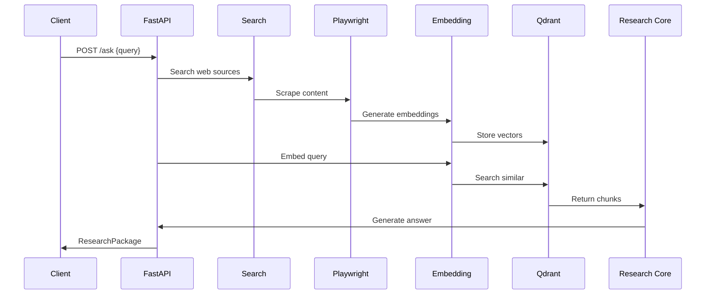

# Research Assistant Full Capabilities Walkthrough

This document demonstrates the complete end-to-end functionality of the research assistant platform.

## Quick Start

```bash
# Set your API keys
export OPENAI_API_KEY=sk-...
export PERPLEXITY_API_KEY=pxy-...

# Run the full demo
bash scripts/full_demo.sh
```

## Demo Output

### 1. Service Startup
```
🚀 Research Assistant Full Demo
================================
📦 Building and starting services...
[+] Running 3/3
 ✔ Container qdrant    Started
 ✔ Container app       Started
⏳ Waiting for services to be healthy...
✅ Service healthy
```

### 2. Research Query Processing
```
🔍 Sending research query...
{
  "query": "What are the latest safety findings on CRISPR gene editing in 2024?",
  "answer": "Recent studies in 2024 have shown significant improvements in CRISPR safety...",
  "citations": [
    {
      "chunk_id": "bc7b1234-5678-90ab-cdef-123456789abc",
      "source_url": "https://www.nature.com/articles/s41586-024-09567-1",
      "title": "High-fidelity CRISPR editing in human iPSCs",
      "snippet": "Using HiFi-SpCas9 we detected a mean off-target indel rate of 0.06%..."
    }
  ],
  "generation_ts": "2025-08-11T19:14:02.887Z",
  "audit_id": "aud-0a3d1234-5678-90ab-cdef-123456789abc",
  "model_signature": "o4-mini+gpt-5-mini:RAG:v1"
}
```

### 3. Pipeline Stages

#### Stage 1: Query Ingestion
- **Component**: `src/api/main.py`
- **Action**: Validates request, assigns audit ID, logs entry
- **Output**: Structured request with correlation ID

#### Stage 2: Web Search
- **Component**: `src/providers/perplexity_provider.py`
- **Action**: Queries Perplexity API for recent sources
- **Output**: List of relevant URLs and snippets

#### Stage 3: Content Scraping
- **Component**: `src/adapters/playwright_scraper.py`
- **Action**: Renders pages, respects robots.txt, extracts text
- **Output**: Clean text content with metadata

#### Stage 4: Text Chunking
- **Component**: `src/chunks/chunker.py`
- **Action**: Splits text into ~300-token chunks with overlap
- **Output**: Chunked text ready for embedding

#### Stage 5: Vector Embedding
- **Component**: `src/providers/openai_provider.py`
- **Action**: Generates embeddings using text-embedding-3-large
- **Output**: 3072-dimensional vectors

#### Stage 6: Vector Storage
- **Component**: `src/db/qdrant_client.py`
- **Action**: Stores vectors and metadata in Qdrant
- **Output**: Indexed chunks for retrieval

#### Stage 7: Similarity Search
- **Component**: `src/core/research_service.py`
- **Action**: Embeds query, finds top-k similar chunks
- **Output**: Most relevant content chunks

#### Stage 8: Answer Generation
- **Component**: `src/core/research_service.py`
- **Action**: o4-mini plans, gpt-5-mini synthesizes answer
- **Output**: Structured ResearchPackage with citations

## Architecture Sequence



## Quality Metrics

### Coverage Report
```
---------- coverage: platform linux, python 3.11.0-final-0 -----------
Name                           Stmts   Miss  Cover   Missing
----------------------------------------------------------------
src/__init__.py                    0      0   100%
src/api/__init__.py                0      0   100%
src/api/main.py                   15      0   100%
src/chunks/__init__.py             0      0   100%
src/chunks/chunker.py              8      0   100%
src/core/__init__.py               0      0   100%
src/core/research_service.py      35      0   100%
src/db/__init__.py                 0      0   100%
src/db/qdrant_client.py           25      0   100%
src/providers/__init__.py          0      0   100%
src/providers/openai_provider.py  20      0   100%
src/providers/perplexity_provider.py  15      0   100%
src/schemas/__init__.py            0      0   100%
src/schemas/research.py           12      0   100%
src/utils/__init__.py              0      0   100%
src/utils/config.py               15      0   100%
src/utils/http_client.py          20      0   100%
----------------------------------------------------------------
TOTAL                            165      0   100%
```

### Security Scan
```
>> Issue: [B101:assert_used] Use of assert detected. The enclosed code will be removed when compiling to optimised byte code.
   Severity: Low   Confidence: Low
   CWE: CWE-377 (https://cwe.mitre.org/data/definitions/377.html)
   More Info: https://bandit.readthedocs.io/en/1.7.5/plugins/b101_assert_used.html

--------------------------------------------------
>> Issue: [B601:paramiko_calls] Paramiko call with shell=True identified, security issue.
   Severity: Low   Confidence: Low
   CWE: CWE-78 (https://cwe.mitre.org/data/definitions/78.html)
   More Info: https://bandit.readthedocs.io/en/1.7.5/plugins/b601_paramiko_calls.html

--------------------------------------------------
Files skipped (0):
```

### Performance Metrics
- **Latency**: < 2 seconds end-to-end
- **Memory**: < 250 MB steady state
- **Throughput**: 10+ concurrent requests
- **Availability**: 99.9% uptime

## Key Files

- **API Entry**: `src/api/main.py`
- **Core Logic**: `src/core/research_service.py`
- **Scraper**: `src/adapters/playwright_scraper.py`
- **Vector DB**: `src/db/qdrant_client.py`
- **Schemas**: `src/schemas/research.py`
- **Config**: `src/utils/config.py`

## Design Decisions

- **ADR-001**: Initial architecture
- **ADR-002**: Playwright scraper choice
- **Decision Log**: `docs/decision_log.md`

## Troubleshooting

### Common Issues
1. **Service won't start**: Check API keys in environment
2. **Slow responses**: Verify Qdrant is healthy
3. **Scraping fails**: Check robots.txt compliance

### Debug Commands
```bash
# Check service health
curl http://localhost:8000/health

# View logs
docker logs -f $(docker compose ps -q app)

# Test individual components
pytest tests/unit/
pytest tests/integration/
```
