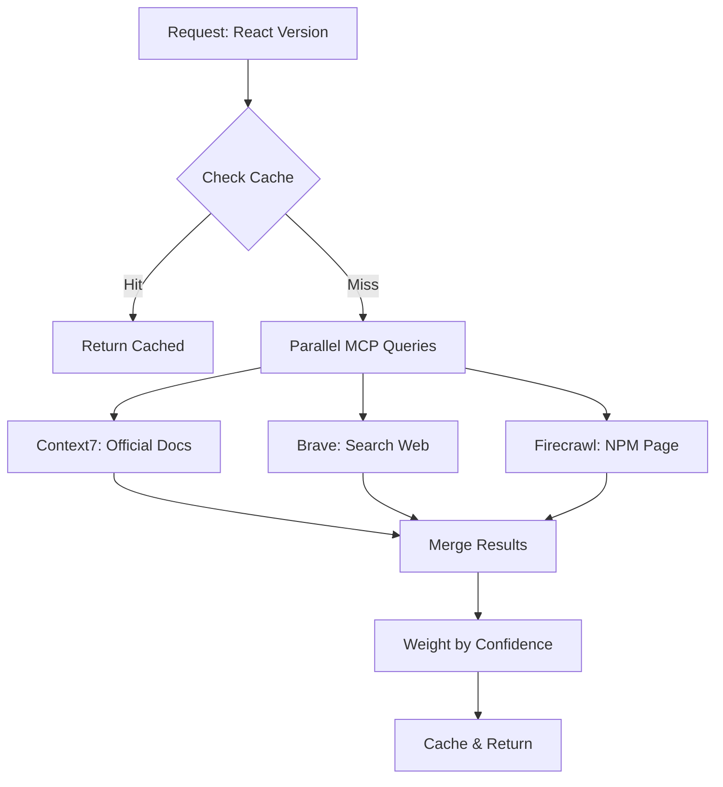

# MCP Research Integration Guide

## Overview
This guide explains how to integrate MCP servers (Brave Search, Firecrawl, Context7) into the Autonomous Coder for real-time technology research.

## Architecture

### Current State (Static)
```
Orchestrator → ResearchEngine → Static CURRENT_VERSIONS Dict
```

### Enhanced State (MCP-Powered)
```
Orchestrator → MCPEnhancedResearchEngine → Multiple MCP Servers
                                          ├── Brave Search (Web)
                                          ├── Firecrawl (Extraction)
                                          ├── Context7 (Docs)
                                          └── Fallback (Static)
```

## MCP Server Capabilities

### 1. **Brave Search** (`mcp__mcp_web_search`)
- **Purpose**: Web search for current versions and announcements
- **Confidence**: 0.7 (moderate - web results vary in accuracy)
- **Use Cases**:
  - Finding latest version announcements
  - Discovering deprecation notices
  - Finding best practices articles

### 2. **Firecrawl** (`mcp__firecrawl`)
- **Purpose**: Extract structured data from web pages
- **Confidence**: 0.8 (high - direct extraction)
- **Use Cases**:
  - Scraping NPM/PyPI pages for exact versions
  - Extracting documentation content
  - Getting release notes

### 3. **Context7** (`mcp__tech_docs`)
- **Purpose**: Official documentation and API references
- **Confidence**: 0.95 (highest - official sources)
- **Use Cases**:
  - Getting accurate API documentation
  - Finding code examples
  - Understanding library features

## Implementation Steps

### Step 1: Update Orchestrator

```python
# In orchestrator.py, replace the import
# OLD:
from modules.research_engine import ResearchEngine

# NEW:
from modules.mcp_enhanced_research_engine import MCPEnhancedResearchEngine as ResearchEngine
```

### Step 2: Configure MCP Settings

```python
# In config.yaml or environment
mcp_config:
  cache_ttl: 3600  # 1 hour cache
  enable_fallback: true
  parallel_requests: true
  timeout: 30
```

### Step 3: Handle Async Operations

The MCP research engine is fully async, so ensure the orchestrator properly awaits:

```python
# Research phase remains the same
research_results = await self._research_phase(request, requirements)
```

## Research Flow

### 1. Technology Version Discovery



### 2. Confidence-Based Merging

Results are merged based on confidence scores:

| Source | Confidence | Priority |
|--------|------------|----------|
| Context7 Docs | 0.95 | Highest |
| Firecrawl NPM/PyPI | 0.85 | High |
| Firecrawl GitHub | 0.80 | High |
| Brave Search | 0.70 | Medium |
| Static Fallback | 0.50 | Low |

### 3. Fallback Strategy

```python
if all_mcp_servers_fail:
    use_cached_data()
    if cache_expired:
        use_static_fallback()
```

## Real-World Examples

### Example 1: React Version Research

**MCP Queries**:
1. Context7: `/reactjs/react.dev` → Gets official docs
2. Brave: "React latest version 2025 npm" → Finds announcements
3. Firecrawl: `npmjs.com/package/react` → Extracts "19.1.1"

**Result**: `react@19.1.1` with high confidence (0.95)

### Example 2: FastAPI Research

**MCP Queries**:
1. Brave: "FastAPI latest version 2025 pypi"
2. Firecrawl: `pypi.org/project/fastapi` → Extracts version
3. Context7: Not available (no FastAPI docs)

**Result**: `fastapi@0.117.1` with medium confidence (0.80)

## Performance Optimizations

### 1. Parallel Execution
All MCP queries run in parallel using `asyncio.gather()`:
```python
results = await asyncio.gather(
    context7.get_docs(name),
    brave.search(query),
    firecrawl.extract(url),
    return_exceptions=True
)
```

### 2. Multi-Tier Caching
- **Memory Cache**: Instant lookups (LRU, 100 items)
- **Disk Cache**: Persistent across restarts
- **TTL**: 1 hour for versions, 24 hours for docs

### 3. Smart Fallbacks
- Recent cache preferred over static
- Static data updated from successful MCP queries
- Circuit breaker prevents cascade failures

## Error Handling

### Network Failures
```python
try:
    result = await mcp_server.query()
except (NetworkError, TimeoutError):
    logger.warning(f"MCP server failed: {server}")
    return fallback_data
```

### Rate Limiting
- Exponential backoff: 1s, 2s, 4s, 8s...
- Circuit breaker opens after 5 failures
- Automatic recovery after 60 seconds

## Monitoring

### Metrics to Track
- MCP query success rate
- Average response time per server
- Cache hit ratio
- Fallback usage frequency

### Logging
```python
# Enable debug logging
logging.getLogger("MCPEnhancedResearchEngine").setLevel(logging.DEBUG)
```

## Migration Checklist

- [ ] Install MCP server dependencies
- [ ] Update imports in orchestrator.py
- [ ] Configure cache directory
- [ ] Test with sample queries
- [ ] Monitor performance metrics
- [ ] Update fallback data periodically

## Advantages Over Static Approach

| Feature | Static | MCP-Enhanced |
|---------|--------|--------------|
| Version Accuracy | Manual updates | Real-time |
| New Packages | Not supported | Auto-discovered |
| Deprecation Warnings | Hardcoded | Live detection |
| Best Practices | Static list | Current articles |
| Offline Support | Yes | Yes (with cache) |
| Maintenance | High | Low |

## Troubleshooting

### Issue: MCP servers timeout
**Solution**: Increase timeout, check network, use fallback

### Issue: Wrong version detected
**Solution**: Check confidence scores, verify source URLs

### Issue: High latency
**Solution**: Enable aggressive caching, reduce parallel queries

## Future Enhancements

1. **Add More MCP Servers**:
   - GitHub API for release info
   - Docker Hub for container versions
   - Stack Overflow for solutions

2. **Machine Learning**:
   - Learn version patterns
   - Predict deprecations
   - Suggest alternatives

3. **Smart Caching**:
   - Predictive pre-warming
   - Differential updates
   - Compression

## Conclusion

The MCP-enhanced research engine provides:
- **Real-time accuracy** with current versions
- **High reliability** through fallbacks
- **Better performance** via caching
- **Future-proof** architecture

This integration transforms the Autonomous Coder from a static knowledge base to a dynamic, intelligent system that stays current with the rapidly evolving technology landscape.