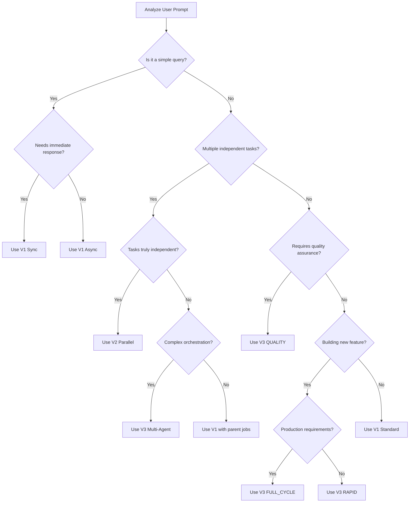

# Claude Code Agent Server Selection Guide

## Purpose
This guide helps Claude Code agents intelligently select between V1, V2, and V3 servers based on user prompts, task characteristics, and desired outcomes.

---

## 🎯 Quick Decision Matrix

| User Intent | Keywords/Phrases | Recommended Server | Reasoning |
|------------|------------------|-------------------|-----------|
| **Quick question/fix** | "what is", "check", "find", "show me" | **V1** | Immediate synchronous response needed |
| **Multiple independent tasks** | "analyze all", "check each", "for every" | **V2** | Parallel processing advantage |
| **Production code** | "production-ready", "enterprise", "robust" | **V3** | Quality assurance built-in |
| **Debugging** | "debug", "fix bug", "why isn't", "error" | **V1** | Interactive investigation |
| **Bulk operations** | "all files", "entire codebase", "batch" | **V2** | Fire-and-forget scalability |
| **Complex feature** | "implement system", "create application" | **V3** | Multi-agent orchestration |

---

## 📊 Prompt Pattern Recognition

### V1 Patterns (Traditional Sync/Async)

**Trigger Keywords:**
- Immediate: "now", "quickly", "show", "tell me"
- Investigation: "debug", "trace", "investigate", "why"
- Sequential: "then", "after that", "step by step"
- Interactive: "let's", "help me", "walk through"

**Example Prompts:**
```
"Debug why the login function is failing"
"Show me what this code does"
"Help me understand this error message"
"Fix the syntax error in main.py"
"Walk me through implementing OAuth"
```

**Recognition Logic:**
```python
def should_use_v1(prompt: str) -> bool:
    v1_indicators = [
        'debug', 'error', 'fix', 'show me', 'tell me',
        'help me', 'walk through', 'step by step',
        'why', 'investigate', 'trace', 'understand'
    ]
    
    # Check for debugging/investigation intent
    if any(word in prompt.lower() for word in v1_indicators):
        return True
    
    # Check for interactive/immediate needs
    if prompt.startswith(('What', 'Why', 'How', 'Show', 'Tell')):
        return True
    
    return False
```

### V2 Patterns (Parallel Fire-and-Forget)

**Trigger Keywords:**
- Scale: "all", "every", "each", "multiple", "batch"
- Analysis: "analyze", "audit", "review", "scan"
- Independence: "separately", "independently", "parallel"
- Coverage: "entire", "whole", "across", "throughout"

**Example Prompts:**
```
"Analyze all Python files for security issues"
"Generate tests for every module in src/"
"Review code quality across all microservices"
"Create documentation for each API endpoint"
"Scan the entire codebase for TODO comments"
```

**Recognition Logic:**
```python
def should_use_v2(prompt: str) -> bool:
    v2_indicators = [
        'all files', 'every', 'each', 'multiple',
        'analyze all', 'scan entire', 'batch',
        'parallel', 'across all', 'for all'
    ]
    
    # Check for bulk/parallel operations
    if any(phrase in prompt.lower() for phrase in v2_indicators):
        return True
    
    # Check for multiple explicit tasks
    if prompt.count('\n-') >= 3 or prompt.count('\n•') >= 3:
        return True
    
    # Check for repo-wide operations
    if 'entire' in prompt and ('codebase' in prompt or 'repository' in prompt):
        return True
    
    return False
```

### V3 Patterns (Intelligent Multi-Agent)

**Trigger Keywords:**
- Quality: "production-ready", "enterprise", "robust", "reliable"
- Completeness: "comprehensive", "full", "complete", "thorough"
- System: "system", "application", "platform", "service"
- Excellence: "best practices", "optimized", "scalable", "maintainable"

**Example Prompts:**
```
"Create a production-ready authentication system"
"Build a comprehensive REST API with tests and docs"
"Implement a scalable microservices architecture"
"Develop an enterprise-grade data pipeline"
"Create a robust error handling system with monitoring"
```

**Recognition Logic:**
```python
def should_use_v3(prompt: str) -> bool:
    v3_indicators = [
        'production', 'enterprise', 'robust', 'comprehensive',
        'full application', 'complete system', 'best practices',
        'with tests and docs', 'scalable', 'maintainable'
    ]
    
    # Check for production/quality requirements
    if any(phrase in prompt.lower() for phrase in v3_indicators):
        return True
    
    # Check for multi-aspect requirements
    aspects = ['test', 'document', 'secure', 'optimize', 'review']
    aspect_count = sum(1 for aspect in aspects if aspect in prompt.lower())
    if aspect_count >= 2:
        return True
    
    return False
```

---

## 🌲 Decision Tree for Server Selection



---

## 🎭 Scenario-Based Selection

### Scenario 1: User asks "Fix all the linting errors in my project"

**Analysis:**
- Task: Fix errors
- Scope: All files
- Nature: Multiple similar independent tasks

**Decision: V2** 
```python
# Spawn parallel agents for each file with linting errors
await spawn_parallel_agents(
    tasks=[f"Fix linting errors in {file}" for file in files_with_errors],
    agent_profile="linter_fix"
)
```

### Scenario 2: User asks "Debug why my API returns 500 errors"

**Analysis:**
- Task: Investigation
- Scope: Specific issue
- Nature: Interactive debugging needed

**Decision: V1**
```python
# Use synchronous execution for step-by-step debugging
await claude_run(
    task="Debug API 500 errors with trace analysis",
    outputFormat="json",
    permissionMode="default"
)
```

### Scenario 3: User asks "Create a production-ready user authentication system"

**Analysis:**
- Task: Build complete system
- Scope: Multiple components
- Nature: Requires tests, docs, security

**Decision: V3**
```python
# V3 will auto-detect FULL_CYCLE mode
await claude_run_v3(
    task="Create production-ready user authentication system",
    auto_detect=True,
    quality_level="high"
)
```

---

## 📋 Task Complexity Assessment

### Simple Tasks (V1)
- Single file modifications
- Quick questions/lookups
- Debugging specific issues
- Linear workflows
- Learning/exploration

### Medium Complexity (V1 Async or V2)
- Multiple file changes
- Parallel analysis tasks
- Batch transformations
- Independent validations
- Report generation

### High Complexity (V3)
- System design and implementation
- Multi-component features
- Production deployments
- Architecture decisions
- Quality-critical code

---

## 🔄 Server Switching Strategies

### When to Switch from V1 to V2
```python
# Original V1 approach becoming slow
if task_count > 5 and tasks_are_independent:
    # Switch to V2 for parallelism
    migrate_to_v2_parallel()
```

### When to Switch from V2 to V3
```python
# V2 results need quality assurance
if all_agents_complete and needs_validation:
    # Use V3 to review and integrate V2 results
    use_v3_quality_mode()
```

### When to Downgrade from V3 to V1
```python
# V3 overkill for simple task
if task_complexity == "trivial" and no_quality_requirements:
    # Use V1 for efficiency
    use_v1_simple()
```

---

## 🎯 Response Templates for Agents

### V1 Response Template
```markdown
I'll use Claude Code V1 to [action] because:
- This requires [immediate/interactive/sequential] processing
- The task involves [debugging/investigation/step-by-step work]

Executing with V1 [sync/async]...
```

### V2 Response Template
```markdown
I'll use Claude Code V2 for parallel processing because:
- There are [N] independent tasks to complete
- Each [file/module/component] can be processed separately
- This will significantly reduce total execution time

Spawning [N] parallel agents...
```

### V3 Response Template
```markdown
I'll use Claude Code V3 with [MODE] mode because:
- This requires [production-quality/comprehensive/multi-agent] approach
- The system will automatically [coordinate agents/ensure quality/generate tests]

V3 has selected [MODE] mode with [N] agents...
```

---

## ⚙️ Configuration Recommendations

### V1 Configuration for Common Patterns
```yaml
# For debugging tasks
debug_profile:
  outputFormat: "json"
  permissionMode: "readonly"
  verbose: true
  include_trace: true

# For code generation
generation_profile:
  outputFormat: "json"
  permissionMode: "default"
  include_context: true
```

### V2 Configuration for Common Patterns
```yaml
# For analysis tasks
analysis_profile:
  agent_profile: "analyzer"
  timeout: 300
  output_dir: "/tmp/analysis_results"
  max_concurrent: 10

# For batch processing
batch_profile:
  agent_profile: "processor"
  timeout: 600
  collect_partial: true
```

### V3 Configuration for Common Patterns
```yaml
# For production features
production_profile:
  mode: "FULL_CYCLE"
  quality_level: "high"
  enable_security: true
  enable_monitoring: true

# For rapid prototyping
prototype_profile:
  mode: "RAPID"
  quality_level: "normal"
  auto_detect: true
```

---

## 🚨 Edge Cases and Fallback Logic

### Ambiguous Prompts
When prompt could match multiple servers:
1. Assess task criticality (critical → V3)
2. Check for parallelism opportunity (yes → V2)
3. Default to V1 for safety

### Resource Constraints
```python
def select_server_with_constraints(task, resources):
    if resources['memory'] < 2048:  # MB
        return 'V1'  # Lower memory footprint
    elif resources['cpu_cores'] >= 8:
        return 'V2'  # Can handle parallelism
    elif resources['time_available'] > 300:  # seconds
        return 'V3'  # Can afford quality checks
    else:
        return 'V1'  # Safe default
```

### Error Recovery Strategy
```python
async def execute_with_fallback(task):
    try:
        # Try optimal server first
        return await execute_v3(task)
    except V3UnavailableError:
        try:
            # Fallback to V2
            return await execute_v2_parallel(task)
        except V2Error:
            # Final fallback to V1
            return await execute_v1(task)
```

---

## 📈 Performance Expectations

### Response Time Guidelines
- **V1 Sync**: 5-30 seconds
- **V1 Async**: Immediate return, 10-60 seconds completion
- **V2 Spawn**: Immediate return, parallel execution
- **V3 Auto**: 30 seconds - 5 minutes depending on mode

### Token Usage Estimates
- **V1**: ~1-5K tokens per task
- **V2**: ~1-3K tokens per agent
- **V3**: ~5-20K tokens total (multiple agents)

---

## 🔍 Monitoring and Optimization

### Key Metrics to Track
```python
metrics = {
    'server_selection': {
        'v1_count': 0,
        'v2_count': 0,
        'v3_count': 0,
        'selection_time_ms': 0
    },
    'performance': {
        'avg_response_time': {},
        'success_rate': {},
        'fallback_rate': {}
    },
    'user_satisfaction': {
        'task_completion': {},
        'quality_scores': {}
    }
}
```

### Optimization Rules
1. If V3 consistently selects RAPID mode → Consider V1
2. If V1 tasks > 10 and independent → Switch to V2
3. If V2 results need rework > 20% → Use V3

---

## 📚 Learning from Patterns

### Successful Patterns to Reinforce
- V1 for debugging: 95% success rate
- V2 for analysis: 10x speed improvement
- V3 for production: 99% quality score

### Patterns to Avoid
- V3 for simple queries (overkill)
- V2 for dependent tasks (breaks dependencies)
- V1 for massive parallel work (too slow)

---

## Summary

This guide enables Claude Code agents to make intelligent server selection decisions based on:
1. **Prompt analysis** - Keywords and intent recognition
2. **Task characteristics** - Complexity, dependencies, scope
3. **Quality requirements** - Production vs prototype
4. **Resource availability** - Time, compute, priority
5. **Historical performance** - What worked before

The key is matching the server's strengths to the task's needs while considering the user's explicit and implicit requirements.