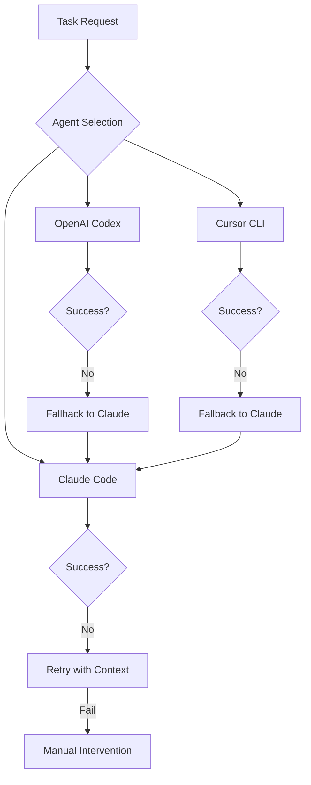

# Multi-Agent Dispatch Policy

## Overview

This document defines the decision matrix for routing tasks to the appropriate AI coding agent (Claude Code, OpenAI Codex, or Cursor Agent CLI) based on task characteristics, constraints, and current tool stability.

## Task Routing Decision Matrix

### Primary Dispatch Rules

| Task Type | Primary Agent | Fallback Agent | Rationale |
|-----------|---------------|----------------|-----------|
| **Complex Refactoring** | Claude Code | Manual | Deep codebase understanding, iterative refinement |
| **Parallel Test Generation** | OpenAI Codex | Claude Code (sequential) | Native parallel sandboxes, isolated execution |
| **Bulk PR Generation** | OpenAI Codex | Claude Code | Automatic PR creation with commits |
| **Style/Lint Enforcement** | Cursor CLI* | Claude Code | Cursor Rules, but CI=1 bug blocks CI usage |
| **Architecture Design** | Claude Code | Manual | Complex reasoning, MCP tool access |
| **Security Analysis** | OpenAI Codex | Claude Code | Sandboxed execution for untrusted code |
| **Documentation Generation** | Claude Code | Cursor CLI* | MCP tools for comprehensive docs |
| **Bug Fixing** | Claude Code | OpenAI Codex | Debugging tools, iterative approach |
| **API Integration** | Claude Code | OpenAI Codex | MCP servers for API testing |
| **CI/CD Automation** | Claude Code | OpenAI Codex | Headless mode stable, Cursor has CI bug |

*\*Cursor CLI currently blocked due to CI=1 hanging bug*

## Task Archetype Classification

### 1. Orchestration Tasks
**Characteristics:** Multi-step, complex reasoning, tool coordination
**Dispatch:** Claude Code (PRIMARY)
**Examples:**
- Full feature implementation with tests and docs
- Cross-service refactoring
- Design document generation with implementation

### 2. Parallel Batch Tasks
**Characteristics:** Independent, repeatable, isolation required
**Dispatch:** OpenAI Codex (PRIMARY)
**Examples:**
- Generate tests for 10 microservices
- Create PRs for dependency updates across repos
- Parallel security scanning

### 3. Rule-Based Edits
**Characteristics:** Style enforcement, pattern application
**Dispatch:** Cursor CLI (BLOCKED) → Claude Code (FALLBACK)
**Examples:**
- Apply coding standards
- Enforce project-specific rules
- Custom linting beyond standard tools

### 4. Interactive Development
**Characteristics:** Iterative, requires local context
**Dispatch:** Claude Code (PRIMARY)
**Examples:**
- Debugging sessions
- Performance optimization
- Feature prototyping

## Constraint-Based Routing

### Security Constraints

| Requirement | Recommended Agent | Reason |
|-------------|------------------|---------|
| **Untrusted Code** | OpenAI Codex | Cloud sandbox isolation |
| **Sensitive Data** | Claude Code | Local execution, no cloud upload |
| **Compliance Audit** | Claude Code | Full control over execution |
| **Third-party Code** | OpenAI Codex | Sandboxed from local environment |

### Performance Constraints

| Requirement | Recommended Agent | Configuration |
|-------------|------------------|---------------|
| **< 30s response** | Claude Code | Sequential, local execution |
| **Parallel execution** | OpenAI Codex | N sandboxes simultaneously |
| **Large codebase** | Claude Code | MCP tools for navigation |
| **Batch processing** | OpenAI Codex | Parallel sandbox farms |

### Cost Constraints

| Budget | Primary Strategy | Fallback |
|--------|-----------------|----------|
| **Low ($0.01-0.05/task)** | Claude Code | Manual |
| **Medium ($0.10-0.50/task)** | OpenAI Codex | Claude Code |
| **Flexible** | Task-optimal selection | Multi-agent hedge |

## Escalation & Fallback Paths

### Failure Handling Matrix



### Retry Logic

| Agent | Initial Timeout | Retry Count | Retry Strategy |
|-------|----------------|-------------|----------------|
| Claude Code | 60s | 2 | Add context, increase timeout |
| OpenAI Codex | 120s | 1 | Simplify task, reduce scope |
| Cursor CLI | 30s | 0 | Immediate fallback (unstable) |

## Hedging Strategies

### Multi-Agent Validation
For critical tasks, run multiple agents and compare:

```yaml
validation_tasks:
  - security_critical:
      primary: openai_codex  # Sandboxed
      validator: claude_code  # Review output
      
  - production_deploy:
      primary: claude_code    # Generate
      validator: openai_codex # Test in sandbox
```

### A/B Testing Policy
Test new agent capabilities on non-critical paths:

```yaml
ab_testing:
  cursor_cli:
    enabled: false  # Disabled due to CI bug
    sample_rate: 0.0
    task_types: []
    
  openai_codex:
    enabled: true
    sample_rate: 0.2  # 20% of eligible tasks
    task_types: ["test_generation", "pr_creation"]
```

## Current Production Settings

### Agent Availability (January 2025)

```yaml
agents:
  claude_code:
    status: ACTIVE
    reliability: 0.95
    restrictions: none
    
  openai_codex:
    status: EXPERIMENTAL
    reliability: 0.82
    restrictions: "preview_only, no_production_critical"
    
  cursor_cli:
    status: BLOCKED
    reliability: 0.70
    restrictions: "ci_bug, beta_instability"
    blocker: "CI=1 hanging issue"
```

### Task Router Configuration

```python
class TaskRouter:
    def route(self, task):
        # Priority 1: Check blockers
        if task.requires_ci and self.agents['cursor_cli'].blocked:
            exclude = ['cursor_cli']
        
        # Priority 2: Security requirements
        if task.untrusted_code:
            return 'openai_codex'  # Sandboxed
            
        # Priority 3: Parallel requirements
        if task.parallel_capable and task.subtask_count > 3:
            return 'openai_codex'
            
        # Priority 4: MCP tool requirements
        if task.requires_mcp_tools:
            return 'claude_code'
            
        # Default: Claude Code (most stable)
        return 'claude_code'
```

## Monitoring & Metrics

### Key Performance Indicators

| Metric | Target | Alert Threshold |
|--------|--------|-----------------|
| **Success Rate** | > 90% | < 85% |
| **Timeout Rate** | < 5% | > 10% |
| **Fallback Rate** | < 10% | > 20% |
| **Cost per Task** | < $0.10 | > $0.25 |

### Tracking Requirements

```yaml
telemetry:
  required_fields:
    - task_id
    - agent_selected
    - execution_time
    - success_status
    - fallback_used
    - error_message
    - token_count
    - cost_estimate
```

## Migration Timeline

### Phase 1: Current State (Now)
- Claude Code: PRIMARY for all tasks
- OpenAI Codex: EXPERIMENTAL for parallel tasks only
- Cursor CLI: BLOCKED pending bug fix

### Phase 2: Q2 2025
- OpenAI Codex: Promote to SECONDARY for approved task types
- Cursor CLI: Re-evaluate after stability improvements

### Phase 3: Q3 2025
- Full multi-agent orchestration if tools prove stable
- Dynamic routing based on learned performance

---
*Policy Version: 1.0*
*Effective Date: January 13, 2025*
*Review Cycle: Monthly*