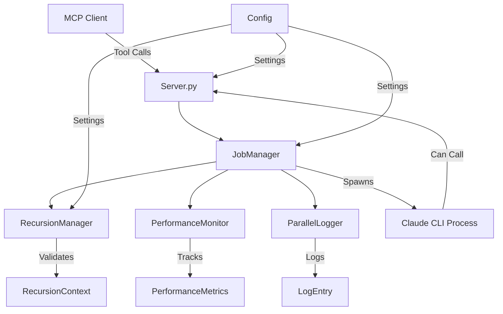

# Claude Code MCP Server Documentation

## Overview

The Claude Code MCP (Model Context Protocol) Server is a sophisticated Python-based server that enables parallel and recursive execution of Claude Code CLI instances. It acts as a bridge between AI agents and the Claude Code CLI, providing asynchronous job management, recursion control, and performance monitoring capabilities.

## Table of Contents

1. [Architecture](#architecture)
2. [Core Components](#core-components)
3. [Configuration & Settings](#configuration--settings)
4. [API Reference](#api-reference)
5. [Workflow & Execution Model](#workflow--execution-model)
6. [Capabilities & Features](#capabilities--features)
7. [Use Cases](#use-cases)
8. [Installation & Setup](#installation--setup)
9. [Examples](#examples)
10. [Performance & Limitations](#performance--limitations)

## Architecture

### System Architecture

```
┌─────────────────────────────────────────────────────────────┐
│                     Claude AI Agent                         │
│                  (Primary Claude Instance)                  │
└──────────────────────┬──────────────────────────────────────┘
                       │ MCP Protocol
                       ▼
┌─────────────────────────────────────────────────────────────┐
│                  Claude Code MCP Server                     │
│  ┌─────────────────────────────────────────────────────┐   │
│  │                   FastMCP Framework                  │   │
│  └─────────────────────────────────────────────────────┘   │
│  ┌──────────────┐ ┌──────────────┐ ┌─────────────────┐    │
│  │ Job Manager  │ │  Recursion   │ │   Performance   │    │
│  │              │ │   Manager    │ │    Monitor      │    │
│  └──────────────┘ └──────────────┘ └─────────────────┘    │
│  ┌─────────────────────────────────────────────────────┐   │
│  │              Parallel Logger System                  │   │
│  └─────────────────────────────────────────────────────┘   │
└──────────────────────┬──────────────────────────────────────┘
                       │ Subprocess
                       ▼
┌─────────────────────────────────────────────────────────────┐
│              Claude Code CLI Instances                      │
│  ┌──────────┐  ┌──────────┐  ┌──────────┐  ┌──────────┐   │
│  │ Job #1   │  │ Job #2   │  │ Job #3   │  │ Job #N   │   │
│  │(headless)│  │(headless)│  │(headless)│  │(headless)│   │
│  └──────────┘  └──────────┘  └──────────┘  └──────────┘   │
└─────────────────────────────────────────────────────────────┘
```

### Component Relationships



## Core Components

### 1. Server (`server.py`)
- **Purpose**: Main MCP server implementation using FastMCP framework
- **Responsibilities**:
  - Expose MCP tools for Claude Code execution
  - Handle synchronous and asynchronous job requests
  - Manage API endpoints for job control
- **Key Features**:
  - FastMCP integration for tool registration
  - Async/await support for parallel execution
  - JSON-based communication protocol

### 2. JobManager (`job_manager.py`)
- **Purpose**: Central orchestrator for job lifecycle management
- **Responsibilities**:
  - Create and track job instances
  - Spawn Claude Code CLI subprocesses
  - Monitor job status and collect results
  - Handle job termination and cleanup
- **Key Features**:
  - Thread-safe job tracking with locks
  - Subprocess management with timeout control
  - Authentication token handling
  - Output buffering and streaming

### 3. RecursionManager (`recursion_manager.py`)
- **Purpose**: Control and track recursive Claude Code invocations
- **Responsibilities**:
  - Validate recursion depth limits
  - Track parent-child job relationships
  - Prevent infinite recursion loops
  - Maintain call stack information
- **Key Features**:
  - Configurable recursion depth (default: 3 levels)
  - Concurrent job limiting per depth level
  - Root job tracking to prevent resource exhaustion
  - Task signature hashing for loop detection

### 4. PerformanceMonitor (`performance_monitor.py`)
- **Purpose**: Track and analyze job performance metrics
- **Responsibilities**:
  - Measure job execution times
  - Calculate system efficiency
  - Track resource utilization
  - Generate performance reports
- **Key Metrics**:
  - Job duration (spawn, execution, total)
  - Parallel efficiency calculation
  - System load monitoring
  - Error rate tracking

### 5. ParallelLogger (`parallel_logger.py`)
- **Purpose**: Centralized logging for concurrent operations
- **Responsibilities**:
  - Thread-safe log aggregation
  - Multi-level logging (ERROR, WARN, INFO, DEBUG, TRACE)
  - Specialized log types (RECURSION, PERF, CHILD_STDOUT)
  - Log file rotation and management
- **Features**:
  - Configurable log levels
  - JSON-formatted log entries
  - Recursion depth tracking in logs
  - Performance metric logging

## Configuration & Settings

### Configuration Structure (`config.py`)

```python
@dataclass
class RecursionLimits:
    max_depth: int = 3                    # Maximum recursion depth
    max_concurrent_at_depth: int = 5      # Max jobs at each depth
    max_total_jobs: int = 20              # Max total jobs per root
    timeout_multiplier: float = 1.5       # Timeout scaling factor

@dataclass
class LoggingConfig:
    log_level: str = "DEBUG"              # Logging verbosity
    enable_performance_logging: bool = True
    enable_child_process_logging: bool = True
    enable_recursion_logging: bool = True
    logs_dir: str = "/home/opsvi/master_root/logs/claude-code"
    enable_trace_logging: bool = True

@dataclass
class ServerConfig:
    base_timeout: int = 300000            # 5 minutes in ms
    max_timeout: int = 1800000            # 30 minutes in ms
    claude_code_token: Optional[str]      # Authentication token
    recursion: RecursionLimits
    logging: LoggingConfig
```

### Environment Variables

| Variable | Description | Default |
|----------|-------------|---------|
| `CLAUDE_CODE_TOKEN` | Authentication token for Claude Code CLI | None |
| `CLAUDE_MAX_RECURSION_DEPTH` | Maximum recursion depth | 3 |
| `CLAUDE_MAX_CONCURRENT_AT_DEPTH` | Max concurrent jobs per depth | 5 |
| `CLAUDE_MAX_TOTAL_JOBS` | Maximum total jobs per root | 20 |
| `CLAUDE_TIMEOUT_MULTIPLIER` | Timeout scaling per depth | 1.5 |
| `CLAUDE_LOG_LEVEL` | Logging verbosity | DEBUG |
| `CLAUDE_PERF_LOGGING` | Enable performance logging | true |
| `CLAUDE_CHILD_LOGGING` | Log subprocess output | true |
| `CLAUDE_RECURSION_LOGGING` | Log recursion events | true |

## API Reference

### MCP Tools

#### 1. `claude_run`
**Synchronous execution** - Blocks until completion

```python
async def claude_run(
    task: str,                           # Task description
    cwd: Optional[str] = None,           # Working directory
    outputFormat: str = "json",          # Output format
    permissionMode: str = "bypassPermissions",  # Permission mode
    verbose: bool = False,               # Verbose output
    parentJobId: Optional[str] = None    # Parent job for recursion
) -> str
```

**Permission Modes**:
- `bypassPermissions`: Auto-approve all operations
- `acceptEdits`: Auto-approve edits only
- `default`: Interactive approval (not suitable for headless)
- `plan`: Planning mode only

#### 2. `claude_run_async`
**Asynchronous execution** - Returns immediately with job ID

```python
async def claude_run_async(
    task: str,
    cwd: Optional[str] = None,
    outputFormat: str = "json",
    permissionMode: str = "bypassPermissions",
    verbose: bool = False,
    parentJobId: Optional[str] = None
) -> str  # Returns: {"jobId": "...", "status": "started"}
```

#### 3. `claude_status`
**Check job status**

```python
async def claude_status(jobId: str) -> str
# Returns: {
#   "jobId": "...",
#   "status": "running|completed|failed|timeout",
#   "task": "...",
#   "startTime": "...",
#   "endTime": "...",
#   "error": "...",
#   "recursionDepth": 0,
#   "parentJobId": "..."
# }
```

#### 4. `claude_result`
**Get completed job result**

```python
async def claude_result(jobId: str) -> str
# Returns: Full Claude Code output JSON
```

#### 5. `claude_list_jobs`
**List all jobs**

```python
async def claude_list_jobs() -> str
# Returns: Array of job status objects
```

#### 6. `claude_kill_job`
**Terminate running job**

```python
async def claude_kill_job(jobId: str) -> str
# Returns: {"success": true, "message": "..."}
```

#### 7. `claude_dashboard`
**System performance dashboard**

```python
async def claude_dashboard() -> str
# Returns: {
#   "activeJobs": 3,
#   "completedJobs": 10,
#   "failedJobs": 1,
#   "averageDuration": 25.5,
#   "parallelEfficiency": 2.8,
#   "nestedDepth": 2,
#   "systemLoad": 65.5,
#   "recursionStats": {...}
# }
```

#### 8. `claude_recursion_stats`
**Recursion statistics**

```python
async def claude_recursion_stats() -> str
# Returns: {
#   "max_depth": 3,
#   "depth_counts": {"0": 2, "1": 1},
#   "root_job_counts": {...},
#   "active_contexts": 3
# }
```

## Workflow & Execution Model

### Job Lifecycle

```
1. Job Creation
   ├── Generate UUID
   ├── Validate recursion limits
   ├── Create RecursionContext
   └── Initialize ClaudeJob object

2. Job Execution
   ├── Start performance monitoring
   ├── Build CLI command
   ├── Spawn subprocess
   ├── Stream output to buffers
   └── Monitor for timeout

3. Job Completion
   ├── Collect results
   ├── Update metrics
   ├── Cleanup recursion context
   └── Store in completed jobs

4. Result Retrieval
   ├── Parse JSON output
   ├── Extract relevant content
   └── Return to caller
```

### Recursion Flow

```
Level 0 (Root Job)
    │
    ├── Spawns Level 1 Job
    │      │
    │      ├── Can spawn Level 2 Job
    │      │      │
    │      │      └── Can spawn Level 3 Job
    │      │             │
    │      │             └── [BLOCKED - Max depth reached]
    │      │
    │      └── Can call other MCP tools
    │
    └── Continues execution
```

### Parallel Execution Model

```
Time →
T0: Job A starts ──────────────────────→ Job A completes
T1:     Job B starts ──────────→ Job B completes
T2:         Job C starts ──────────────→ Job C completes
T3:             Job D starts ───→ Job D completes

Parallel Efficiency = (Total Job Time) / (Wall Clock Time)
```

## Capabilities & Features

### Core Capabilities

1. **Parallel Execution**
   - Run multiple Claude Code instances simultaneously
   - Async job management with immediate ID return
   - Non-blocking execution model

2. **Recursive Invocation**
   - Claude Code instances can spawn child instances
   - Configurable depth limits prevent infinite loops
   - Full call stack tracking

3. **Mixed Tool Usage**
   - Nested agents can call both Claude Code and other MCP tools
   - Seamless integration with existing MCP ecosystem
   - Tool availability inherited by child instances

4. **Performance Monitoring**
   - Real-time metrics collection
   - Efficiency calculations
   - Resource utilization tracking

5. **Safety Mechanisms**
   - Recursion depth limiting
   - Timeout enforcement with scaling
   - Concurrent job throttling
   - Resource exhaustion prevention

### Advanced Features

1. **Authentication Management**
   - Automatic token loading from environment
   - .env file support
   - Token inheritance to child processes

2. **Output Streaming**
   - Real-time stdout/stderr capture
   - Buffer management for large outputs
   - JSON parsing and validation

3. **Error Handling**
   - Graceful failure recovery
   - Timeout detection and job termination
   - Error propagation through recursion chain

4. **Logging System**
   - Multi-level logging with filters
   - Specialized log types for debugging
   - Thread-safe log aggregation

## Use Cases

### 1. Parallel Task Execution
**Scenario**: Process multiple independent tasks simultaneously

```python
# Launch parallel jobs
job1 = await claude_run_async("Analyze file1.py")
job2 = await claude_run_async("Analyze file2.py")
job3 = await claude_run_async("Analyze file3.py")

# Collect results
result1 = await claude_result(job1["jobId"])
result2 = await claude_result(job2["jobId"])
result3 = await claude_result(job3["jobId"])
```

### 2. Hierarchical Task Decomposition
**Scenario**: Break complex tasks into subtasks

```python
# Parent task spawns specialized child tasks
await claude_run("""
    1. Analyze the codebase structure
    2. For each module, spawn a child task to:
       - Generate documentation
       - Run tests
       - Check code quality
    3. Aggregate results
""")
```

### 3. Multi-Agent Orchestration
**Scenario**: Coordinate multiple specialized agents

```python
# Orchestrator agent manages specialists
await claude_run("""
    Coordinate the following:
    1. Code Review Agent: Review PR changes
    2. Test Agent: Generate test cases
    3. Documentation Agent: Update docs
    4. Security Agent: Scan for vulnerabilities
""")
```

### 4. Recursive Problem Solving
**Scenario**: Solve problems requiring recursive decomposition

```python
# Recursive directory processing
await claude_run("""
    Process directory tree:
    1. List current directory
    2. For each subdirectory:
       - Spawn child to process that directory
    3. Aggregate and report findings
""")
```

### 5. Long-Running Workflows
**Scenario**: Execute time-consuming operations without blocking

```python
# Start long-running task
job = await claude_run_async("""
    1. Clone large repository
    2. Run comprehensive test suite
    3. Generate coverage reports
    4. Deploy to staging
""", timeout=1800000)  # 30 minutes

# Monitor progress
while True:
    status = await claude_status(job["jobId"])
    if status["status"] in ["completed", "failed"]:
        break
    await asyncio.sleep(5)
```

## Installation & Setup

### Prerequisites

- Python 3.9+
- Claude Code CLI installed and configured
- Valid Claude API key

### Installation

```bash
# Install from package
pip install opsvi-mcp

# Or install from source
cd libs/opsvi-mcp
pip install -e .
```

### Configuration

1. **Set Authentication Token**:
```bash
export CLAUDE_CODE_TOKEN="your-token-here"
```

2. **Configure Limits** (optional):
```bash
export CLAUDE_MAX_RECURSION_DEPTH=5
export CLAUDE_MAX_TOTAL_JOBS=50
```

3. **Start Server**:
```bash
# Via Python module
python -m opsvi_mcp.servers.claude_code

# Or via entry point
claude-code-server
```

### MCP Client Configuration

Add to your MCP client configuration:

```json
{
  "mcpServers": {
    "claude-code-wrapper": {
      "command": "python",
      "args": ["-m", "opsvi_mcp.servers.claude_code"],
      "env": {
        "CLAUDE_CODE_TOKEN": "your-token"
      }
    }
  }
}
```

## Examples

### Example 1: Simple Task Execution

```python
# Synchronous execution
result = await claude_run("Write a hello world Python script")
print(result)
```

### Example 2: Parallel Multi-File Processing

```python
# Process multiple files in parallel
files = ["app.py", "utils.py", "config.py"]
jobs = []

for file in files:
    job = await claude_run_async(f"Add type hints to {file}")
    jobs.append(job["jobId"])

# Wait for all jobs
results = []
for job_id in jobs:
    while True:
        status = await claude_status(job_id)
        if status["status"] == "completed":
            result = await claude_result(job_id)
            results.append(result)
            break
        await asyncio.sleep(2)
```

### Example 3: Recursive Task with Mixed Tools

```python
result = await claude_run("""
    Create a workflow that:
    1. Use mcp__time__current_time to get timestamp
    2. Spawn nested Claude Code to generate report
    3. Use mcp__firecrawl__search to find related docs
    4. Compile final summary
""")
```

### Example 4: Dashboard Monitoring

```python
# Monitor system performance
while True:
    dashboard = await claude_dashboard()
    print(f"Active Jobs: {dashboard['activeJobs']}")
    print(f"Efficiency: {dashboard['parallelEfficiency']:.2f}")
    print(f"System Load: {dashboard['systemLoad']:.1f}%")
    
    if dashboard['activeJobs'] == 0:
        break
    
    await asyncio.sleep(5)
```

## Performance & Limitations

### Performance Characteristics

| Metric | Typical Value | Notes |
|--------|--------------|-------|
| Job Spawn Time | 1-2 seconds | CLI initialization overhead |
| Execution Overhead | 5-10% | MCP protocol and logging |
| Parallel Efficiency | 2.5-3.5x | With 4 concurrent jobs |
| Memory per Job | 100-200 MB | Depends on task complexity |
| Token Usage | 50K-150K | Per job execution |

### Limitations

1. **Recursion Depth**
   - Hard limit of 3 levels (configurable)
   - Off-by-one bug allows 4 levels currently

2. **Concurrent Jobs**
   - Default max 5 jobs per depth level
   - Total max 20 jobs per root

3. **Timeouts**
   - Base timeout: 5 minutes
   - Scales by 1.5x per depth level
   - Maximum: 30 minutes

4. **Resource Constraints**
   - Each job spawns a separate process
   - Memory usage scales linearly
   - File descriptor limits may apply

5. **Authentication**
   - Requires valid Claude Code token
   - Token must be available to child processes

### Best Practices

1. **Job Granularity**
   - Break large tasks into smaller chunks
   - Aim for 30-60 second job duration
   - Avoid deeply nested recursion

2. **Error Handling**
   - Always check job status before getting results
   - Implement retry logic for failures
   - Set appropriate timeouts

3. **Resource Management**
   - Monitor active job count
   - Use dashboard for system health
   - Clean up completed jobs

4. **Logging**
   - Enable appropriate log levels
   - Monitor recursion depth
   - Track performance metrics

## Troubleshooting

### Common Issues

1. **Authentication Failures**
   - Verify CLAUDE_CODE_TOKEN is set
   - Check token validity
   - Ensure token is exported to environment

2. **Recursion Limit Errors**
   - Reduce recursion depth
   - Increase max_depth configuration
   - Check for infinite loops

3. **Timeout Errors**
   - Increase base_timeout
   - Break task into smaller parts
   - Check for blocking operations

4. **Performance Issues**
   - Reduce concurrent job count
   - Monitor system resources
   - Check network latency

## Dependencies

### Required Python Packages

- `fastmcp`: MCP server framework
- `pydantic>=2.0.0`: Data validation
- `uvloop`: High-performance event loop
- `asyncio`: Async programming support

### System Requirements

- Claude Code CLI installed
- Python 3.9 or higher
- Unix-like OS (Linux, macOS)
- Sufficient memory for parallel jobs

## Related Documentation

- [MCP Protocol Specification](https://modelcontextprotocol.io/docs)
- [Claude Code CLI Documentation](https://docs.anthropic.com/claude-code)
- [FastMCP Framework](https://github.com/jlowin/fastmcp)

## Version History

- **1.0.0** - Initial release with core functionality
- **1.1.0** - Added performance monitoring
- **1.2.0** - Enhanced recursion management
- **1.3.0** - Improved logging and debugging

## License

MIT License - See LICENSE file for details

## Support

For issues, questions, or contributions:
- GitHub: [opsvi/master_root](https://github.com/opsvi/master_root)
- Issues: [GitHub Issues](https://github.com/opsvi/master_root/issues)