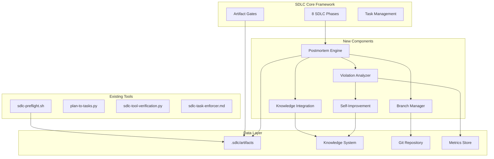

# SDLC Enhancements - Architecture Design

## System Overview

The SDLC Enhancement system extends the existing SDLC framework with a formal POSTMORTEM phase, branch management, knowledge integration, and self-improvement mechanisms. The architecture follows a modular design where each component can function independently while integrating seamlessly with the existing SDLC tools.

## Architecture Diagram



## Component Architecture

### 1. Postmortem Engine (`sdlc-postmortem.sh`)

**Purpose**: Orchestrate the entire postmortem process

**Responsibilities**:
- Validate all phases completed
- Generate postmortem template
- Run analysis tools
- Capture knowledge
- Handle branch disposition

**Interface**:
```bash
sdlc-postmortem.sh <project-path> [options]
  --auto        Run in automated mode
  --template    Generate template only
  --analyze     Run analysis only
  --cleanup     Handle branch cleanup only
```

**Implementation Details**:
```bash
#!/bin/bash
# Core functions:
validate_phases()      # Check all artifacts exist
generate_template()    # Create postmortem.md
run_analysis()        # Compare plan vs actual
capture_knowledge()   # Store lessons learned
handle_branch()       # Merge/PR/delete
```

### 2. Violation Analyzer (`sdlc-violation-analyzer.py`)

**Purpose**: Detect and analyze SDLC violations

**Responsibilities**:
- Scan project for violations
- Identify patterns
- Generate violation report
- Suggest improvements

**Interface**:
```python
class ViolationAnalyzer:
    def scan_project(project_path: Path) -> ViolationReport
    def analyze_patterns() -> List[Pattern]
    def suggest_improvements() -> List[Improvement]
```

**Data Model**:
```python
@dataclass
class Violation:
    phase: str
    type: str  # skipped_tool, missing_artifact, shortcut_taken
    severity: str  # critical, major, minor
    description: str
    impact: str
    prevention: str

@dataclass
class ViolationReport:
    project: str
    violations: List[Violation]
    compliance_score: float
    recommendations: List[str]
```

### 3. Branch Manager (`sdlc-branch-manager.sh`)

**Purpose**: Handle git branch lifecycle

**Responsibilities**:
- Validate branch state
- Create pull requests
- Merge branches
- Archive or delete branches

**Interface**:
```bash
sdlc-branch-manager.sh <action> <project-path>
  Actions:
    status     Show branch status
    pr         Create pull request
    merge      Merge to main
    archive    Archive branch
    delete     Delete branch
```

**PR Template**:
```markdown
## SDLC Project: <project-name>

### Summary
<auto-generated from requirements>

### SDLC Phases Completed
- [x] Discovery
- [x] Design
- [x] Planning
- [x] Development
- [x] Testing
- [x] Deployment
- [x] Production
- [x] Postmortem

### Artifacts
- Requirements: docs/1-requirements.md
- Design: docs/2-design.md
- Planning: docs/3-planning.md
- Testing: docs/4-testing.md
- Deployment: docs/5-deployment.md
- Postmortem: docs/6-postmortem.md

### Compliance Score: X%

### Review Checklist
- [ ] All tests passing
- [ ] Documentation complete
- [ ] No outstanding violations
- [ ] Knowledge captured
```

### 4. Knowledge Integration (`sdlc-knowledge.py`)

**Purpose**: Integrate with knowledge system

**Responsibilities**:
- Query before starting projects
- Capture lessons learned
- Store patterns and solutions
- Update SDLC documentation

**Interface**:
```python
class SDLCKnowledge:
    def query_similar_projects(project_type: str) -> List[Project]
    def capture_lesson(lesson: Lesson) -> None
    def store_pattern(pattern: Pattern) -> None
    def get_recommendations(context: Context) -> List[str]
```

### 5. Self-Improvement Engine (`sdlc-improve.py`)

**Purpose**: Automatically improve SDLC process

**Responsibilities**:
- Analyze violation patterns
- Generate improvement proposals
- Update SDLC scripts
- Track improvement metrics

**Interface**:
```python
class SelfImprovement:
    def analyze_trends() -> TrendReport
    def generate_proposals() -> List[Proposal]
    def apply_improvement(proposal: Proposal) -> None
    def measure_impact() -> ImpactReport
```

## Data Flow

### Postmortem Flow
```
1. User runs: sdlc-postmortem.sh <project>
2. System validates all phases complete
3. Violation Analyzer scans project
4. Generate postmortem template with data
5. User fills in subjective sections
6. Knowledge Integration captures lessons
7. Branch Manager handles branch
8. Self-Improvement analyzes for patterns
9. Create postmortem-complete.json artifact
```

### Knowledge Flow
```
Before Project:
  Query ’ Knowledge System ’ Recommendations ’ User

During Project:
  Violations ’ Capture ’ Knowledge System

After Project:
  Postmortem ’ Lessons ’ Knowledge System ’ Process Updates
```

## API Specifications

### Artifact Schema Enhancement

#### postmortem-complete.json
```json
{
  "phase": "postmortem",
  "completed": "ISO-8601 timestamp",
  "postmortem_doc": "docs/6-postmortem.md",
  "violations": [...],
  "compliance_score": 0.85,
  "lessons_captured": [...],
  "branch_disposition": "merged|pr|archived|deleted",
  "improvements_proposed": [...],
  "knowledge_stored": true
}
```

### Integration Points

#### With Existing Tools
- **sdlc-preflight.sh**: Add postmortem phase check
- **sdlc-gates.md**: Add postmortem gate definition
- **plan-to-tasks.py**: Include postmortem task
- **sdlc-tool-verification.py**: Track postmortem tools

#### With External Systems
- **Knowledge System**: MCP tools for storage/retrieval
- **Git**: Direct git commands for branch operations
- **GitHub/GitLab**: API for PR creation

## Error Handling Strategy

### Failure Modes
1. **Incomplete Phases**: Block postmortem until complete
2. **Git Conflicts**: Provide resolution guidance
3. **Knowledge System Down**: Cache locally, sync later
4. **Invalid Artifacts**: Regenerate from git history

### Recovery Procedures
```python
try:
    run_postmortem()
except IncompletePhaseError:
    complete_missing_phases()
    retry()
except GitConflictError:
    guide_conflict_resolution()
except KnowledgeSystemError:
    use_local_cache()
    schedule_sync()
```

## Security Considerations

1. **No Credential Storage**: Use git config for auth
2. **Input Validation**: Sanitize all user inputs
3. **Safe File Operations**: Validate paths, prevent traversal
4. **Audit Logging**: Track all operations

## Performance Considerations

1. **Lazy Loading**: Only analyze what's needed
2. **Caching**: Cache analysis results
3. **Async Operations**: Knowledge queries in background
4. **Incremental Analysis**: Only scan changes

## Technology Choices

| Component | Technology | Justification |
|-----------|------------|---------------|
| Postmortem Engine | Bash | Consistency with existing tools |
| Violation Analyzer | Python | Complex analysis logic |
| Branch Manager | Bash | Git operations are shell-native |
| Knowledge Integration | Python | MCP tool integration |
| Self-Improvement | Python | ML/pattern analysis potential |

## Design Decisions

### Decision: 8th Phase vs Separate Process
**Choice**: 8th Phase
**Rationale**: Ensures postmortem cannot be skipped, maintains SDLC integrity

### Decision: Automated vs Manual Postmortem
**Choice**: Hybrid - automated analysis, manual reflection
**Rationale**: Combines objective metrics with subjective insights

### Decision: Branch Handling
**Choice**: Flexible options (merge/PR/archive/delete)
**Rationale**: Different projects have different needs

## Success Metrics

1. **Compliance Score**: Average >85%
2. **Violation Reduction**: 50% fewer violations over time
3. **Knowledge Capture**: 100% of projects have lessons
4. **Branch Hygiene**: No orphaned branches
5. **Process Improvement**: Monthly SDLC updates
