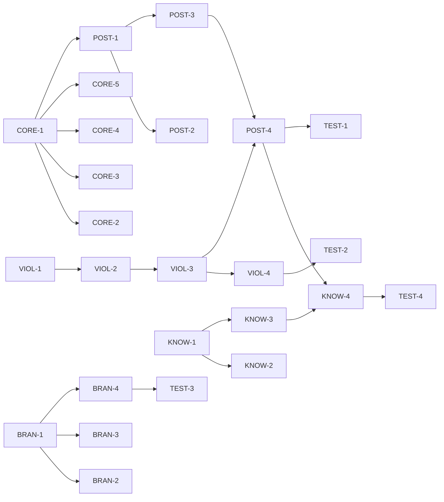

# SDLC Enhancements - Implementation Plan

## Executive Summary
Implementation of SDLC enhancements including POSTMORTEM phase, violation analysis, branch management, and knowledge integration. Estimated effort: 6-8 hours.

## Task Breakdown Structure

### Phase 1: Update Core SDLC (1 hour)
| Task ID | Task | Effort | Dependencies | Acceptance Criteria |
|---------|------|--------|--------------|-------------------|
| CORE-1 | Update SDLC command with 8th phase | 15 min | None | POSTMORTEM phase added to sdlc.md |
| CORE-2 | Add postmortem gate definition | 10 min | CORE-1 | Gate defined in sdlc-gates.md |
| CORE-3 | Update preflight for postmortem | 10 min | CORE-1 | Preflight creates postmortem doc |
| CORE-4 | Update task enforcer for postmortem | 10 min | CORE-1 | Enforcer recognizes 8th phase |
| CORE-5 | Update agent profiles | 15 min | CORE-1 | Create sdlc-postmortem agent |

### Phase 2: Postmortem Engine (1.5 hours)
| Task ID | Task | Effort | Dependencies | Acceptance Criteria |
|---------|------|--------|--------------|-------------------|
| POST-1 | Create sdlc-postmortem.sh scaffold | 20 min | CORE-1 | Basic script structure |
| POST-2 | Implement phase validation | 20 min | POST-1 | Validates all phases complete |
| POST-3 | Implement template generation | 30 min | POST-1 | Generates postmortem.md |
| POST-4 | Add analysis integration | 20 min | POST-3, VIOL-3 | Calls violation analyzer |

### Phase 3: Violation Analyzer (1.5 hours)
| Task ID | Task | Effort | Dependencies | Acceptance Criteria |
|---------|------|--------|--------------|-------------------|
| VIOL-1 | Create violation analyzer scaffold | 20 min | None | Python script structure |
| VIOL-2 | Implement artifact scanning | 30 min | VIOL-1 | Scans all phase artifacts |
| VIOL-3 | Implement violation detection | 30 min | VIOL-2 | Detects common violations |
| VIOL-4 | Generate violation report | 10 min | VIOL-3 | Creates readable report |

### Phase 4: Branch Manager (1 hour)
| Task ID | Task | Effort | Dependencies | Acceptance Criteria |
|---------|------|--------|--------------|-------------------|
| BRAN-1 | Create branch manager scaffold | 15 min | None | Basic script structure |
| BRAN-2 | Implement status checking | 15 min | BRAN-1 | Shows branch status |
| BRAN-3 | Implement PR creation | 20 min | BRAN-1 | Creates PR with template |
| BRAN-4 | Implement merge/delete | 10 min | BRAN-1 | Handles branch cleanup |

### Phase 5: Knowledge Integration (1 hour)
| Task ID | Task | Effort | Dependencies | Acceptance Criteria |
|---------|------|--------|--------------|-------------------|
| KNOW-1 | Create knowledge integration scaffold | 15 min | None | Python script structure |
| KNOW-2 | Implement MCP knowledge queries | 20 min | KNOW-1 | Queries knowledge system |
| KNOW-3 | Implement lesson capture | 15 min | KNOW-1 | Stores lessons learned |
| KNOW-4 | Add to postmortem flow | 10 min | POST-4, KNOW-3 | Integrated with postmortem |

### Phase 6: Testing (1 hour)
| Task ID | Task | Effort | Dependencies | Acceptance Criteria |
|---------|------|--------|--------------|-------------------|
| TEST-1 | Test postmortem flow | 20 min | POST-4 | End-to-end test passes |
| TEST-2 | Test violation detection | 20 min | VIOL-4 | Detects known violations |
| TEST-3 | Test branch operations | 10 min | BRAN-4 | Branch operations work |
| TEST-4 | Test knowledge integration | 10 min | KNOW-4 | Knowledge stored/retrieved |

### Phase 7: Documentation (30 min)
| Task ID | Task | Effort | Dependencies | Acceptance Criteria |
|---------|------|--------|--------------|-------------------|
| DOC-1 | Update SDLC documentation | 15 min | All tasks | Docs reflect new phase |
| DOC-2 | Create usage examples | 10 min | All tasks | Examples for each tool |
| DOC-3 | Update README | 5 min | All tasks | README current |

## Task Dependencies Graph

## Priority Matrix

### Critical Path
1. CORE-1 ’ POST-1 ’ POST-3 ’ POST-4
2. VIOL-1 ’ VIOL-2 ’ VIOL-3
3. Integration points

### High Priority
- Postmortem engine (core functionality)
- Violation detection (key insight)
- Branch cleanup (prevents issues)

### Medium Priority
- Knowledge integration
- PR creation
- Self-improvement

### Low Priority
- Advanced analysis
- Metrics dashboard
- Automated fixes

## Risk Register

| Risk | Probability | Impact | Mitigation |
|------|------------|--------|------------|
| Complex git operations fail | Medium | High | Test thoroughly, provide manual fallback |
| Knowledge system unavailable | Low | Medium | Cache locally, sync when available |
| Breaking existing SDLC | Low | High | Careful testing, incremental rollout |
| Adoption resistance | Medium | Medium | Clear documentation, show value |

## Test Strategy

### Unit Testing
- Each script function tested independently
- Mock external dependencies (git, MCP)
- Test error conditions

### Integration Testing
- Full postmortem flow
- Cross-component communication
- Artifact validation

### User Acceptance
- Run on real project
- Gather feedback
- Iterate on UX

## Success Criteria

### Functional
- [ ] POSTMORTEM phase works end-to-end
- [ ] Violations detected accurately
- [ ] Branches cleaned up properly
- [ ] Knowledge captured successfully

### Technical
- [ ] All scripts executable
- [ ] Error handling robust
- [ ] Performance acceptable
- [ ] Integration seamless

### Process
- [ ] Documentation complete
- [ ] Examples provided
- [ ] Team trained
- [ ] Metrics baselined

## Implementation Order

1. **Core SDLC updates** (foundation)
2. **Postmortem engine** (main feature)
3. **Violation analyzer** (key insight)
4. **Branch manager** (critical cleanup)
5. **Knowledge integration** (future value)
6. **Testing** (validation)
7. **Documentation** (adoption)

## Next Steps

1. Convert this plan to TodoWrite tasks
2. Begin with CORE-1
3. Implement incrementally
4. Test each component
5. Run full postmortem on this project!
