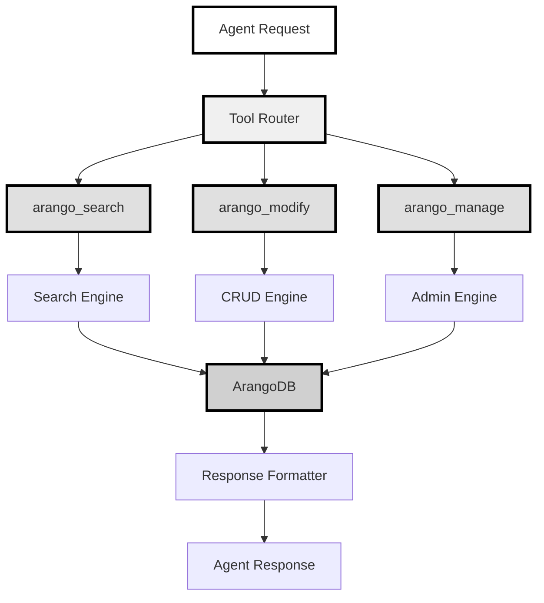
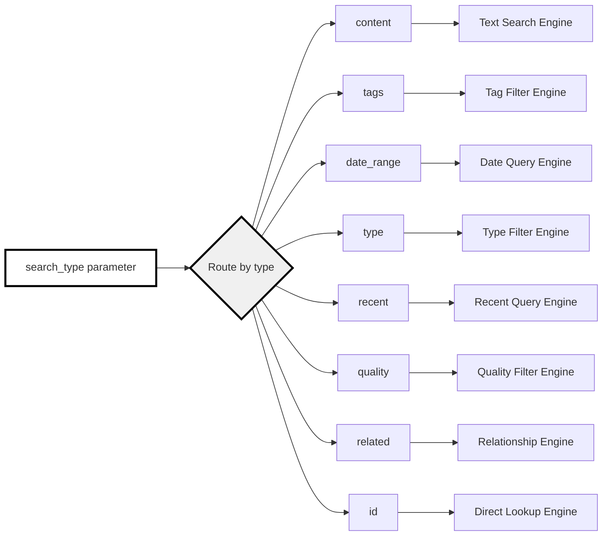
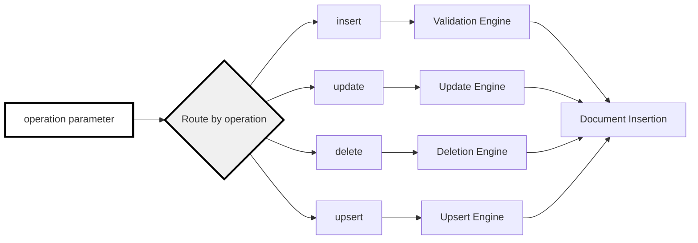
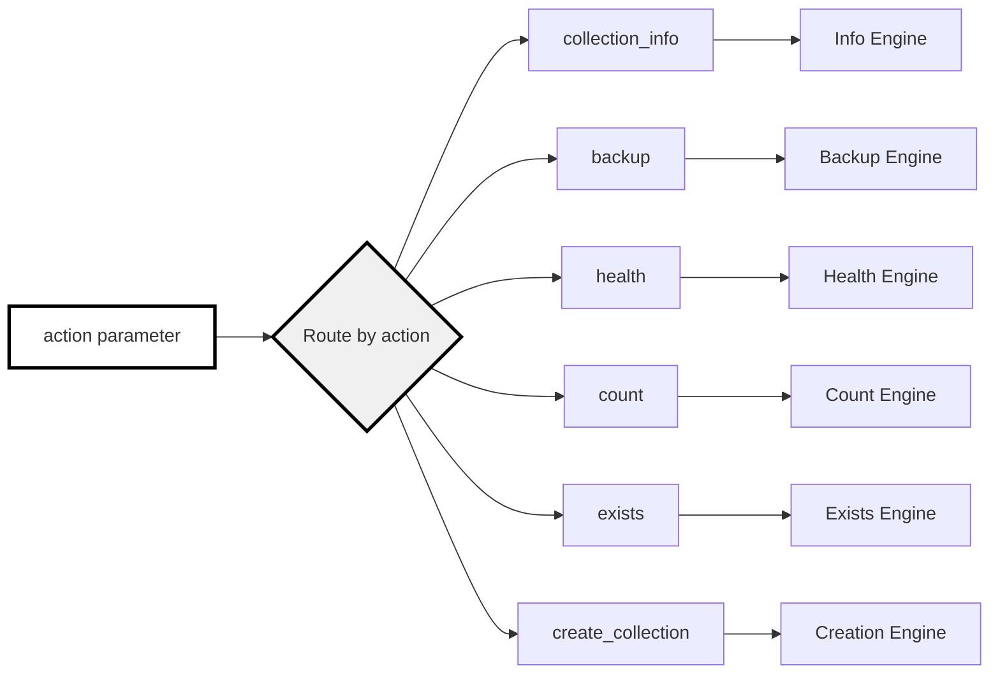

# Consolidated ArangoDB MCP Tool Suite - Requirements & Design

## Overview

This document specifies the requirements and design for a consolidated 3-tool ArangoDB MCP suite that replaces the complex `multi_modal_db` tool while staying within the 40-function IDE limit. The solution eliminates AQL syntax complexity for agents while providing comprehensive database functionality.

## Prerequisites

- **Problem Context**: Agents cannot reliably write AQL queries (Rule 606 violations)
- **Constraint**: Maximum 40 MCP tools in Cursor IDE
- **Current State**: ~35-40 tools already deployed, approaching limit
- **Target Collections**: 55+ ArangoDB collections in sophisticated cognitive architecture
- **Existing Tools**: 7 `multi_modal_db` tools + 6 `cognitive_database` tools to replace/consolidate

## System Architecture



## Requirements Specification

### Functional Requirements

#### FR1: Search Operations (arango_search)

- **FR1.1**: Content-based search across document fields
- **FR1.2**: Tag-based filtering with AND/OR logic
- **FR1.3**: Date range queries with flexible date field selection
- **FR1.4**: Document type filtering
- **FR1.5**: Recent document retrieval with configurable time windows
- **FR1.6**: Quality-based filtering using quality score fields
- **FR1.7**: Related document discovery using relationships
- **FR1.8**: Direct document retrieval by ID

#### FR2: Modification Operations (arango_modify)

- **FR2.1**: Document insertion with schema validation
- **FR2.2**: Document updates by key or criteria
- **FR2.3**: Document deletion with confirmation safeguards
- **FR2.4**: Upsert operations with conflict resolution

#### FR3: Management Operations (arango_manage)

- **FR3.1**: Collection information and statistics
- **FR3.2**: Collection backup with selective collection support
- **FR3.3**: Database and collection health monitoring
- **FR3.4**: Document counting with optional criteria
- **FR3.5**: Document existence checking
- **FR3.6**: Collection creation with type specification

### Non-Functional Requirements

#### NFR1: Agent Usability

- **NFR1.1**: Zero AQL syntax exposure to agents
- **NFR1.2**: Self-documenting parameter patterns
- **NFR1.3**: Meaningful error messages (not AQL syntax errors)
- **NFR1.4**: Maximum 3 tools to remember

#### NFR2: Performance

- **NFR2.1**: Query optimization built into tool logic
- **NFR2.2**: Result caching for repeated operations
- **NFR2.3**: Timeout protection (30-second default)
- **NFR2.4**: Connection pooling and reuse

#### NFR3: Reliability

- **NFR3.1**: Graceful handling of null/missing fields
- **NFR3.2**: Schema mismatch detection and reporting
- **NFR3.3**: Silent failure detection (Rule 605 compliance)
- **NFR3.4**: Rollback capability for failed operations

#### NFR4: Security

- **NFR4.1**: Input validation and sanitization
- **NFR4.2**: Injection attack prevention
- **NFR4.3**: Authorized collection access only
- **NFR4.4**: Audit trail for modification operations

## Tool Design Specifications

### Tool 1: arango_search



#### Parameters Schema

```typescript
interface SearchParams {
  search_type:
    | "content"
    | "tags"
    | "date_range"
    | "type"
    | "recent"
    | "quality"
    | "related"
    | "id";
  collection: string;

  // Type-specific parameters
  content?: string; // for content search
  fields?: string[]; // optional field restriction
  tags?: string[]; // for tag search
  match_all?: boolean; // tag matching logic
  start_date?: string; // for date_range
  end_date?: string; // for date_range
  date_field?: string; // date field name
  document_type?: string; // for type search
  limit?: number; // for recent/general limiting
  min_quality?: number; // for quality search
  quality_field?: string; // quality field name
  reference_id?: string; // for related search
  relationship_type?: string; // relationship filtering
  document_id?: string; // for id search
}
```

### Tool 2: arango_modify



#### Parameters Schema

```typescript
interface ModifyParams {
  operation: "insert" | "update" | "delete" | "upsert";
  collection: string;

  // Operation-specific parameters
  document?: object; // for insert/upsert
  key?: string; // for update/delete by key
  criteria?: object; // for update/delete by criteria
  updates?: object; // for update operations
  upsert?: boolean; // for update with upsert
  validate_schema?: boolean; // for insert validation
  confirm?: boolean; // for delete confirmation
  match_fields?: string[]; // for upsert matching
}
```

### Tool 3: arango_manage



#### Parameters Schema

```typescript
interface ManageParams {
  action:
    | "collection_info"
    | "backup"
    | "health"
    | "count"
    | "exists"
    | "create_collection";

  // Action-specific parameters
  collection?: string; // for collection-specific actions
  collections?: string[]; // for backup multiple
  output_dir?: string; // for backup location
  criteria?: object; // for count/exists filtering
  name?: string; // for create_collection
  collection_type?: "document" | "edge"; // for create_collection
}
```

## Implementation Design

### Core Architecture Components

#### Database Abstraction Layer

```python
class ConsolidatedArangoDB:
    def __init__(self, connection_params):
        self.client = ArangoClient(hosts=connection_params.host)
        self.db = self.client.db(
            database=connection_params.database,
            username=connection_params.username,
            password=connection_params.password
        )
        self.query_cache = QueryCache()

    def execute_search(self, search_type: str, params: dict) -> dict:
        """Route search requests to appropriate search engines"""

    def execute_modify(self, operation: str, params: dict) -> dict:
        """Route modification requests to appropriate engines"""

    def execute_manage(self, action: str, params: dict) -> dict:
        """Route management requests to appropriate engines"""
```

#### Search Engine Implementations

```python
class SearchEngineRouter:
    def route_search(self, search_type: str, params: dict) -> dict:
        engines = {
            "content": ContentSearchEngine(),
            "tags": TagSearchEngine(),
            "date_range": DateRangeEngine(),
            "type": TypeFilterEngine(),
            "recent": RecentDocEngine(),
            "quality": QualityFilterEngine(),
            "related": RelationshipEngine(),
            "id": DirectLookupEngine()
        }

        engine = engines.get(search_type)
        if not engine:
            raise ValueError(f"Unknown search type: {search_type}")

        return engine.execute(params)
```

#### Error Handling Strategy

```python
class ArangoErrorHandler:
    def handle_aql_error(self, error: Exception) -> dict:
        """Convert AQL errors to meaningful agent messages"""

    def handle_schema_mismatch(self, error: Exception) -> dict:
        """Handle missing fields and schema issues"""

    def handle_silent_failure(self, result: list) -> dict:
        """Detect and report silent failures per Rule 605"""
```

## Migration Strategy

### Phase 1: Implementation and Testing

1. Implement consolidated tool core (`ConsolidatedArangoDB` class)
2. Create MCP server wrapper with 3 tools
3. Comprehensive testing with existing collections
4. Performance benchmarking against current tools

### Phase 2: Deployment and Validation

1. Add tools to `.cursor/mcp.json` configuration
2. Parallel testing with existing `multi_modal_db` tools
3. Agent testing and usability validation
4. Error handling and edge case validation

### Phase 3: Migration and Cleanup

1. Update all agent workflows to use new tools
2. Remove `multi_modal_db` tools from configuration
3. Archive old cognitive database tools (keep as backup)
4. Documentation and training material updates

## Success Criteria

### Primary Success Metrics

- **Tool Count Reduction**: From 13 tools to 3 tools (net -10 tools)
- **AQL Error Elimination**: Zero AQL syntax errors in agent operations
- **Agent Adoption**: 100% agent workflows migrated successfully
- **Performance Maintenance**: No degradation in query performance

### Secondary Success Metrics

- **Error Rate Reduction**: 90% reduction in database operation failures
- **Agent Satisfaction**: Simplified parameter patterns vs AQL complexity
- **Maintenance Efficiency**: Single codebase for all database operations
- **Feature Coverage**: 100% functional parity with existing tools

## Risk Assessment

### High Risk

- **Complexity Regression**: Tools become too complex, agents struggle again
  - _Mitigation_: Extensive agent testing, parameter validation, clear error messages

### Medium Risk

- **Performance Degradation**: Abstraction layer adds overhead
  - _Mitigation_: Query optimization, caching, performance benchmarking

### Low Risk

- **Migration Issues**: Existing workflows need updates
  - _Mitigation_: Parallel deployment, gradual migration, rollback capability

## References

- **Rule 606**: AQL Syntax Mastery Requirements
- **Rule 605**: Silent Failure Detection Protocols
- **Rule 510**: Documentation Standards (this document)
- **Project Structure**: `/home/opsvi/asea/development/cognitive_interface/`
- **Current Implementation**: `cognitive_database.py` and `mcp_server.py`
- **Configuration**: `.cursor/mcp.json` MCP server settings
