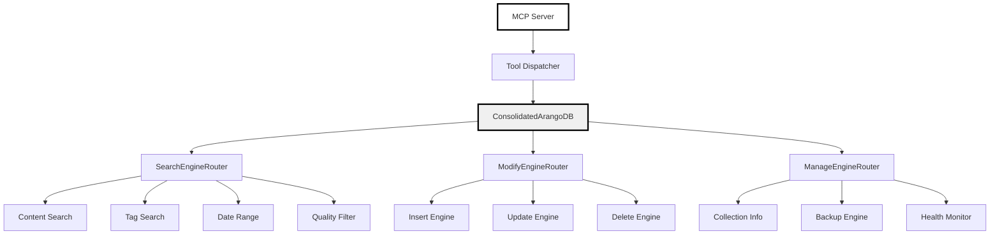

# Consolidated ArangoDB MCP Tool Suite - Technical Specification

## Overview

This document provides the detailed technical specification for implementing the 3-tool consolidated ArangoDB MCP suite that replaces complex AQL operations with agent-friendly interfaces.

## Technical Architecture

### Core Implementation Structure



## Implementation Details

### File Structure

```
development/cognitive_interface/
├── core/
│   ├── __init__.py
│   ├── consolidated_arango.py     # Main database abstraction
│   ├── search_engines.py          # Search operation engines
│   ├── modify_engines.py          # CRUD operation engines
│   ├── manage_engines.py          # Admin operation engines
│   └── error_handlers.py          # Error handling utilities
├── mcp_consolidated_server.py     # MCP server with 3 tools
├── tests/
│   ├── test_search_engines.py
│   ├── test_modify_engines.py
│   └── test_manage_engines.py
└── docs/
    ├── REQUIREMENTS_AND_DESIGN.md
    ├── TECHNICAL_SPECIFICATION.md
    └── API_REFERENCE.md
```

### Core Database Abstraction

#### ConsolidatedArangoDB Class

```python
class ConsolidatedArangoDB:
    """
    Main database abstraction providing agent-friendly interfaces
    """

    def __init__(self, host="http://127.0.0.1:8550",
                 database="_system",
                 username="root",
                 password="change_me"):
        """Initialize database connection with standard configuration"""

    def search(self, search_type: str, collection: str, **kwargs) -> dict:
        """Execute search operations with type-based routing"""

    def modify(self, operation: str, collection: str, **kwargs) -> dict:
        """Execute modification operations with operation-based routing"""

    def manage(self, action: str, **kwargs) -> dict:
        """Execute management operations with action-based routing"""
```

This technical specification provides the complete implementation blueprint for the 3-tool consolidated ArangoDB MCP suite.
