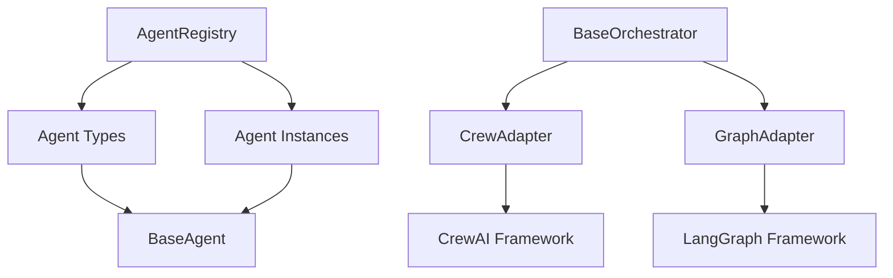

# OPSVI Agents Library

Multi-agent orchestration and framework adapters for the OPSVI ecosystem. Provides seamless integration with CrewAI, LangGraph, and other agent frameworks following modern async patterns and 2025 best practices.

## Features

### 🤖 **Framework Adapters**
- **CrewAI Integration**: Seamless adapter for CrewAI agent framework
- **LangGraph Integration**: State-based graph execution with LangGraph
- **Extensible Architecture**: Easy integration of new agent frameworks

### 🏗️ **Agent Management**
- **Agent Registry**: Centralized agent type registration and instance management
- **Lifecycle Management**: Proper startup, shutdown, and error handling
- **Type Safety**: Full type hints and Pydantic validation

### 🔄 **Orchestration Patterns**
- **Base Orchestrator**: Common patterns for all agent frameworks
- **Async Operations**: Full async/await support throughout
- **Error Handling**: Comprehensive error handling with structured logging

### 📊 **Monitoring & Observability**
- **Structured Logging**: Integration with `structlog` for detailed logging
- **Health Checks**: Built-in health monitoring for all components
- **Statistics**: Detailed operation metrics and performance tracking

## Installation

```bash
# Install from local development
cd libs/opsvi-agents
pip install -e .

# Or install with development dependencies
pip install -e ".[dev]"
```

## Quick Start

### Basic Agent Registry Usage

```python
import asyncio
from opsvi_agents import AgentRegistry
from opsvi_core.agents.base_agent import BaseAgent

# Create registry
registry = AgentRegistry()

# Register agent type
class MyAgent(BaseAgent):
    async def process(self, message: str) -> str:
        return f"Processed: {message}"

registry.register_agent_type("my_agent", MyAgent, "custom")

# Create agent instance
async def main():
    agent = await registry.create_agent("my_agent", "agent-1")

    # Use the agent
    result = await agent.handle("Hello world")
    print(result)

    # Clean up
    await registry.remove_agent("agent-1")

asyncio.run(main())
```

### CrewAI Integration

```python
import asyncio
from opsvi_agents import CrewAdapter
from opsvi_core.agents.base_agent import BaseAgent

async def main():
    # Create crew adapter
    crew_adapter = CrewAdapter()

    # Create agents (your custom BaseAgent implementations)
    agents = [
        MyAgent("researcher"),
        MyAgent("writer"),
    ]

    # Define tasks
    tasks = [
        {"id": "research", "description": "Research the topic"},
        {"id": "write", "description": "Write the report"},
    ]

    # Create crew
    crew = await crew_adapter.create_crew("content-crew", agents, tasks)
    print(f"Created crew: {crew['id']}")

    # List all crews
    crews = await crew_adapter.list_crews()
    print(f"Total crews: {len(crews)}")

asyncio.run(main())
```

### LangGraph Integration

```python
import asyncio
from opsvi_agents import GraphAdapter

async def main():
    # Create graph adapter
    graph_adapter = GraphAdapter()

    # Define graph structure
    nodes = [
        {"id": "start", "type": "input"},
        {"id": "process", "type": "transform"},
        {"id": "end", "type": "output"},
    ]

    edges = [
        {"from": "start", "to": "process"},
        {"from": "process", "to": "end"},
    ]

    # Create graph
    graph = await graph_adapter.create_graph("my-workflow", nodes, edges)
    print(f"Created graph: {graph['id']}")

    # Execute graph
    input_data = {"message": "Hello world"}
    result = await graph_adapter.execute_graph("my-workflow", input_data)
    print(f"Execution result: {result}")

asyncio.run(main())
```

## Architecture

### Core Components



### Integration with OPSVI Ecosystem

- **opsvi-core**: Inherits from `BaseAgent` and uses structured logging
- **opsvi-llm**: Can be used within agents for LLM operations
- **opsvi-rag**: Agents can leverage RAG capabilities for enhanced responses

## Development

### Setup Development Environment

```bash
# Clone and setup
cd libs/opsvi-agents

# Install with development dependencies
pip install -e ".[dev]"

# Install pre-commit hooks
pre-commit install
```

### Running Tests

```bash
# Run all tests
pytest

# Run with coverage
pytest --cov=opsvi_agents --cov-report=html

# Run specific test
pytest tests/test_agents.py::TestCrewAdapter::test_create_crew_success
```

### Code Quality

```bash
# Format code
black .
ruff --fix .

# Type checking
mypy opsvi_agents/

# Run all quality checks
pre-commit run --all-files
```

## Configuration

### Environment Variables

```bash
# Optional: Configure logging level
export OPSVI_LOG_LEVEL=DEBUG

# Optional: Configure specific framework settings
export CREWAI_CONFIG_PATH=/path/to/crewai/config
export LANGGRAPH_CONFIG_PATH=/path/to/langgraph/config
```

### Framework-Specific Configuration

```python
# CrewAI configuration
crew_config = {
    "max_execution_time": 300,
    "memory_enabled": True,
    "verbose": True,
}
crew_adapter = CrewAdapter(crew_config)

# LangGraph configuration
graph_config = {
    "checkpoint_enabled": True,
    "max_iterations": 100,
}
graph_adapter = GraphAdapter(graph_config)
```

## Advanced Usage

### Custom Orchestrator

```python
from opsvi_agents.base_orchestrator import BaseOrchestrator

class CustomOrchestrator(BaseOrchestrator):
    async def create(self, config):
        # Implement custom orchestration logic
        return {"status": "created", "config": config}

    async def start(self):
        await super().start()
        # Custom startup logic

    async def stop(self):
        # Custom shutdown logic
        await super().stop()
```

### Plugin Architecture

```python
# Agents support plugins via opsvi-core
agent = await registry.create_agent("my_agent", "agent-1")

# Add custom plugins
class LoggingPlugin:
    async def before_process(self, message):
        print(f"Processing: {message}")

agent.add_plugin(LoggingPlugin())
```

## Performance Considerations

- **Async Operations**: All operations are async for maximum concurrency
- **Resource Management**: Proper cleanup of agent instances and connections
- **Monitoring**: Built-in metrics collection for performance optimization
- **Caching**: Framework-specific caching where applicable

## Contributing

1. Fork the repository
2. Create a feature branch (`git checkout -b feature/amazing-feature`)
3. Make your changes following the coding standards
4. Add tests for your changes
5. Run the test suite (`pytest`)
6. Commit your changes (`git commit -m 'Add amazing feature'`)
7. Push to the branch (`git push origin feature/amazing-feature`)
8. Open a Pull Request

## License

This project is licensed under the MIT License - see the [LICENSE](../../LICENSE) file for details.

## Support

- **Documentation**: [GitHub Repository](https://github.com/opsvi/master_root)
- **Issues**: [GitHub Issues](https://github.com/opsvi/master_root/issues)
- **Discussions**: [GitHub Discussions](https://github.com/opsvi/master_root/discussions)